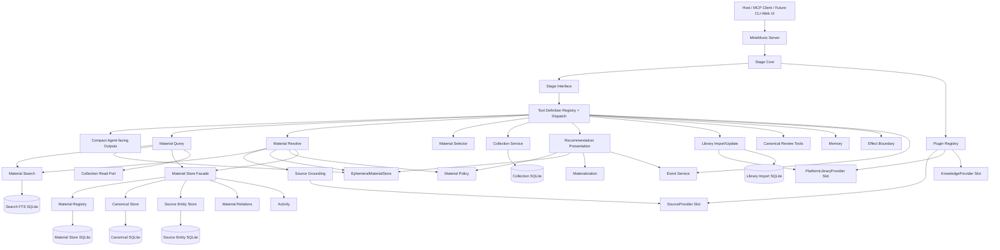
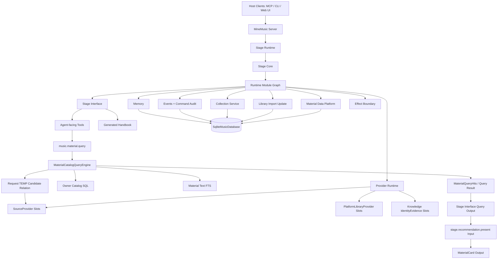

# MineMusic MVP -> Formal Project Architecture Audit v3

> 版本：v3。
> 审计对象：`Odefined/MineMusic`。
> 输出性质：同一 repo 内的 formal rebuild 技术报告，不新开默认空仓，也不在 MVP 上修修补补；不保留旧 schema、旧 public tool、旧查询路径、旧 `resolve` / `ephemeral material` 模型，也不设计兼容层。
> 证据来源：当前会话中重新读取的仓库文档、源码、测试文件，以及用户在 v2 文档中的 inline comments。
> 已采纳的架构决定：
>
> 1. 正式项目采用 same-repo formal rebuild：旧 MVP 代码只作为 evidence、donor implementation 和迁移输入，不作为 formal architecture 的基础。
> 2. `music.material.resolve`、`MaterialResolve*`、`EphemeralMaterialStorePort`、`emat:*` 全部移除。
> 3. Provider search result 不默认写入 durable `MaterialRecord`；进入 request-scoped candidate relation，用 SQLite TEMP table / request-local FTS / in-memory candidate corpus 完成混合检索与排序。只有跨过 commit boundary 时才 materialize。
> 4. 领域层统一用 `SourceEntity` / `CanonicalEntity` / `MaterialEntity`；存储层才叫 `SourceRecord` / `CanonicalRecord` / `MaterialRecord`。
> 5. 正式项目在 `SourceEntity` 和 `MaterialEntity` 层统一使用 `album`；`release` 只表示具体发行物/版本，用于后续唱片收藏。`release_group` 不删除，保留为未来 identity / canonical grouping vocabulary；formal v1 默认不进入普通 `SourceEntity` / `MaterialEntity` / query / present flow，只有专门 identity grouping phase 才启用。
> 6. 完全移除 public `canonical.review.*` tools，并同步删除对应 docs / tests。
> 7. public handle 改为 `refKey(ref)`。`namespace`、`kind`、`id` 禁止出现 `:`；provider namespace 使用 `source_netease`，不使用 `source:netease`。
> 8. `material_relations` 改名为 `owner_material_relations`。Collection 与 owner relation 必须明确分工，不能同时维护同一类事实；relation 保留 material/source/version/event scope，而不是另起一套 source feedback 模型。
> 9. Pool combination 使用 `any / all / none` 语义，可以组合使用；不使用显式 `union / intersect / except` expression tree 作为 public query model。

---

## 1. Executive Summary

MineMusic 的正式项目目标是：提供一个可扩展的音乐 agent 脚手架和工作台，使通用 LLM 能作为用户的私人音乐生活助理、伙伴和代理运行。README 已经给出核心边界：LLM 负责音乐解释、对话和最终推荐，MineMusic 负责 grounding、identity anchors、source-backed links、material states、events、memory proposals、effect boundaries、callable instruments、provider slots 和 runtime lifecycle。 这一定义是正式架构的根，不是 material search 子系统的附属说明。

当前 MVP 已经验证了几个方向：Stage Interface 作为 agent-facing callable boundary、Stage Core 作为 runtime composition root、provider slots、Source / Canonical / Material 三层概念、Collection / Source Library 产品语义、SQLite FTS 的本地搜索方向、以及 architecture tests 的工程文化。AGENTS 也已经明确要求 bounded context、narrow capability port、side-effect method 不应藏在 vague read/query/support port 后面，并要求架构边界必须有测试守卫。

但当前实现已经不适合继续迭代。主要问题不是“搜索算法不够好”，而是对象语言、读写能力、provider 边界、数据库入口和查询管线没有统一模型。正式项目应在同一 repo 内 formal rebuild：保留可迁移资产，删除旧 runtime path，按可 review 的 PR 切片重建正式模块，而不是在旧 `material/search/query/resolve` 链路上继续补丁。

### 1.1 最高优先级结论

| 优先级 | 结论 | 具体动作 |
|---|---|---|
| P0 | 删除 `resolve` / `ephemeral material` | 删除 `music.material.resolve`、`src/material/resolve/**`、`MaterialResolve*` contracts、`EphemeralMaterialStorePort`、`emat:*` codec。 |
| P0 | query 成为唯一 material retrieval 入口 | `music.material.query` 支持 local catalog、source library、collection、provider search、material ref pool，以及 `any / all / none` 组合。 |
| P0 | provider search 使用 request-scoped candidate relation | Provider search results 进入 TEMP candidate table / request-local FTS corpus；只在 present/save/favorite/block/feedback/collection add/source library import 等 commit boundary materialize。 |
| P0 | 重写 provider contract | `SourceProvider.search` 返回 `ProviderMaterialCandidate[]`，不能返回 `MusicMaterial` / `SourceMaterial` / `MaterialEntity` / `MaterialState`。 |
| P0 | 统一 DB 入口 | 引入 `SqliteMusicDatabase`，所有 SQLite repositories、commands、query engines 共用一个 `DatabaseSync` 与 transaction boundary。 |
| P0 | 重建 material catalog read model | `source_library_items`、`collection_items`、`owner_material_relations` 是 owner-facing 事实源；`owner_material_entries`、`owner_material_catalog_view`、policy/text projections 只支撑查询。 |
| P0 | 删除 public canonical review | 完全移除 `canonical.review.list`、`canonical.review.inspect`、`canonical.review.apply`、`canonical.review.auto_update`，同步删除 docs 和 tests。当前 Stage Interface 确实暴露这些工具。 |
| P1 | album / release / release_group 语义重置 | `SourceEntity` / `MaterialEntity` 用 `album`；`release` 只表示具体发行物、版本、唱片收藏对象；`release_group` 保留为未来 identity / canonical grouping vocabulary，但不进入 formal v1 默认普通 flow。 |
| P1 | `owner_material_relations` 与 Collection 分工 | `owner_material_relations` 保存 owner 对 material 某个 scope target 的关系和反馈；Collection 只保存用户命名集合、分组、排序和 collection-local 描述。 |

### 1.2 建议 formal rebuild 策略

不建议小修小补，也不建议默认新开空 repo 重来。应采用 **same-repo formal rebuild + 清晰 PR 切片**。旧 MVP 实现是 evidence 和 donor，不是 formal v1 的 base：

```text
1. 先冻结正式词表和 public tool surface。
2. 删除 resolve / ephemeral / canonical review public tools。
3. 重写 provider contract。
4. 建立统一 DB gateway。
5. 建立 Source / Canonical / Material / Alias write model。
6. 建立 source library / collection / relation facts，并建立 owner catalog / policy / text projection read model。
7. 实现 MaterialCatalogQueryEngine。
8. 让 Stage Interface 的 music.material.query 接入新 query engine。
9. 最后删除旧 material/search/query/resolve runtime 拼装路径。
```

---

## 2. Evidence Inventory

### 2.1 实际阅读过的关键文件

| 文件 | 证据用途 | 关键结论 |
|---|---|---|
| `AGENTS.md` | 架构纪律 | 要求 bounded context、narrow ports、显式 read/write capability、禁止 side-effect methods 藏在 vague query/read/support port 后面。 |
| `README.md` | 产品定位和 runtime | MineMusic 是 LLM music partner/secretary/agent 的 stage；server 持有 Stage Core 并通过 MCP 暴露 Stage Interface。 |
| `ARCHITECTURE.md` | 当前 MVP 架构 | 当前文档仍描述 Material Resolve、`emat:*`、canonical maintenance、Material Query/Search 旧模型。 |
| `src/stage_core/compose.ts` | Runtime composition | Stage Core 当前手写 wire 了 canonical、material store、search index、ephemeral store、query、resolve、presentation、canonical maintenance、library import、dispatch 等。 |
| `src/stage_core/repositories.ts` | DB/repository construction | 当前按多个 DB path 创建 material store、collection、library import、provider cache、material search DB。 |
| `src/contracts/index.ts` | 当前对象词表 | 当前存在 `MusicMaterial`、`SourceMaterial`、`MaterialRecord`、`CanonicalRecord`、`MaterialResolve*`、`MaterialQuery*`、`SourceProvider.search -> SourceMaterial[]` 等混合模型。   |
| `src/stage_interface/tool_definitions/music.ts` | public material tools | 当前暴露 `music.material.resolve` 和 `music.material.query`。 |
| `src/stage_interface/tool_definitions/canonical_review.ts` | canonical review public tools | 当前暴露 `canonical.review.list/inspect/apply/auto_update`。 |
| `src/material/search/index.ts` | 搜索管线 | 当前搜索由 TS 收集 candidate pool、eligible filtering、sort、pageHits，再调用 FTS。  |
| `src/material/query/index.ts` | 查询管线 | 当前 query 调 search 和 selector，并在 source library release_tracks 分支写 ephemeral material。 |
| `src/material/resolve/index.ts` | resolve 管线 | 当前 resolve 做 local search、source grounding、ephemeral、policy、rerank。 |
| `src/material/presentation/index.ts` | recommendation present | 当前 presentation 同时处理 durable 和 ephemeral material，并在 selected ephemeral 上做 materialization。  |
| `src/material/projection/index.ts` | public material handle | 当前 `mat:*` / `emat:*` codec 和 `MusicMaterial` hydration 在 projection module。 |
| `src/providers/netease/index.ts` | provider implementation | NetEase source provider 返回 material-like `SourceMaterial`；`toMaterial(song)` 设置 `state`、links、evidence。  |
| `src/providers/musicbrainz/index.ts` | provider implementation | MusicBrainz 是 KnowledgeProvider；descriptor 明确 No playable links / No identity confirmation / No Canonical Store writes。 |
| `test/providers/netease-source-provider.test.ts` | provider tests | 当前测试断言 NetEase source provider 返回 source-backed material 和 blocked state，这是正式项目必须改掉的测试。 |
| `src/storage/sqlite/*` | SQLite layer | 多个 repository 自己 `new DatabaseSync`，并存在 list all + TS filter。    |
| `test/architecture/material-boundary.test.ts` | architecture guards | 已有 exact port key-set 与 forbidden import guard，但缺 provider conformance、removed tools、DB ownership、query/write separation。  |

### 2.2 证据不足但必须后续检查的范围

本报告已补看 NetEase 和 MusicBrainz provider。仍需在实施前完整检查：

```text
src/server/**
src/surfaces/**
src/app/**
src/memory/**
src/effects/**
src/events/**
src/knowledge/**
全部 integration tests
全部 provider smoke/live tests
```

这些不影响本报告的核心结论，因为最大问题已经由 contracts、Stage Interface、Stage Core、provider、material/search/query/resolve、storage 层证据证明。

---

## 3. Current Architecture Map

### 3.1 当前实际 runtime 架构



### 3.2 当前主要偏差

| 偏差 | 当前代码行为 | 正式项目目标 |
|---|---|---|
| Stage Interface 暴露旧工具 | `music.material.resolve` 和 `canonical.review.*` 仍在 tool definitions 中。  | 删除这些 public tools，只保留 expanded `music.material.query` 与必要 action tools。 |
| Stage Core hand-wired 过重 | `composeMineMusicStageCore` 手写创建全部 services、stores、search index、ephemeral、query、resolve、presentation、canonical maintenance。 | Stage Core 保留为 composition root，但引入 runtime module graph / capability registration。 |
| Provider 返回 Material-like object | `SourceProvider.search` 返回 `SourceMaterial[]`，NetEase `toMaterial` 写 `state`。  | Provider 只返回 `ProviderMaterialCandidate[]`，不返回 MaterialEntity / MaterialState。 |
| Query/Search/Resolve 重叠 | search 拼 pool；query 再 select/slice；resolve 再 provider+ephemeral+rerank。 | 一个 `MaterialCatalogQueryEngine` 承担复杂检索。 |
| DB 入口分散 | 多个 SQLite repository 自己开 DB。 | 一个 `SqliteMusicDatabase`。 |
| Collection / relation 重叠 | MVP 同时存在 collections 和 material relations，且 saved/favorite/blocked 可在多个路径表达。 | `owner_material_relations` 负责 owner 对 material/source/version/event target 的关系事实；Collection 负责用户命名集合与集合内排序/描述。 |

---

## 4. Domain Language And Naming Audit

| 当前词 | 当前含义 / 证据 | 问题 | 正式名称 | 处理 |
|---|---|---|---|---|
| `Ref` | `{ namespace, kind, id, label?, url? }`，当前注释说明 label/url 非权威。 | refKey helper 到处复制，当前 provider namespace 可含 `:`；`url` 和 source-owned links 语义重叠。 | `Ref` | 保留统一 `namespace/kind/id/label?` shape，删除 `url`。不拆 `SourceRef` / `MaterialRef` / `CanonicalRef` 独立结构；用字段名表达语义。新增全局 `refKey(ref)`。约束 namespace/kind/id 禁止 `:`。`label` 只是非权威 display/debug hint；links 只走 `SourceEntity.links` / `PlayableLink`。 |
| `refKey` | 当前多处私有 helper 用 `${namespace}:${kind}:${id}`。 | 没有 contract；`source:netease` 破坏简单解析。 | `refKey` | 统一实现；provider namespace 改为 `source_netease`。`PublicRefKey` formal v1 仍是 plain `string`，不做 branded type；稳定性靠 helper、validation、tests。禁止各模块私写 refKey 拼接。 |
| `materialId` | 当前 public handle 是 `mat:*` / `emat:*`。 | 与 refKey 分裂，且支持将被删除的 `emat:*`。 | `PublicMaterialHandle = refKey(materialRef)` | 删除 `mat:*`/`emat:*` codec。 |
| `MusicMaterial` | 当前 hydrated domain result，含 state、identity、playable links。 | 名称与职责混乱；不是 storage row，也不是 public card；playable links 也不是 material identity。 | `MaterialEntity` | 删除 `MusicMaterial` 名称。`MaterialEntity` 只表达 material identity anchor；不含 `PlayableLink[]`、public display links、availability、score、basis/provenance、owner policy、presentation seed、provider raw payload、notes 等展示/查询/偏好字段。 |
| `SourceMaterial` | 当前 provider search 返回的 material-like object。 | Provider 层泄露 material semantics。 | `ProviderMaterialCandidate` | 删除。 |
| `MaterialRecord` | 当前 material registry row。 | 可作为 storage record，但不应是领域名称，也不能假装和 domain entity 是同一 shape。 | storage `MaterialRecord` | 保留为存储层名称。领域层叫 `MaterialEntity`。`MaterialRecord` 可包含 material_key/canonical_key/source_key/merged_into_key 等 SQL lookup columns；`MaterialEntity` 只暴露 refs 和语义字段。 |
| `CanonicalRecord` | 当前 canonical identity record。 | 与 `SourceEntity` 命名不一致，且旧模型容易把 identity、source 绑定、review 状态混在一起；也不能假装和 domain entity 是同一 shape。 | domain `CanonicalEntity`; storage `CanonicalRecord` | 领域改名，存储保留 Record。`CanonicalEntity` 只表达跨来源 identity authority；可有 display/search `aliases?: string[]`，但不拥有 `sourceRefs`、`materialRefs`、playable links、owner relations，也不暴露 storage key。source/canonical 到 material 的绑定走 `material_aliases` / binding facts。`CanonicalRecord` 可包含 canonical_key/merged_into_key/provider identity indexes/facts_json 等存储字段。 |
| `SourceRecord` | 目标新增 storage 名称，对应 `source_records` table row。 | 需要和 normalized `SourceEntity` 区分，避免把 SQL keys/index columns 暴露到 domain/source contract。 | storage `SourceRecord` | 只作为 persistence shape；可包含 source_key、namespace/kind/id columns、album_source_key、source_json、index columns。`SourceEntity` 不暴露 source_key 或 SQL denormalized columns。 |
| `SourceEntity` | provider-side source track/release/artist，当前可带 `providerFacts`。 | kind 要改，source/material 层应统一 album；raw/generic provider payload 不应进入 durable source contract。 | `SourceEntity` | 保留为 durable normalized provider-side facts；kind 改为 `track | album | artist`。显式包含 `providerEntityId`，用于保存 provider 原始实体 id；`sourceRef.id` 是 ref-safe id。可保存规范化 label/title/artist/album/duration/tracklist/providerUrl/availabilityHint/`PlayableLink[]` 等来源侧事实或提示；`SourceArtist` 可有 provider-side `aliases?: string[]`，track/album 不泛化 aliases。不得保存 raw provider payload、`providerFacts` / `metadata` / `raw` generic dump、material/canonical 绑定、owner relation、public display links、score/basis/query 字段。 |
| `track` / `recording` | 当前代码在 source/material/search 语境中容易混用曲目与录音身份。 | provider/source 的 track 条目和 MineMusic/canonical 的 recording identity 不是同一层。 | `track` source kind; `recording` material/canonical kind | `SourceEntity.kind = track | album | artist`；`MaterialEntity.kind` / `CanonicalEntity.kind = recording | album | artist | work | release`。不要让 `track` 进入 material/canonical kind，也不要让 `recording` 进入 SourceEntity kind。 |
| `VersionInfo` | 当前版本信息散落在 title/label 或用户 wrong_version 反馈里。 | remaster/remix/live/edit/deluxe 等不是边角 metadata，会影响身份、检索、展示和 wrong_version 判断。 | `VersionInfo` | 一等领域概念。`SourceEntity.versionInfo` 表达 provider/source 看到的版本事实；`MaterialEntity.versionInfo` 表达 MineMusic 对 material identity 的版本判定；`CanonicalEntity.versionInfo` 只在 canonical identity 本身是版本化对象时存在。VersionInfo 不是 presentation-only，后续 query/text projection 必须可索引。 |
| `work` | 当前 canonical/material kind 中出现。 | work-level identity 与普通 provider track materialization 不同。 | `work` material/canonical kind | 保留在 `MaterialEntity.kind` / `CanonicalEntity.kind`，不进入 `SourceEntity.kind`。普通 provider song materialization 默认 `recording`；只有明确 work-level intent、canonical evidence、或用户创建 work-level item 时才创建 material `work`。 |
| recording-work relation | 目标边界概念。 | 容易被误塞进 VersionInfo 或 MaterialEntity core 字段。 | identity graph / canonical relation | recording 与 work 的归属关系属于 identity graph / canonical maintenance phase；不是 VersionInfo、不是 owner relation、不是 presentation field。Phase 1 不引入 `workRef` 等 active core field。 |
| `album` | NetEase sourceRef 当前使用 kind `album`。 | 代码其他地方还用 release/release_group。 | `album` | `SourceEntity.kind` / `MaterialEntity.kind` / `CanonicalEntity.kind` 正式统一使用 `album`。普通 album identity 不叫 `release_group`。 |
| `release` | 当前 target kind / canonical kind / collection kind 中使用。 | 普通 album 与具体发行物混用。 | `release` material/canonical kind for concrete edition | 保留在 `MaterialEntity.kind` / `CanonicalEntity.kind`，不进入 `SourceEntity.kind`。普通 provider album materialization 默认 `album`；只有 concrete edition / pressing / version / record-collection workflow 明确需要时才创建 `release`。 |
| `release_group` | 当前部分 kind vocabulary 中出现。 | 如果直接删除，会丢掉未来按发行组/版本组表达身份的空间；如果直接放进普通 flow，又会继续混淆 album 与 concrete release。 | `release_group` reserved identity vocabulary | 不删除；Phase 1 明确它不是 `album` 的替代词，formal v1 默认不作为普通 query target / public output kind。 |
| `MaterialState` | 当前包括 grounded、confirmed_playable、source_only_playable、blocked 等。 | 混合 lifecycle、identity confidence、availability、owner policy、presentation readiness。 | `MaterialLifecycleStatus`、`MaterialIdentityStatus`、`MaterialAvailability`、`owner_material_relations` policy projection | 拆分。Provider 不得写 MaterialState；`blocked` 来自 scoped owner relation/policy，identity confidence 与 availability 分开。`MaterialAvailability` 是 query/present projection，由 SourceEntity links / availabilityHint、owner scoped corrections、provider/account constraints 计算，不是 MaterialEntity core，也不是 provider 原话。 |
| `Collection` | 当前 owner collection、collection items。 | 与 saved/favorite/blocked relation 可能重叠。 | `Collection` | 只负责用户命名集合、排序、collection-local note/description；不建 saved/favorite/blocked 系统集合。 |
| `material_relations` | 当前 owner/material relation facts。 | 名称缺少 owner 语义，且 formal 语义必须表达 target scope。 | `owner_material_relations` | 改名，负责 saved/favorite/blocked/wrong_version/not_playable/bad_match/liked/disliked/memory_preference，并显式保存 material/source/version/event scope。 |
| `query` | 当前 local/source_library/collection retrieval。 | provider search 不在 query，resolve 分裂。 | `MaterialCatalogQuery` | 唯一 material retrieval 入口。 |
| `search` | 当前 owner visibility + FTS + cursor + rerank。 | 职责过宽。 | `MaterialTextIndex` / `CatalogQueryEngine` | search 不再是业务 boundary。 |
| `resolve` | 当前 local + provider + ephemeral + rerank。 | 职责混乱。 | 无 | 删除。 |
| `ephemeral` | 当前 process-local temp material。 | public/runtime identity 分裂。 | 无 | 删除 material identity；保留 request-scoped provider candidate relation，不叫 material。 |
| `ProviderMaterialCandidate` | 目标新增 | Provider search output。 | `ProviderMaterialCandidate` | 包含 normalized `sourceEntity: SourceEntity`，并只额外携带可选 `providerScore`；不含 rank/searchText/queryRunId、materialRef、canonicalRef、identityState、MaterialState、raw provider payload，不代表 material identity。 |
| `MaterialCard` | Recommendation presentation 的最终 Stage Interface compact output。 | 方向正确，但不能用于 Query Engine 或 query tool 的中间结果。 | `MaterialCard` | 只作为 `stage.recommendation.present` 的最终输出；query tool 输出 query result items。 |
| `PlayableLink` / provider url | 当前 `PlayableLink` 内含 sourceRef，public output 只显示 label/url。 | 如果 link 已经挂在 `SourceEntity` 下，再重复 `sourceRef` 是旧 `MusicMaterial.playableLinks` 模型残留；过期判断不需要塞进 link value。 | `PlayableLink` / `PublicDisplayLink` | `PlayableLink` 是 source-owned internal link value，shape 为 `{ url, label?, requiresAccount? }`；不含 `sourceRef`，不含 `expiresAt`。父 `SourceEntity` 或独立 link fact row 的 owner key 表达来源；链接坏了/过期了走显式 refresh/repair。`PublicDisplayLink` 保持 `{ url, label? }`，不带 `requiresAccount`；账号限制通过 card/query availability 表达。`MaterialEntity` 不拥有 links。 |

---

Formal correction for Collection / relation vocabulary:

```text
Collection:
  user-named organizing container for material refs, ordering, grouping, and collection-local notes.
  No saved/favorite/blocked system collections in formal v1.

owner_material_relations:
  owner-scoped relationship and feedback facts targeted at material/source/version/event scope.
  Do not split source-scoped feedback into a separate source-signal model.
  Projections may summarize relation effects for query/presentation, but relations remain the source of truth.
```

## 5. What To Keep And Migrate

| Component / File | Good Design Or Code Worth Preserving | Why It Is Valuable | Migration Condition | Tests / Guards Needed |
|---|---|---|---|---|
| `src/stage_interface/**` | Tool registry、schema、payload validation、compact output | Stage Interface 是 agent-facing 外部接口边界。AGENTS 明确 domain modules 不应依赖 Stage Interface DTO。 | 删除旧 tools，重写 `music.material.query` schema，输出保持 compact。 | removed tools test；public output leak test。 |
| `src/stage_core/**` | Stage Core as composition root | README 的 runtime 是 server -> Stage Core -> Stage Interface -> Core Capabilities。 | 从 hand-wired compose 迁移到 module graph；先不要阻塞 DB/query 重构。 | composition graph test；capability registration tests。 |
| Provider slot / descriptor | Plugin slot 思路 | 可插拔 provider 是 MineMusic harness 的核心。ARCHITECTURE 当前已有 Source/Platform/Knowledge slot。 | Provider contract 重写；manifest 更严格。 | provider conformance suite。 |
| NetEase provider parsing/pagination/account code | HTTP endpoint、payload parsing、account identity、readPage 逻辑 | 可复用，尤其 platform library import/update。  | 去掉 `toMaterial`，改 `toProviderMaterialCandidate`；namespace 改 `source_netease`；album vocabulary。 | NetEase provider candidate tests；no MaterialState import guard。 |
| MusicBrainz KnowledgeProvider | evidence provider boundary | Descriptor 明确 no playable links/no identity confirmation/no canonical store writes。 | 保留为 Knowledge / IdentityEvidence provider；不迁移 canonical review public tools。 | no-write provider tests。 |
| Library Import product flow | source library import/update/absence | source library 是 provider-imported owner facts 的主要事实源。当前 import 已有 upsert source entity/library item/material 的流程。 | 改为 DB command transaction，写 SourceRecord/SourceLibraryItem/MaterialRecord，并触发 owner catalog/text projection rebuild。 | import transaction tests；absence projection tests。 |
| Collection Service semantic | owner named collections | Collection 仍是用户组织音乐的核心功能。 | 与 owner relation 分工：collection 不再表达 saved/favorite/blocked 关系事实。 | collection vs relation ownership tests。 |
| SQLite FTS implementation idea | weighted field search / request corpus | 当前 rerankDocuments 已有 request corpus table/drop 思路，可迁移为 TEMP provider candidate relation 的技术基础。 | 改为 `material_text_documents` + `material_text_fts` + `temp_query_candidates_fts`。 | FTS integration tests。 |
| Architecture tests | boundary regression guard | 当前已有 exact port key-set 和 forbidden imports。 | 扩展 provider、DB、removed tools、query/write separation。 | architecture suite。 |
| v1 database-first design | source/canonical/material/catalog/signal/text projection 分层 | v1 中关于统一 DB、owner material entries、catalog view、signals、FTS、keyset cursor、merge semantics 的内容正确，应保留并修正 terminology。 | 改 Entity/Record、album/release、owner_material_relations、provider temp candidate relation。 | database/query integration tests。 |

---

## 6. What Must Be Refactored Or Removed

| Severity | Module / File / Concept | Symptom | Root Architectural Problem | Target Shape | Minimal Migration Slice | Tests / Guards |
|---|---|---|---|---|---|---|
| P0 | `src/material/resolve/**` | local search + source grounding + ephemeral + policy + rerank。 | 把 query、provider search、candidate materialization、rerank 混成一条隐式流程。 | 删除。用 `music.material.query` 的 provider_search pool 取代。 | 删除 contracts/tools/docs/tests 中 resolve。 | no `MaterialResolve` grep guard；removed public tool test。 |
| P0 | `EphemeralMaterialStorePort` / `emat:*` | presentation 消费 ephemeral 并 materialize。 | public handle 和 runtime identity 分裂。 | 删除。Provider search candidate 是 request-scoped candidate，不是 material。 | 删除 store、codec、presentation branches。 | no `ephemeral_material` / `emat:` guard。 |
| P0 | `SourceProvider.search -> SourceMaterial[]` | provider 返回 material-like object。 | Provider slot 泄露 MaterialEntity 语义。 | `SourceProvider.search -> ProviderMaterialCandidate[]`。 | 修改 contracts + providers + tests。 | providers cannot import MaterialEntity/MaterialState/MaterialRecord。 |
| P0 | NetEase `toMaterial` | 设置 `state: blocked/grounded`、links、evidence。 | Provider 做 material policy。 | `toProviderMaterialCandidate` + availabilityHint。 | 重写 NetEase source provider。 | `noCopyrightRcmd` -> availabilityHint test。 |
| P0 | `music.material.resolve` public tool | Stage Interface 暴露 resolve。 | 旧 workflow 泄露给 agent。 | 删除。 | 更新 tool registry、MCP schema、Handbook。 | stableToolNames excludes tool。 |
| P0 | public `canonical.review.*` | Stage Interface 暴露 maintenance workflow。 | formal v1 不迁移 canonical maintenance。 | 删除 public tools、docs、tests。 | remove tool group and associated tests. | stableToolNames excludes all canonical.review names。 |
| P0 | Multi-DB repository construction | Stage Core 用多个 DB path。 | 无统一 transaction/cross-table query。 | `SqliteMusicDatabase`。 | Add DB context and migrate repositories. | forbid `new DatabaseSync` outside DB gateway。 |
| P0 | TS candidate pool | `collectCandidatePool`、`eligibleCandidateHits`、offset cursor。  | DB 应拥有 visibility/filter/dedupe/sort/pagination。 | `MaterialCatalogQueryEngine`。 | Implement source_library + collection pool SQL. | no TS pool construction guard。 |
| P0 | Offset pagination | Search/Query 用 offset/slice。  | 动态数据下重复/漏项。 | keyset cursor。 | cursor module and query integration. | cursor regression tests。 |
| P1 | `MaterialStorePort` god port | full aggregate port 包含 registry/source/canonical/relation/activity writers。 | capability 过宽。 | Split read/query/commands/signals/projections。 | define new ports. | exact port key-set tests。 |
| P1 | `material_relations` naming | relation is owner-scoped but name does not say owner。 | 领域边界不清。 | `owner_material_relations`。 | schema/contracts rename. | naming/import tests。 |
| P1 | Collection vs relation overlap | saved/favorite/blocked 可被 collection 和 relation 双重表达。 | source-of-truth duplication。 | relation stores scoped owner facts; collection stores user-named ordered sets. | update schema/query/design docs. | no saved/favorite/blocked system collection duplication tests。 |
| P1 | album/release drift | NetEase uses album, contracts use release/release_group。  | domain vocabulary unstable。 | source/material use album; release only concrete issue; release_group remains reserved vocabulary. | contracts + provider kind rewrite. | album/release regression tests; no dedicated release_group guard. |
| P1 | JSON-first repositories | list all + TS filter。  | DB indexes/query not used. | SQL-visible columns and WHERE. | rewrite source/collection lists. | repository query tests。 |
| P1 | Stage Core giant compose | `composeMineMusicStageCore` wires every detail。 | hard to add plugins/capabilities cleanly. | runtime module graph. | staged after DB/query base. | module graph tests。 |

---

## 7. Target Formal Architecture

### 7.1 Architecture overview



### 7.2 Context / responsibility table

| Context | Owns | Allowed Reads | Allowed Writes | Public Ports | Forbidden Imports / Behaviors |
|---|---|---|---|---|---|
| MineMusic Server | process lifecycle, transport config, runtime config, holding Stage Runtime | config, runtime health | server process state | server runtime factory | domain business logic, provider parsing, query planning |
| Stage Core | module graph assembly, provider registration, repository/DB wiring, runtime lifecycle | module manifests, config, provider descriptors | composition only | `StageRuntime`, `StageCoreRuntimeKit` | query logic, material identity decisions, provider API logic |
| Stage Interface | agent-facing tool names, schemas, validation, compact output, Handbook lookup, dispatch policy | session context, tool descriptors, compact domain outputs | no storage writes directly; calls command ports | `MineMusicStageInterface` | raw DB records, provider payloads, Stage Interface DTO imported by domain modules |
| Provider Runtime | provider registration, provider manifest, provider conformance, provider cache access | provider config/cache | provider HTTP cache only | `PluginRegistryPort`, provider slots | MaterialEntity writes, CanonicalEntity writes, MaterialState decisions |
| SourceProvider Slot | provider search and explicit playable-link refresh/repair | external provider API | none except provider cache | `SourceProvider.search`, `getPlayableLinks` | returning MaterialEntity/MusicMaterial/MaterialState; hidden provider calls from ordinary present path |
| PlatformLibraryProvider Slot | external account library preview/read/page | external provider API | none except provider cache | `PlatformLibraryProvider` | collection writes, material identity decisions |
| Knowledge / IdentityEvidence Provider Slot | external knowledge and identity evidence | external knowledge API, cache | provider cache only | `KnowledgeProvider` | direct CanonicalEntity writes, playable links |
| Material Data Platform | SourceEntity, CanonicalEntity, MaterialEntity, aliases, owner fact tables, owner catalog read model, relation policy projections, text projections, query engine | DB facts/projections, provider candidates via query runtime | DB commands and projection maintenance | `MaterialCatalogQueryPort`, `MaterialEntityCommandPort`, `MaterialMaintenancePort` | Stage Interface DTOs, provider raw payloads, Stage Interface `MaterialCard` output, TS candidate pool orchestration, treating owner catalog as command source-of-truth |
| Library Import/Update | provider account library import/update batches, source library facts, absence handling | PlatformLibraryProvider, Source/Material command ports | SourceRecord, SourceLibraryItem, MaterialRecord, projection invalidation/rebuild, import audit | `LibraryImportPort` | Collection writes for saved/favorite, Canonical maintenance, direct owner catalog writes |
| Collection Service | named user collections, collection items, collection-local order/description | Material ref resolver, collection records | CollectionRecord, CollectionItemRecord, projection invalidation/rebuild | `CollectionPort` | provider APIs, saved/favorite/blocked relation source-of-truth, direct owner catalog writes |
| Owner Relation Service | scoped owner-material/source/version/event relations: saved, favorite, blocked, wrong_version, not_playable, bad_match, liked, disliked, memory_preference | material resolver, relation records | `owner_material_relations`, relation policy projections | `OwnerMaterialRelationPort` | named collection membership, provider APIs |
| Recommendation Presentation | final presentation gate, max/min cards, impression facts, session/owner policy projections, compact result | MaterialEntity/Card hydration, relation policy facts | recommendation_impressions, owner/session policy projections, events | `RecommendationPresentationPort` | candidate discovery, provider search, hidden materialization |
| Event Service | factual event history and command/event audit integration | event records | events, maybe material activity projections | `EventPort` | preference inference, raw provider payload output |
| Memory Service | durable preferences, feedback interpretation, memory proposals | events, presented cards, material refs | memory entries/proposals | `MemoryPort` | raw provider payloads, direct provider calls |
| Effect Boundary | permission and consequence control for external/durable actions | effect proposals and policy | effect proposals/decisions | `EffectBoundaryPort` | hidden side effects behind query/read methods |
| Storage / SQLite | DB context, schema, low-level repositories | SQLite | SQLite | `SqliteMusicDatabase`, repositories | domain decisions, provider calls |

### 7.3 Formal v1 public tool surface

Keep / redesign:

```text
stage.context.read
stage.recommendation.present
stage.effects.propose
stage.effects.decide
handbook.*
music.material.query
music.material.context.brief
music.pools.list
music.links.refresh
music.collection.*
music.relation.*                  # optional; if saved/favorite/block are no longer collection-backed
library.import.*
library.update.*
knowledge.query
memory.feedback.record
```

Remove:

```text
music.material.resolve
canonical.review.list
canonical.review.inspect
canonical.review.apply
canonical.review.auto_update
any public emat/material-prepare source-list diagnostic tools from MVP plans
```

### 7.4 Public handle policy

```ts
export type PublicRefKey = string;

export type Ref = {
  namespace: string; // MUST NOT contain ':'
  kind: string;      // MUST NOT contain ':'
  id: string;        // MUST NOT contain ':'
  label?: string;    // non-authoritative display/debug hint
};

export function refKey(ref: Ref): PublicRefKey {
  return `${ref.namespace}:${ref.kind}:${ref.id}`;
}
```

Rules:

```text
provider namespaces use source_netease, musicbrainz, local_file, not source:netease.
source/material/canonical refs all use the same refKey contract.
Do not introduce separate SourceRef / MaterialRef / CanonicalRef structures in formal v1; use field names such as sourceRef, materialRef, canonicalRef.
Base Ref.kind remains string; concrete contracts constrain allowed kind sets by field/entity usage.
Base Ref.namespace remains string with no global enum; concrete contexts/provider registry constrain namespace usage.
MaterialEntity.materialRef.namespace is fixed to local `material` in formal v1; provider namespaces stay on SourceEntity.sourceRef.
MaterialEntity.materialRef.id is a locally generated stable id, not derived from providerEntityId/sourceRef.id.
CanonicalEntity.canonicalRef.namespace uses a `canonical_*` namespace family; provider/source namespaces such as `source_netease` must not be used as canonical namespaces.
CanonicalEntity.canonicalRef.id is a local canonical stable id, not a MusicBrainz/provider raw id; external ids live in provider identity indexes/evidence.
SourceEntity.sourceRef.namespace uses `source_<providerId>` in formal v1, normalized to satisfy Ref rules; never `source:<providerId>`.
Provider registry providerId must also be ref-safe and must not contain `:`; e.g. providerId `netease` maps to source namespace `source_netease`.
Ref.id must be ref-safe and must not contain `:`. Provider raw ids may be used only when already ref-safe; otherwise provider-specific encoding/normalization is required before constructing Ref. If normalization changes the provider id, retain the original as an explicit normalized SourceEntity field such as providerEntityId, not as Ref.id and not as generic metadata/raw dump.
public material handle for durable material = refKey(materialRef).
provider candidate handle in query result = refKey(sourceRef), with handleKind = provider_candidate.
Agent-facing inputs/outputs that may carry either durable material or provider candidate handles must use `{ handleKind, handle }`; do not encode handle kind back into the string.
No mat:* prefix.
No emat:* prefix.
No namespace/kind/id containing ':'.
No Ref.url; links belong to SourceEntity.links / PlayableLink.
Do not use branded strings for PublicRefKey in formal v1.
Do not hand-roll `${namespace}:${kind}:${id}` outside the canonical refKey helper.
```

---

## 8. Data Access And Query Architecture

### 8.1 Database gateway

```ts
export class SqliteMusicDatabase {
  constructor(readonly db: DatabaseSync) {}

  initialize(): void {
    this.db.exec(`
      PRAGMA foreign_keys = ON;
      PRAGMA journal_mode = WAL;
      PRAGMA synchronous = NORMAL;
    `);

    initializeSourceSchema(this.db);
    initializeCanonicalSchema(this.db);
    initializeMaterialSchema(this.db);
    initializeOwnerCatalogSchema(this.db);
    initializeOwnerRelationSchema(this.db);
    initializeSignalSchema(this.db);
    initializeTextIndexSchema(this.db);
    initializeCommandAuditSchema(this.db);
  }

  transaction<T>(operation: (tx: SqliteMusicDatabase) => T): T {
    this.db.exec("BEGIN IMMEDIATE");
    try {
      const result = operation(this);
      this.db.exec("COMMIT");
      return result;
    } catch (error) {
      this.db.exec("ROLLBACK");
      throw error;
    }
  }
}
```

Rules:

```text
No repository constructs DatabaseSync.
All repositories receive SqliteRepositoryContext.
All multi-table writes go through commands.
Complex reads go through MaterialCatalogQueryEngine.
JSON is payload/audit/cold data only, not join/filter/sort source.
```

### 8.2 Fact tables

```text
source_records
canonical_records
material_records
material_aliases
source_library_items
collections
collection_items
owner_material_relations
recommendation_impressions
command_audit
```

### 8.3 Projection / query tables

```text
owner_material_entries
owner_material_catalog_view
owner_material_signals
session_material_signals
material_text_documents
material_text_fts
temp_query_candidates
temp_query_candidates_fts
```

### 8.4 Source records

```sql
CREATE TABLE source_records (
  source_key TEXT PRIMARY KEY,
  namespace TEXT NOT NULL,
  kind TEXT NOT NULL,
  id TEXT NOT NULL,
  source_ref_json TEXT NOT NULL,

  provider_id TEXT NOT NULL,
  provider_entity_id TEXT NOT NULL,
  entity_kind TEXT NOT NULL,

  label TEXT NOT NULL,
  title TEXT,
  artist_labels_text TEXT,
  album_label TEXT,
  album_source_key TEXT,
  album_source_ref_json TEXT,
  duration_ms INTEGER,
  provider_url TEXT,
  availability_hint TEXT,
  source_json TEXT NOT NULL,

  created_at TEXT NOT NULL,
  updated_at TEXT NOT NULL,

  CHECK (namespace NOT LIKE '%:%'),
  CHECK (kind NOT LIKE '%:%'),
  CHECK (id NOT LIKE '%:%'),
  CHECK (entity_kind IN ('track', 'album', 'artist'))
);

CREATE INDEX source_records_provider_kind_label_idx
ON source_records(provider_id, entity_kind, label);

CREATE UNIQUE INDEX source_records_provider_entity_unique_idx
ON source_records(provider_id, entity_kind, provider_entity_id);

CREATE INDEX source_records_album_idx
ON source_records(album_source_key);
```

`source_json` stores the normalized `SourceEntity` snapshot, not the raw provider response. Raw provider payloads belong in provider cache / audit / debug-only storage, not the durable source contract.

Source-owned links can live inside the normalized `SourceEntity` snapshot or in a separate source-owned link fact table if later indexing/expiry requires it. The link value itself does not repeat `sourceRef`.

`provider_url` / `SourceEntity.providerUrl` is only a navigation hint to the provider's source page. It is not a playable link and does not replace `SourceEntity.links` / `PlayableLink`.

`availability_hint` is a provider-side hint. Final `MaterialAvailability` is computed from SourceEntity links / availabilityHint, owner scoped corrections, and provider/account constraints by availability/projection/query/presentation layers. It must not be treated as a SourceEntity identity field or provider-authored final state.

### 8.5 Canonical records

```sql
CREATE TABLE canonical_records (
  canonical_key TEXT PRIMARY KEY,
  namespace TEXT NOT NULL,
  kind TEXT NOT NULL,
  id TEXT NOT NULL,
  canonical_ref_json TEXT NOT NULL,

  label TEXT NOT NULL,
  aliases_json TEXT,
  status TEXT NOT NULL,
  merged_into_canonical_key TEXT,
  merged_into_canonical_ref_json TEXT,
  facts_json TEXT,

  created_at TEXT NOT NULL,
  updated_at TEXT NOT NULL,

  CHECK (namespace NOT LIKE '%:%'),
  CHECK (kind NOT LIKE '%:%'),
  CHECK (id NOT LIKE '%:%'),
  CHECK (status IN ('active', 'provisional', 'merged', 'archived'))
);

CREATE INDEX canonical_records_kind_label_idx
ON canonical_records(kind, label);
```

`CanonicalEntity.status` is separate from `MaterialLifecycleStatus`; `provisional` belongs only to canonical identity maintenance/evidence workflows, and `archived` replaces the old `rejected` vocabulary. Canonical status must not leak into MaterialEntity, MaterialIdentityStatus, SourceEntity, query output, or MaterialCard.

`CanonicalEntity.aliases` / `canonical_records.aliases_json` are display/search name aliases only. They are not `material_aliases`; they do not bind source/canonical refs to materials and do not express redirects.

`canonical_records.facts_json` is storage/maintenance/evidence payload only. It must not appear as a generic facts field on CanonicalEntity; domain-visible canonical facts should be explicit named fields if needed.

Provider identity indexes/evidence are not a Phase 1 active domain contract. Phase 1 only allows them as CanonicalRecord storage/maintenance concerns; concrete MusicBrainz/provider identity evidence contracts belong to canonical maintenance / identity schema phases.

### 8.6 Material records

```sql
CREATE TABLE material_records (
  material_key TEXT PRIMARY KEY,
  namespace TEXT NOT NULL,
  kind TEXT NOT NULL,
  id TEXT NOT NULL,
  material_ref_json TEXT NOT NULL,

  entity_kind TEXT NOT NULL,
  identity_state TEXT NOT NULL,

  canonical_key TEXT,
  canonical_ref_json TEXT,

  primary_source_key TEXT,
  primary_source_ref_json TEXT,

  status TEXT NOT NULL,
  merged_into_material_key TEXT,
  merged_into_material_ref_json TEXT,

  created_at TEXT NOT NULL,
  updated_at TEXT NOT NULL,

  CHECK (namespace NOT LIKE '%:%'),
  CHECK (kind NOT LIKE '%:%'),
  CHECK (id NOT LIKE '%:%'),
  CHECK (entity_kind IN ('recording', 'album', 'artist', 'work', 'release')),
  CHECK (identity_state IN ('canonical_confirmed', 'source_backed', 'unresolved_identity')),
  CHECK (status IN ('active', 'merged', 'archived'))
);

CREATE INDEX material_records_status_kind_idx
ON material_records(status, entity_kind);

CREATE INDEX material_records_canonical_idx
ON material_records(canonical_key);

CREATE INDEX material_records_primary_source_idx
ON material_records(primary_source_key);
```

### 8.7 Material aliases

```sql
CREATE TABLE material_aliases (
  alias_key TEXT PRIMARY KEY,
  alias_namespace TEXT NOT NULL,
  alias_kind TEXT NOT NULL,
  alias_id TEXT NOT NULL,
  alias_ref_json TEXT NOT NULL,

  alias_type TEXT NOT NULL,
  material_key TEXT NOT NULL,
  material_ref_json TEXT NOT NULL,
  active INTEGER NOT NULL DEFAULT 1,

  created_at TEXT NOT NULL,
  updated_at TEXT NOT NULL,

  CHECK (alias_namespace NOT LIKE '%:%'),
  CHECK (alias_kind NOT LIKE '%:%'),
  CHECK (alias_id NOT LIKE '%:%'),
  CHECK (alias_type IN ('material', 'source', 'canonical', 'redirect')),
  CHECK (active IN (0, 1))
);

CREATE UNIQUE INDEX material_aliases_active_unique_idx
ON material_aliases(alias_key)
WHERE active = 1;

CREATE INDEX material_aliases_material_idx
ON material_aliases(material_key, alias_type, active);
```

### 8.8 Source library items

```sql
CREATE TABLE source_library_items (
  library_item_key TEXT PRIMARY KEY,
  owner_scope TEXT NOT NULL,
  provider_id TEXT NOT NULL,
  provider_account_id TEXT NOT NULL,

  source_key TEXT NOT NULL,
  source_ref_json TEXT NOT NULL,
  source_entity_kind TEXT NOT NULL,

  library_kind TEXT NOT NULL,
  label TEXT NOT NULL,
  added_at TEXT,
  first_imported_batch_id TEXT,
  last_seen_batch_id TEXT,
  last_seen_at TEXT NOT NULL,
  status TEXT NOT NULL,
  item_json TEXT NOT NULL,
  updated_at TEXT NOT NULL,

  CHECK (source_entity_kind IN ('track', 'album', 'artist')),
  CHECK (status IN ('present', 'absent'))
);

CREATE INDEX source_library_items_owner_idx
ON source_library_items(owner_scope, provider_id, provider_account_id, library_kind, status);

CREATE INDEX source_library_items_source_idx
ON source_library_items(source_key);
```

### 8.9 Collection tables and owner relation tables

Collection 与 relation 的 source-of-truth 分工：

```text
owner_material_relations:
  owner-scoped relation facts targeted at material/source/version/event scope:
  saved, favorite, blocked, wrong_version, not_playable, bad_match, liked, disliked, memory_preference.
  Source-scoped wrong_version/not_playable feedback stays here; do not create a parallel source-feedback source of truth.

collections / collection_items:
  named, ordered, user-created groups with collection-local description, note, position, display grouping.
  Do not use collection_items as the source of truth for saved/favorite/blocked if owner_material_relations already owns those relations.
```

```sql
CREATE TABLE owner_material_relations (
  relation_key TEXT PRIMARY KEY,
  owner_scope TEXT NOT NULL,
  material_key TEXT NOT NULL,
  material_ref_json TEXT NOT NULL,

  relation_kind TEXT NOT NULL,
  scope_level TEXT NOT NULL,
  scope_source_ref_json TEXT,
  scope_version_note TEXT,
  scope_event_id TEXT,
  source TEXT NOT NULL,
  status TEXT NOT NULL,

  evidence_event_ids_json TEXT,
  note TEXT,
  created_at TEXT NOT NULL,
  updated_at TEXT NOT NULL,

  CHECK (relation_kind IN (
    'saved', 'favorite', 'blocked', 'wrong_version', 'not_playable',
    'bad_match', 'liked', 'disliked', 'memory_preference'
  )),
  CHECK (scope_level IN ('material', 'source', 'version', 'event')),
  CHECK (
    (scope_level = 'material' AND scope_source_ref_json IS NULL AND scope_event_id IS NULL)
    OR (scope_level = 'source' AND scope_source_ref_json IS NOT NULL)
    OR (scope_level = 'version' AND scope_version_note IS NOT NULL)
    OR (scope_level = 'event' AND scope_event_id IS NOT NULL)
  ),
  CHECK (
    (relation_kind IN ('saved', 'favorite', 'liked', 'disliked', 'memory_preference') AND scope_level = 'material')
    OR (relation_kind = 'blocked' AND scope_level IN ('material', 'source'))
    OR (relation_kind = 'wrong_version' AND scope_level IN ('source', 'version'))
    OR (relation_kind = 'not_playable' AND scope_level = 'source')
    OR (relation_kind = 'bad_match' AND scope_level IN ('source', 'event'))
  ),
  CHECK (source IN ('user_explicit', 'event_derived', 'imported', 'system')),
  CHECK (status IN ('active', 'removed', 'rejected'))
);

CREATE INDEX owner_material_relations_owner_material_idx
ON owner_material_relations(owner_scope, material_key, relation_kind, status);

CREATE INDEX owner_material_relations_owner_relation_idx
ON owner_material_relations(owner_scope, relation_kind, status);

CREATE INDEX owner_material_relations_scope_idx
ON owner_material_relations(owner_scope, material_key, scope_level, relation_kind, status);
```

`owner_material_relations.status` describes the lifecycle/adoption state of the relation fact only. `rejected` is retained here for inferred/imported/proposed relation facts that were not accepted; it is not a material/canonical lifecycle value. Identity uncertainty belongs to `MaterialIdentityStatus` or to the chosen relation scope, not to relation status.

```sql
CREATE TABLE collections (
  collection_id TEXT PRIMARY KEY,
  owner_scope TEXT NOT NULL,
  label TEXT NOT NULL,
  description TEXT,
  created_at TEXT NOT NULL,
  removed_at TEXT,
  updated_at TEXT NOT NULL
);

CREATE UNIQUE INDEX collections_active_owner_label_unique_idx
ON collections(owner_scope, label)
WHERE removed_at IS NULL;

CREATE TABLE collection_items (
  collection_item_id TEXT PRIMARY KEY,
  collection_id TEXT NOT NULL,
  material_key TEXT NOT NULL,
  material_ref_json TEXT NOT NULL,
  label TEXT NOT NULL,
  description TEXT,
  position INTEGER,
  created_at TEXT NOT NULL,
  removed_at TEXT,
  updated_at TEXT NOT NULL
);

CREATE INDEX collection_items_collection_idx
ON collection_items(collection_id, removed_at, position);

CREATE UNIQUE INDEX collection_items_active_material_unique_idx
ON collection_items(collection_id, material_key)
WHERE removed_at IS NULL;

CREATE INDEX collection_items_material_idx
ON collection_items(material_key, removed_at);
```

### 8.10 Owner material entries

`owner_material_entries` 是 read model / projection，不是 source-of-truth。它由 `source_library_items`、`collection_items`、`owner_material_relations` 派生。

```sql
CREATE TABLE owner_material_entries (
  entry_key TEXT PRIMARY KEY,
  owner_scope TEXT NOT NULL,
  material_key TEXT NOT NULL,
  material_ref_json TEXT NOT NULL,

  entry_kind TEXT NOT NULL,
  visibility_role TEXT NOT NULL,

  provider_id TEXT,
  provider_account_id TEXT,
  library_kind TEXT,
  source_key TEXT,
  source_ref_json TEXT,
  source_label TEXT,
  added_at TEXT,
  last_seen_at TEXT,

  collection_id TEXT,
  collection_item_id TEXT,
  collection_label TEXT,
  collection_item_label TEXT,
  collection_item_position INTEGER,
  collection_item_created_at TEXT,

  relation_kind TEXT,
  relation_key TEXT,

  active INTEGER NOT NULL DEFAULT 1,
  provenance_json TEXT NOT NULL,
  created_at TEXT NOT NULL,
  updated_at TEXT NOT NULL,

  CHECK (entry_kind IN ('source_library', 'collection', 'owner_relation')),
  CHECK (visibility_role IN ('positive', 'blocked_audit', 'historical')),
  CHECK (active IN (0, 1))
);

CREATE INDEX owner_material_entries_owner_material_idx
ON owner_material_entries(owner_scope, material_key, active, visibility_role);

CREATE INDEX owner_material_entries_collection_idx
ON owner_material_entries(owner_scope, entry_kind, collection_id, active);

CREATE INDEX owner_material_entries_relation_idx
ON owner_material_entries(owner_scope, entry_kind, relation_kind, active);

CREATE INDEX owner_material_entries_source_library_idx
ON owner_material_entries(owner_scope, entry_kind, provider_id, provider_account_id, library_kind, active);
```

Projection rules:

```text
source_library item present -> entry_kind=source_library, visibility_role=positive, active=1
source_library item absent  -> active=0
collection item active      -> entry_kind=collection, visibility_role=positive, active=1
collection item removed     -> active=0
material-scope owner relation saved/favorite/liked/memory_preference active -> entry_kind=owner_relation, visibility_role=positive
material-scope blocked active -> signals projection update; may also create blocked_audit entry if audit browsing is needed
source/event/version-scope wrong_version/not_playable/bad_match active -> relation policy consumes scoped target directly; do not flatten into material-wide catalog truth
```

### 8.11 Owner catalog view

```sql
CREATE VIEW owner_material_catalog_view AS
SELECT
  e.owner_scope,
  e.material_key,
  MAX(e.material_ref_json) AS material_ref_json,

  SUM(CASE WHEN e.visibility_role = 'positive' AND e.active = 1 THEN 1 ELSE 0 END) AS positive_entry_count,

  MAX(CASE WHEN e.entry_kind = 'source_library' AND e.visibility_role = 'positive' THEN 1 ELSE 0 END) AS is_in_source_library,
  MAX(CASE WHEN e.entry_kind = 'collection' AND e.visibility_role = 'positive' THEN 1 ELSE 0 END) AS is_in_collection,
  MAX(CASE WHEN e.entry_kind = 'owner_relation' AND e.relation_kind = 'saved' THEN 1 ELSE 0 END) AS is_saved,
  MAX(CASE WHEN e.entry_kind = 'owner_relation' AND e.relation_kind = 'favorite' THEN 1 ELSE 0 END) AS is_favorite,

  MIN(
    CASE
      WHEN e.relation_kind = 'favorite' THEN 0
      WHEN e.relation_kind = 'saved' THEN 1
      WHEN e.entry_kind = 'collection' THEN 2
      WHEN e.entry_kind = 'source_library' THEN 3
      ELSE 99
    END
  ) AS best_provenance_priority,

  MAX(COALESCE(e.added_at, e.collection_item_created_at, e.last_seen_at, e.created_at)) AS recently_added_at,
  json_group_array(json(e.provenance_json)) AS provenance_json

FROM owner_material_entries e
JOIN material_records m
  ON m.material_key = e.material_key
LEFT JOIN owner_material_signals sig
  ON sig.owner_scope = e.owner_scope
 AND sig.material_key = e.material_key
WHERE e.active = 1
  AND e.visibility_role = 'positive'
  AND m.status = 'active'
  AND COALESCE(sig.is_blocked, 0) = 0
GROUP BY e.owner_scope, e.material_key;
```

### 8.12 Policy projections and impressions

`owner_material_signals` is a projection, not a feedback source of truth. It may
summarize material-scope relations and behavioral counters. Source/version/event
corrections remain in `owner_material_relations` and are applied by policy with
their scoped target.

```sql
CREATE TABLE owner_material_signals (
  owner_scope TEXT NOT NULL,
  material_key TEXT NOT NULL,

  is_blocked INTEGER NOT NULL DEFAULT 0,
  has_material_bad_match INTEGER NOT NULL DEFAULT 0,
  is_liked INTEGER NOT NULL DEFAULT 0,
  is_disliked INTEGER NOT NULL DEFAULT 0,

  last_recommended_at TEXT,
  last_opened_at TEXT,
  last_played_at TEXT,
  last_skipped_at TEXT,
  recommended_count_total INTEGER NOT NULL DEFAULT 0,
  updated_at TEXT NOT NULL,

  PRIMARY KEY (owner_scope, material_key)
);

CREATE TABLE session_material_signals (
  owner_scope TEXT NOT NULL,
  session_id TEXT NOT NULL,
  material_key TEXT NOT NULL,
  recommended_count INTEGER NOT NULL DEFAULT 0,
  opened_count INTEGER NOT NULL DEFAULT 0,
  played_count INTEGER NOT NULL DEFAULT 0,
  skipped_count INTEGER NOT NULL DEFAULT 0,
  updated_at TEXT NOT NULL,
  PRIMARY KEY (owner_scope, session_id, material_key)
);

CREATE TABLE recommendation_impressions (
  impression_id TEXT PRIMARY KEY,
  owner_scope TEXT NOT NULL,
  session_id TEXT,
  material_key TEXT NOT NULL,
  material_ref_json TEXT NOT NULL,
  request_id TEXT,
  surface TEXT NOT NULL,
  position INTEGER,
  presented_at TEXT NOT NULL,
  basis_json TEXT
);
```

### 8.13 Text projections and TEMP candidate relation

Durable catalog text:

```sql
CREATE TABLE material_text_documents (
  material_key TEXT PRIMARY KEY,
  material_ref_json TEXT NOT NULL,
  entity_kind TEXT NOT NULL,
  canonical_label TEXT,
  canonical_aliases TEXT,
  source_title TEXT,
  source_artist_labels TEXT,
  source_album_label TEXT,
  source_artist_aliases TEXT,
  duration_ms INTEGER,
  has_playable INTEGER NOT NULL DEFAULT 0,
  updated_at TEXT NOT NULL
);

CREATE VIRTUAL TABLE material_text_fts USING fts5(
  canonical_label,
  canonical_aliases,
  source_title,
  source_artist_labels,
  source_album_label,
  source_artist_aliases,
  content='material_text_documents',
  tokenize='unicode61'
);
```

Request-scoped mixed candidate relation:

```sql
CREATE TEMP TABLE temp_query_candidates (
  handle TEXT PRIMARY KEY,
  handle_kind TEXT NOT NULL,
  -- durable_material / provider_candidate

  material_key TEXT,
  material_ref_json TEXT,

  provider_id TEXT,
  source_key TEXT,
  source_ref_json TEXT,

  entity_kind TEXT NOT NULL,
  title TEXT NOT NULL,
  artist_labels_text TEXT,
  album_label TEXT,
  playable_url TEXT,
  availability_hint TEXT,
  provider_score REAL,
  candidate_json TEXT,

  CHECK (handle_kind IN ('durable_material', 'provider_candidate'))
);

CREATE VIRTUAL TABLE temp_query_candidates_fts USING fts5(
  title,
  artist_labels_text,
  album_label,
  content='temp_query_candidates',
  tokenize='unicode61'
);
```

Provider candidate lifecycle:

```text
1. Provider search returns ProviderMaterialCandidate[].
2. Query engine checks material_aliases by source_key.
3. If source_key resolves to existing material, insert durable_material candidate row.
4. If source_key is unknown, insert provider_candidate row into TEMP table.
5. Ranking/dedupe happens across durable rows and provider_candidate rows.
6. Query output may include provider_candidate handle = refKey(sourceRef).
7. present/save/favorite/block/feedback/collection add can materialize provider_candidate through an explicit commit command.
8. Query itself does not write MaterialRecord for ordinary provider hits.
```

This avoids durable material garbage while preserving database-style ranking through TEMP tables.

---

## 9. Query Model

### 9.1 Public input

Pool combination uses `any / all / none`. These can be combined in one query.

```ts
type MaterialPool =
  | { kind: "local_catalog" }
  | { kind: "source_library"; providerId?: string; providerAccountId?: string; libraryKinds?: string[] }
  | { kind: "collection"; collectionId?: string; label?: string }
  | { kind: "owner_relation"; relationKinds: Array<"saved" | "favorite" | "liked" | "memory_preference"> }
  | { kind: "provider_search"; providerId?: string; text: string; limit?: number }
  | { kind: "refs"; handles: string[] };

type MaterialPoolFilter = {
  any?: MaterialPool[];  // include candidates that appear in at least one pool
  all?: MaterialPool[];  // require candidates to appear in every listed pool
  none?: MaterialPool[]; // exclude candidates that appear in any listed pool
};

type MaterialCatalogQueryInput = {
  ownerScope: string;
  sessionId?: string;
  text?: string;
  pools?: MaterialPoolFilter;
  targetKind?: "recording" | "album" | "artist" | "work" | "release";
  filters?: {
    availability?: "playable" | "any";
    identity?: "confirmed_only" | "allow_source_backed";
    excludeMaterialRelations?: Array<"blocked" | "bad_match">;
    applyScopedCorrections?: boolean;
    durationMs?: { from?: number; to?: number };
  };
  freshness?: {
    recommended?: "session" | "1m" | "1h" | "24h" | "7d";
    played?: "session" | "1m" | "1h" | "24h" | "7d";
    opened?: "session" | "1m" | "1h" | "24h" | "7d";
    mode: "hard" | "soft" | "off";
  };
  order: "relevance" | "recently_added" | "least_recently_recommended" | "library_order" | "random";
  randomSeed?: string;
  limit: number;
  cursor?: string;
};
```

Semantics:

```text
If pools.any is empty, base = owner-visible local_catalog.
If pools.any exists, base = union of all any pools.
If pools.all exists, result must also appear in every all pool.
If pools.none exists, result must not appear in any none pool.
provider_search pool contributes TEMP provider_candidate rows and resolved durable rows.
local/source_library/collection/owner_relation pools contribute durable material rows.
```

Examples:

```ts
// 我的网易云收藏里，且在“晚上听”集合里，但不要最近 1m 推荐过的。
{
  pools: {
    all: [
      { kind: "source_library", providerId: "netease", libraryKinds: ["saved_source_track"] },
      { kind: "collection", label: "晚上听" }
    ]
  },
  freshness: { recommended: "1m", mode: "hard" },
  order: "relevance"
}
```

```ts
// 本地 catalog + provider search 混合召回；material-scope blocked 可硬排除，source-scope correction 由 policy 移除/降级对应 source。
{
  text: "夜曲 周杰伦",
  pools: {
    any: [
      { kind: "local_catalog" },
      { kind: "provider_search", providerId: "netease", text: "夜曲 周杰伦", limit: 20 }
    ]
  },
  filters: { excludeMaterialRelations: ["blocked"], applyScopedCorrections: true },
  order: "relevance"
}
```

### 9.2 Query execution pipeline

```text
1. Normalize input and compute query fingerprint.
2. Build durable candidate CTEs for local/source_library/collection/owner_relation/ref pools.
3. Execute provider_search pools and insert returned ProviderMaterialCandidate rows into TEMP candidate tables.
4. Resolve provider candidate source keys through material_aliases.
5. Replace known provider candidates with durable material rows.
6. Keep unknown provider candidates in TEMP rows.
7. Apply any/all/none combination over durable CTEs and TEMP candidates.
8. Join owner_material_catalog_view for durable candidates.
9. Join material_text_documents/material_text_fts for durable candidates.
10. Join temp_query_candidates_fts for provider candidates.
11. Join owner_material_signals and session_material_signals for durable candidates.
12. Apply relation filters and freshness policy.
13. Compute text_score, provider_score, source boost, availability boost, exposure penalty.
14. Dedupe by material_key for durable candidates and source_key for provider candidates.
15. Sort by requested order.
16. Apply keyset cursor.
17. Return MaterialQueryHit[] / query result rows with handles, score, provenance, and display seeds.
18. Stage Interface query output exposes query result items, not MaterialCard.
19. stage.recommendation.present consumes selected query result items and returns final MaterialCard output.
```

### 9.3 Output

```ts
type MaterialQueryHit =
  | {
      handleKind: "material";
      handle: string; // refKey(materialRef)
      display: MaterialQueryDisplaySeed;
      score?: number;
      basis?: PublicResultBasis[];
    }
  | {
      handleKind: "provider_candidate";
      handle: string; // refKey(sourceRef)
      display: MaterialQueryDisplaySeed;
      score?: number;
      availabilityHint?: "playable" | "restricted" | "unavailable" | "unknown";
      basis?: PublicResultBasis[];
    };

type MaterialQueryDisplaySeed = {
  title: string;
  artists?: string[];
  album?: string;
  kind: "recording" | "album" | "artist" | "work" | "release";
  identityStatus?: MaterialIdentityStatus;
  availability?: MaterialAvailability;
};

type PublicResultBasis =
  | { kind: "provider_search"; providerId?: string; label?: string }
  | { kind: "source_library"; providerId?: string; libraryKind?: string; label?: string }
  | { kind: "collection"; collectionId?: string; label?: string }
  | { kind: "owner_relation"; relationKind: "saved" | "favorite" | "liked" | "memory_preference"; label?: string };

// Stage Interface query output maps MaterialQueryHit -> query result item.
// Recommendation presentation consumes selected query result items and outputs MaterialCard.
```

Query-to-present handoff:

```ts
type MaterialQueryResultItem = {
  handleKind: "material" | "provider_candidate";
  handle: string;
  title: string;
  artists?: string[];
  album?: string;
  kind: "recording" | "album" | "artist" | "work" | "release";
  identityStatus?: MaterialIdentityStatus;
  availability?: MaterialAvailability;
  score?: number;
  basis?: PublicResultBasis[];
};

type RecommendationPresentItemInput = {
  handleKind: "material" | "provider_candidate";
  handle: string;
  reason?: string;
};
```

Query result item rules:

```text
Query result items must give the agent enough visible information to compare,
explain, and choose results. They are not MaterialCard and not presentation
candidate records.

Do not include `source` as a separate public field; use `basis` for public
result context such as provider_search, source_library, collection, or
owner_relation.

Do not decide public provider context fields as a Phase 1 concern. Whether query output exposes provider context through top-level fields, `basis`, label only, or not at all belongs to the query/output phase. Phase 1 only requires internal provider identity on cached `ProviderMaterialCandidate.sourceEntity.providerId`.

Do not include text-match/debug ranking evidence such as `text_match` in
ordinary query output. Keep field-level match evidence internal unless an
explicit debug/audit tool asks for it.

Do not include displayLinks in ordinary query output. Query may expose
availability, while source-owned playable links remain internal
SourceEntity/candidate facts until final MaterialCard output or an explicit
detail/link tool.
```

Commit boundary materialization:

```text
recommendation.present(provider_candidate handle)
collection.add(provider_candidate handle)
relation.save/favorite/block(provider_candidate handle)
feedback.wrong_version/not_playable/bad_match(provider_candidate handle)
```

These commands resolve candidate facts from request/session candidate cache, then write SourceRecord / MaterialRecord / aliases / projections in a transaction. `stage.recommendation.present` must not default to a second provider call by sourceRef; explicit refresh/recovery flows may call a provider, but that is not the ordinary present path.

If cached SourceEntity/candidate facts have no playable links, `stage.recommendation.present` can still output a non-playable/restricted card, but `displayLinks` must be empty and availability must not be promoted to playable.

---

## 10. Pipeline Audit

### 10.1 Source provider search

Current:

```text
SourceProvider.search -> SourceMaterial[]
NetEase toMaterial(song) -> id/kind/label/state/sourceRefs/playableLinks/evidence
```

Evidence: `SourceProvider.search` currently returns `SourceMaterial[]`。 NetEase `toMaterial` currently returns material-like object and writes `state: blocked/grounded`。

Target:

```text
SourceProvider.search -> ProviderMaterialCandidate[]
SourceProvider.getPlayableLinks remains available for explicit refresh/repair/account re-check flows, not ordinary stage.recommendation.present.
Provider does not set MaterialState.
Provider does not create MaterialEntity.
Provider returns ProviderMaterialCandidate with `sourceEntity` plus optional providerScore.
```

Minimal PR:

```text
contracts: SourceProvider.search returns ProviderMaterialCandidate[]
providers/netease: toMaterial -> toProviderCandidate
tests/providers: assert no materialRef, no identityState, no MaterialState, no raw provider payload
architecture: providers cannot import MaterialEntity/MaterialState/MaterialRecord/material projection
```

### 10.2 Platform library import/update

Current:

```text
LibraryImport reads PlatformLibraryProvider.
Upserts SourceEntity.
Puts SourceLibraryItem.
Calls getOrCreateBySourceRef.
```

Evidence: `storeSourceEntityAndLibraryItem` upserts source entity, source library item, then calls `getOrCreateBySourceRef`。

Target:

```text
LibraryImportCommand.transaction:
  upsert SourceRecord
  upsert SourceLibraryItem
  get/create MaterialRecord
  bind material_aliases
  invalidate/rebuild owner_material_entries projection
  rebuild owner_material_catalog_view/material_text_documents projections
  command_audit
```

Album rule:

```text
Default source -> material kind mapping:
SourceEntity.track  -> MaterialEntity.recording
SourceEntity.album  -> MaterialEntity.album
SourceEntity.artist -> MaterialEntity.artist

saved_source_release -> SourceEntity.kind = album, MaterialEntity.kind = album
release only when concrete edition / pressing / version / record-collection workflow exists
release_group is preserved as future identity / canonical grouping vocabulary, but not enabled in default formal v1 source/material/query/present flows
work does not come from ordinary SourceEntity materialization; it requires explicit work-level intent/evidence.
```

### 10.3 Material query

Current:

```text
music.material.query -> MaterialQueryService
MaterialQueryService -> MaterialSearch -> Selector -> slice
source_library release_tracks path can write ephemeral material
```

Evidence: query calls MaterialSearch and selector; release track path uses `ephemeralMaterialStore`。

Target:

```text
music.material.query -> MaterialCatalogQueryEngine
MaterialCatalogQueryEngine supports any/all/none pools.
provider_search pool uses TEMP candidate relation.
No resolve.
No ephemeral material.
No late TypeScript slice.
```

### 10.4 Material search

Current:

```text
MaterialSearchService.search:
  collectCandidatePool
  eligibleCandidateHits
  pageHits
  searchIndex.search(candidateMaterialRefs)
```

Evidence: search service flow。 Candidate pool and eligibility logic in TS。

Target:

```text
No standalone MaterialSearchService as business boundary.
Text search is material_text_fts and temp_query_candidates_fts.
MaterialCatalogQueryEngine joins owner catalog read model + text docs + policy projections + temp candidates.
```

### 10.5 Material resolve

Current:

```text
Resolve local search + source grounding + ephemeral store + rerank + policy.
```

Evidence: resolve pipeline。

Target:

```text
Deleted.
Equivalent use case becomes:
  music.material.query({ pools: { any: [local_catalog, provider_search] }, text })
```

### 10.6 Canonical maintenance

Current:

```text
canonical.review.list / inspect / apply / auto_update exposed as tools.
```

Evidence: canonical review tool definitions。

Target:

```text
Remove public tools in formal v1.
Delete corresponding docs/tests.
Keep CanonicalEntity/CanonicalRecord as formal identity concepts, but do not keep the old mixed schema semantics.
CanonicalEntity owns identity fields only; source/material bindings stay in aliases / binding facts.
Keep MusicBrainz as Knowledge/IdentityEvidence provider.
Rebuild canonical maintenance later as a separate design.
```

### 10.7 Collection action

Target responsibility split:

```text
owner_material_relations:
  save/favorite/liked/disliked/memory_preference as material-scope relations
  block as material-scope or source-scope relation depending on command target
  wrong_version/not_playable/bad_match as scoped correction relations, not collection membership

collections:
  user-named groups, ordering, collection-local descriptions
```

Collection command flow:

```text
1. Resolve public handle to current MaterialRecord.
2. If handle is provider_candidate, materialize through explicit commit command first.
3. Insert/update collection_item.
4. Project owner_material_entries entry_kind=collection.
5. Rebuild affected catalog/relation policy projections if needed.
```

Owner relation command flow:

```text
1. Resolve public handle to current MaterialRecord.
2. If handle is provider_candidate, materialize first.
3. Upsert owner_material_relations.
4. Project owner_material_entries only for positive relation kinds.
5. Update material-scope policy projections and keep source/version/event corrections in scoped relations.
```

### 10.8 Recommendation presentation

Current:

```text
Presentation handles durable and ephemeral materialIds.
Ephemeral selected items are materialized before event record.
```

Evidence: presentation finalizes selected ephemeral items through materialization。

Target:

```text
Presentation receives material handles and provider_candidate handles.
Provider_candidate handles cross commit boundary here and are materialized explicitly.
Presentation writes recommendation_impressions + owner/session signals + event/command audit.
No emat, no EphemeralMaterialStorePort.
```

### 10.9 Feedback / correction

Target:

```text
Feedback resolves public handle.
If provider_candidate, materialize first.
Writes owner_material_relations with allowed relation scope:
  liked/disliked -> material scope
  wrong_version -> source scope when a sourceRef is known; version scope only when enforceable
  not_playable -> source scope
  bad_match -> source or event scope unless the user explicitly makes it material-wide
May create memory proposal if feedback contains durable preference evidence.
Writes event/command audit.
```

### 10.10 Handbook / agent-facing output

Current Handbook is generated from Instrument Catalog and tool descriptors。

Target:

```text
Keep generated Handbook.
Remove deleted tool entries.
Provider manifest may appear only as capability summary.
No raw provider payloads, storage records, source refs, canonical refs in ordinary output.
```

---

## 11. Testing And Architecture Guards

| Risk | Required Tests / Guards |
|---|---|
| Deleted tools return | Assert `stableToolNames` excludes `music.material.resolve` and all `canonical.review.*` names. |
| Resolve remains reachable | Grep/architecture guard: no `MaterialResolve`, `PublicMaterialResolve`, `src/material/resolve` in active source. |
| Ephemeral material remains | Guard: no `EphemeralMaterialStorePort`, `ephemeral_material`, `emat:` in active source. |
| Provider leaks material domain | Architecture scan: `src/providers/**` must not import `MaterialEntity`, `MusicMaterial`, `MaterialState`, `MaterialRecord`, `material/projection`. |
| NetEase blocked leakage | Test `noCopyrightRcmd` maps to `availabilityHint`, not MaterialState. |
| Provider raw payload leak | Provider conformance: candidate output allowed key set only. |
| refKey invalid component | Contract tests reject namespace/kind/id containing `:`; NetEase namespace must be `source_netease`; architecture/grep guard discourages hand-rolled refKey template strings outside the canonical helper. |
| album/release regression | Contract tests assert provider album maps to `album`; `release` appears only in concrete-edition APIs. |
| DB ownership regression | Architecture scan forbids `new DatabaseSync` outside `src/storage/sqlite/database.ts`. |
| Query writes durable material accidentally | Provider search query tests assert ordinary query populates TEMP candidates, not MaterialRecord. |
| Candidate commit not audited | present/save/block provider_candidate must write command_audit and SourceRecord/MaterialRecord transactionally. |
| Collection/relation overlap | Tests assert saved/favorite/blocked are not stored as collection_items; a user-named collection may contain the same materials but is not the relation source of truth. |
| Owner catalog becomes accidental fact source | Architecture/test guard asserts commands write `source_library_items`, `collection_items`, or `owner_material_relations`, then rebuild projections; no command treats `owner_material_entries` or `owner_material_catalog_view` as independent source-of-truth. |
| Query TS pool returns | Architecture scan forbids `collectCandidatePool`, `eligibleCandidateHits`, `candidateMaterialRefs` search path. |
| Offset pagination returns | Query engine cursor tests require keyset cursor and fingerprint. |
| Public output leak | MaterialCard structural tests reject `sourceRef`, `canonicalRef`, `materialRef`, raw provider fields. |
| Merge corrupts catalog | Merge tests assert loser resolves to survivor, owner entries transfer, signals preserved, text projection rebuilt. |
| Docs/tests drift after deleting canonical review | Docs guard and test runner updated to remove canonical review docs/tests. |

---

## 12. Migration Roadmap

### Phase 0 — Formal decisions and docs sync

Goal:

```text
Freeze same-repo formal rebuild decisions and document which MVP paths are
evidence/donor code versus formal v1 targets.
```

Files likely to change:

```text
ARCHITECTURE.md
CONTEXT.md
INDEX.md
CURRENT_STATE.md
PROGRESS.md
docs/formal-project-glossary.md  # formal target vocabulary and MVP-to-formal term mapping
docs/archive/root/*              # pre-formal root snapshots
docs/stage-interface/*
docs/material/*
docs/material-search/*
docs/material-store/*
docs/canonical/* or archive canonical review docs
docs/adr/*
```

Acceptance:

```text
Docs state formal target decisions without pretending they are current implementation:
  same repo formal rebuild, not new blank repo, not MVP patching
  no resolve
  no ephemeral material
  no canonical.review public tools
  refKey public handle with ':' component ban
  domain Entity / storage Record naming
  album/release policy
  provider_search TEMP candidate relation
  collection vs owner_material_relations ownership

Phase 0 ADRs include:
  same-repo formal rebuild instead of new blank repo or MVP patching
  no MVP compatibility layers

Glossary split:
  docs/formal-project-glossary.md owns formal target vocabulary and migration term mapping
  CONTEXT.md only receives stable domain glossary entries, not migration status or implementation plan details

ARCHITECTURE.md handling:
  archive existing root ARCHITECTURE.md as pre-formal MVP architecture snapshot
  recreate root ARCHITECTURE.md as formal architecture authority
  do not preserve old resolve/emat/canonical.review architecture language in root authority

CURRENT_STATE.md / PROGRESS.md handling:
  archive existing root files as pre-formal MVP snapshots
  recreate root CURRENT_STATE.md / PROGRESS.md as formal rebuild status docs
  do not use old MVP status as formal target authority
  preserve archived snapshots as evidence of pre-rebuild state

INDEX.md handling:
  update in place as the current navigation entrypoint
  point to formal ARCHITECTURE.md, formal glossary, ADRs, formal rebuild status docs, and archived pre-formal snapshots
  do not archive old INDEX.md separately

Area docs handling:
  do not fully rewrite docs/material*, docs/material-search*, docs/stage-interface* in Phase 0
  add Archived/Superseded notices where a document describes old MVP resolve/emat/canonical.review/query paths
  point readers to root formal ARCHITECTURE.md, formal glossary, ADRs, and rebuild status docs
  rewrite area docs later in the phase that owns the corresponding code boundary

Code/test scope:
  Phase 0 is docs/ADR/glossary/status reset only
  no business code, contracts, provider code, tool schema, or runtime wiring changes
  only docs-guard/test metadata may change if needed to recognize the new formal/archive doc structure
```

### Phase 1 — Contract vocabulary reset

Goal: contract object model reset, not rename-only.

Changes:

```text
Create/redefine MaterialEntity as a domain entity, not a public card and not a provider result.
MaterialEntity.kind and CanonicalEntity.kind use the same identity kind set: recording | album | artist | work | release.
MaterialEntity only represents the MineMusic-owned material identity anchor.
VersionInfo is first-class, not presentation-only.
MaterialEntity may contain versionInfo when version affects the material identity, such as remaster/remix/live/edit/acoustic/demo/deluxe/explicit/instrumental distinctions.
MaterialEntity may carry canonicalRef, primarySourceRef, and sourceRefs as identity anchors/default source pointers.
MaterialEntity.canonicalRef represents confirmed canonical binding only, not provisional/candidate canonical evidence.
MaterialEntity identityStatus must be canonical_confirmed if and only if canonicalRef exists.
MaterialEntity identityStatus source_backed requires at least one reliable sourceRef and no canonicalRef.
MaterialEntity identityStatus unresolved_identity is for cases without source/canonical anchors; ordinary provider candidate materialization with SourceEntity should become source_backed.
MaterialEntity sourceRefs may contain multiple source anchors for the same material, including post-merge survivor sources and provider/source alternatives.
If MaterialEntity.primarySourceRef exists, MaterialEntity.sourceRefs must include it.
Entity contracts may carry createdAt/updatedAt for audit/storage semantics, but ordinary query/present outputs must not expose them by default.
MaterialEntity primarySourceRef/sourceRefs do not own links; links remain on SourceEntity/source-owned link facts.
MaterialEntity does not own PlayableLink[]; playable links belong to SourceEntity or source-owned link facts.
MaterialEntity does not own display links, availability, score, basis/provenance, owner policy, provider raw payload, notes, or presentation title/artists/album seeds.
MaterialEntity does not own aliases; display/search aliases come from CanonicalEntity.aliases, SourceEntity labels, and text projections.
MaterialEntity does not own ownerScope; owner-specific visibility/state lives in source_library_items, collections/collection_items, owner_material_relations, and owner catalog projections.
MaterialEntity does not own collectionIds or collection membership; collection membership lives in collection_items.
MaterialEntity, SourceEntity, and CanonicalEntity core contracts do not own notes.
MaterialEntity, SourceEntity, and CanonicalEntity core contracts are not owner-scoped.
Create/redefine CanonicalEntity as a domain identity entity.
CanonicalEntity only represents cross-source identity authority; it does not own sourceRefs, materialRefs, playable links, or owner relations.
CanonicalEntity may have aliases as display/search name aliases only; these are distinct from material_aliases binding/redirect records.
CanonicalEntity may contain versionInfo only when the canonical identity itself is version-specific.
Source/canonical/material bindings live in material_aliases / binding facts, not CanonicalEntity core.
SourceEntity represents durable normalized provider-side facts, not raw provider payload and not material identity.
SourceEntity.kind uses the source-side kind set only: track | album | artist.
SourceArtist may carry aliases as provider-side normalized facts; SourceTrack and SourceAlbum do not get generic aliases in formal v1.
SourceEntity does not contain providerFacts, metadata, raw, or other generic provider dump fields; provider-side facts must be explicit normalized fields.
SourceEntity contains providerEntityId as the provider's original entity id; sourceRef.id is the ref-safe id used by refKey.
SourceEntity must satisfy sourceRef.namespace = `source_${providerId}`.
By default, sourceRef.id = normalizeProviderEntityId(providerEntityId); if providerEntityId is already ref-safe, they may be the same.
SourceEntity may contain versionInfo as normalized provider/source version facts.
`track` belongs only to SourceEntity/source-side facts; `recording` belongs to MaterialEntity/CanonicalEntity identity.
`work` belongs to MaterialEntity/CanonicalEntity identity only; ordinary provider song materialization defaults to `recording`.
`release` belongs to MaterialEntity/CanonicalEntity identity for concrete editions only; ordinary provider album materialization defaults to `album`.
`album` is the default album identity kind across SourceEntity, MaterialEntity, and CanonicalEntity; ordinary canonical album identity is not `release_group`.
SourceEntity may carry provider-side availabilityHint/navigation hints and PlayableLink[].
SourceEntity.availabilityHint is provider/source-side hint only; it is not final MaterialAvailability.
PlayableLink is nested under SourceEntity and does not repeat sourceRef; if stored in a separate table, the row owner key carries the source identity.
PlayableLink shape is `{ url, label?, requiresAccount? }`; it does not contain sourceRef or expiresAt. `requiresAccount` is retained as an access constraint and can make availability restricted. Stale/expired links are handled by explicit refresh/repair, not by an expiry field in the link value.
PublicDisplayLink shape is `{ url, label? }`; it does not contain requiresAccount. Account constraints are expressed through card/query availability.
If a SourceEntity/provider candidate has no links, present may still create a card, but it must not claim playable display links; availability should degrade to unknown/restricted/unavailable until an explicit links.refresh/repair flow updates SourceEntity.links.
Final MaterialAvailability lives in availability/projection/query output and is computed from SourceEntity links / availabilityHint, owner scoped corrections, and provider/account constraints.
SourceEntity does not own materialRef, canonicalRef, owner relations, public display links, score, basis/provenance, or query/presentation fields.
SourceEntity does not own ownerScope; owner/source visibility lives in source_library_items.
Entity notes are out of core; user notes belong to collection item notes, owner_material_relations.note, memory/preference records, or explicit audit/evidence workflows.
Create ProviderMaterialCandidate as provider/search candidate wrapper around `sourceEntity: SourceEntity`, not material identity.
ProviderMaterialCandidate does not duplicate SourceEntity fields; it only adds optional providerScore.
ProviderMaterialCandidate uses `providerScore` for provider/search-native score; query output `score` is the query engine's combined relevance score.
ProviderMaterialCandidate providerScore must not be persisted into SourceEntity; it belongs only to candidate cache, TEMP query relation, and scoring.
Rank/searchText/queryRunId belong to TEMP query relation or debug/audit metadata, not ProviderMaterialCandidate formal contract.
ProviderMaterialCandidate must not contain raw provider payload; raw provider responses belong only to provider cache / debug audit storage.
ProviderMaterialCandidate does not contain createdAt/updatedAt; cache TTL, insertedAt, queryRunId, or similar timing fields belong to candidate cache / TEMP relation, not the formal candidate contract.
ProviderMaterialCandidate does not contain ownerScope; ownerScope belongs to query execution context, candidate cache keys, and owner facts/projections.
Keep SourceRecord, MaterialRecord, and CanonicalRecord as storage records only.
Record shapes may contain storage keys and denormalized SQL lookup columns; Entity contracts expose refs and semantic status fields, not persistence keys.
CanonicalRecord and CanonicalEntity follow the same split: Record is persistence/index shape, Entity is identity domain contract.
Split MaterialState into MaterialLifecycleStatus / MaterialIdentityStatus / MaterialAvailability / owner relation policy projection.
Split source-owned PlayableLink values and public PublicDisplayLink output.
Remove MaterialResolve* contracts
Remove PublicMaterialResolve* contracts
Remove mat:/emat: materialId codec contract from active public contracts.
Remove MusicMaterial and SourceMaterial from active provider/domain contracts.
```

Target status axes:

```ts
type VersionTag =
  | "remaster"
  | "remix"
  | "live"
  | "edit"
  | "radio_edit"
  | "extended"
  | "acoustic"
  | "unplugged"
  | "demo"
  | "deluxe"
  | "explicit"
  | "instrumental"
  | (string & {});

type VersionInfo = {
  label?: string;
  tags?: VersionTag[];
};

type MaterialLifecycleStatus =
  | "active"
  | "merged"
  | "archived";

type MaterialIdentityStatus =
  | "canonical_confirmed"
  | "source_backed"
  | "unresolved_identity";

type MaterialAvailability =
  | "playable"
  | "restricted"
  | "unavailable"
  | "unknown";
```

`unresolved_identity` is retained, but it is not the default state for provider candidate materialization. If a candidate has a durable normalized `SourceEntity` anchor, the resulting `MaterialEntity` should normally be `source_backed`; `unresolved_identity` is for explicit pending/manual/import cases where MineMusic lacks a reliable source or canonical anchor.

VersionInfo participates in identity, query, display, and wrong_version feedback. It must be indexed/projected later; it is not just title text or presentation copy. `VersionInfo.label` preserves provider/user-readable version wording, while `tags` provide structured normalized categories.

Use one VersionInfo type in formal v1. Track/recording versus album/release version semantics are determined by the owning SourceEntity/MaterialEntity/CanonicalEntity kind, not by separate TrackVersionInfo/AlbumVersionInfo contracts.

Whether ordinary query output exposes VersionInfo directly belongs to the query/output phase. Phase 1 only requires VersionInfo to be part of the domain/source contracts and later indexed/projected.

wrong_version feedback compares requested/expected VersionInfo against SourceEntity/MaterialEntity/CanonicalEntity VersionInfo. Exact version-scope relation schema remains a Phase 6 owner relation design detail.

Recording-to-work relation is an identity graph / canonical relation, not VersionInfo. Phase 1 does not add `workRef` or equivalent active core fields; that belongs to the identity graph / canonical maintenance phase.

Acceptance:

```text
No active domain/provider contract accepts or returns MusicMaterial or SourceMaterial.
No active source references MaterialResolve* or PublicMaterialResolve*.
Providers compile against ProviderMaterialCandidate and cannot construct MaterialEntity.
ProviderMaterialCandidate contracts contain `sourceEntity: SourceEntity`; normalized source facts and links live there, not in parallel candidate fields.
ProviderMaterialCandidate does not expose providerEntityId as a top-level field; it lives at sourceEntity.providerEntityId.
ProviderMaterialCandidate.sourceEntity.sourceRef must satisfy Ref validation before leaving the provider boundary: namespace/kind/id contain no `:`, namespace uses values such as `source_netease`, and kind is track | album | artist.
Stage Interface contracts do not expose MaterialEntity, MaterialRecord, CanonicalEntity, or CanonicalRecord.
MaterialEntity and MaterialRecord are not required to have identical fields; Record is persistence shape, Entity is domain contract.
CanonicalEntity and CanonicalRecord are not required to have identical fields; CanonicalEntity does not expose canonical_key, merged_into_key, provider identity indexes, or storage facts_json.
MaterialEntity contracts do not contain PlayableLink[] as identity/core state.
MaterialEntity contracts may contain primarySourceRef/sourceRefs as identity anchors, but those refs must not be used as embedded link facts.
MaterialEntity canonicalRef and identityStatus must satisfy: canonicalRef exists iff identityStatus is canonical_confirmed.
MaterialEntity source_backed requires sourceRefs.length > 0 and canonicalRef absent.
MaterialEntity unresolved_identity requires canonicalRef absent and sourceRefs empty.
MaterialEntity sourceRefs may be multiple, but ordinary Stage Interface output must not expose raw sourceRefs unless an explicit detail/audit tool asks for them.
MaterialEntity primarySourceRef must be a member of sourceRefs when present.
MaterialEntity contracts do not contain public display links, availability, score, basis/provenance, owner policy, provider raw payload, notes, or presentation display seed fields.
MaterialEntity contracts do not contain aliases.
MaterialEntity, SourceEntity, and CanonicalEntity contracts may contain VersionInfo according to their identity/source roles; VersionInfo must not be flattened into presentation-only title text.
MaterialEntity contracts do not contain ownerScope.
MaterialEntity contracts do not contain collectionIds or collection membership.
SourceEntity and CanonicalEntity contracts also do not contain generic notes.
CanonicalEntity contracts do not contain sourceRefs, materialRefs, playable links, owner relations, or provider raw payload.
SourceEntity contracts do not contain raw provider payload, materialRef, canonicalRef, owner relations, public display links, score, basis/provenance, or query/presentation fields.
SourceEntity contracts do not contain providerFacts, metadata, raw, or generic provider dump fields.
SourceEntity contracts do not contain ownerScope.
CanonicalEntity contracts do not contain ownerScope.
SourceEntity contracts may contain PlayableLink[]; PlayableLink values do not contain sourceRef because SourceEntity or the link fact row already owns the source identity.
PlayableLink values do not contain expiresAt; refresh/repair handles stale links.
SourceEntity availabilityHint must not be treated as final availability; MaterialAvailability is computed in projection/query/present.
No active formal contract uses MaterialState or a generic MaterialStatus catch-all.
Public handles use `{ handleKind, handle }` when more than one handle domain is possible; no mat:/emat: public codec remains.
```

### Phase 2 — Public tool surface reset

Goal: clean Stage Interface.

Changes:

```text
remove music.material.resolve
remove canonical.review.* group
update agentToolDescriptors
update Handbook output
update MCP tests
remove canonical review tests/docs from active suite
```

Acceptance:

```text
stableToolNames excludes deleted tools.
Handbook excludes deleted tools.
Test runner no longer imports deleted canonical review tests.
```

### Phase 3 — Provider conformance and NetEase rewrite

Goal: provider-pure source search.

Changes:

```text
Provider conformance suite
NetEase source provider returns ProviderMaterialCandidate
NetEase namespace source_netease
NetEase album kind album
no MaterialState in provider
MusicBrainz remains Knowledge/IdentityEvidence provider
```

Acceptance:

```text
Provider search result has no materialRef, identityState, MaterialState, raw payload.
NetEase unavailable/noCopyright maps to availabilityHint.
```

### Phase 4 — SqliteMusicDatabase foundation

Goal: unified DB.

Changes:

```text
src/storage/sqlite/database.ts
central schema initialization
repository constructors accept context
transaction helper
architecture guard for DatabaseSync
```

Acceptance:

```text
No repository constructs DatabaseSync directly.
A command can write source/material/alias/entry/signal in one transaction.
```

### Phase 5 — Identity write model

Goal: SourceRecord / CanonicalRecord / MaterialRecord / aliases.

Tables:

```text
source_records
canonical_records
material_records
material_aliases
command_audit
```

Acceptance:

```text
source ref resolves to material.
canonical ref resolves to material.
material ref resolves current material.
merged loser resolves to survivor.
```

### Phase 6 — Owner facts and projections

Goal: owner visibility and relations.

Tables:

```text
source_library_items
owner_material_relations
collections
collection_items
owner_material_entries
owner_material_catalog_view
owner_material_signals
session_material_signals
```

Acceptance:

```text
source library, owner relation, and collection facts project to owner catalog without duplicate source-of-truth.
No command writes owner_material_entries or owner_material_catalog_view as independent facts; commands write fact tables and trigger projection maintenance.
```

### Phase 7 — Text projection and TEMP candidate relation

Goal: durable + provider candidate mixed ranking.

Changes:

```text
material_text_documents
material_text_fts
temp_query_candidates
temp_query_candidates_fts
```

Acceptance:

```text
provider_search query returns ranked provider candidates without writing MaterialRecord.
known provider candidates resolve to durable material rows.
```

### Phase 8 — MaterialCatalogQueryEngine

Goal: one complex query path.

Features:

```text
any/all/none pools
local_catalog/source_library/collection/owner_relation/provider_search/ref pools
text search
signals/freshness
keyset cursor
hydration after pagination
```

Acceptance:

```text
No TS runtime candidate pool.
No offset slice.
```

### Phase 9 — Commit boundary materialization

Goal: provider candidates materialize only on action.

Commands:

```text
present provider_candidate
save/favorite/block provider_candidate
add provider_candidate to collection
feedback provider_candidate
source library import
```

Acceptance:

```text
Command creates SourceRecord/MaterialRecord/aliases/projections atomically and writes command_audit.
```

### Phase 10 — Delete old pipeline

Remove:

```text
src/material/resolve/**
old material search candidate collection path
old ephemeral presentation path
old mat/emat codec
canonical review tools/tests/docs
```

Acceptance:

```text
One authoritative complex query path remains: MaterialCatalogQueryEngine.
```

---

## 13. PR Slice Plan

| PR | Goal | Owned Context | Expected Files | Guards / Tests | Acceptance |
|---|---|---|---|---|---|
| PR 1: Formal ADR and vocabulary | Freeze decisions | Docs | `ARCHITECTURE.md`, `CONTEXT.md`, `INDEX.md`, `CURRENT_STATE.md`, `PROGRESS.md`, `docs/formal-project-glossary.md`, `docs/archive/root/*`, `docs/adr/*`, selected area-doc notices, docs guard metadata if needed | docs guard only; no business code/contracts/tool schemas | Archive old root architecture/state docs, recreate root `ARCHITECTURE.md` as formal authority, recreate root status docs as formal rebuild trackers, update `INDEX.md` in place, mark superseded MVP area docs without fully rewriting them, and define refKey/entity/album/relation split. |
| PR 2: Remove canonical review public surface | Delete tools/docs/tests | Stage Interface | `tool_definitions/index.ts`, delete/archive `canonical_review.ts`, test runner, docs | removed tool tests | No `canonical.review.*` in stable tools or Handbook. |
| PR 3: Remove material resolve public surface | Delete resolve API | Stage Interface / Contracts | contracts, music tools, tests | no MaterialResolve guard | No `music.material.resolve`; no public resolve contracts. |
| PR 4: Contract object model reset | Entity/Candidate/Record boundary | Contracts | `src/contracts/index.ts` | typecheck + contract tests + forbidden exposure/import guards | `MaterialEntity` is domain-only and does not own `PlayableLink[]`, records are storage-only, `ProviderMaterialCandidate` is not material identity, no `MusicMaterial`/`SourceMaterial`/`MaterialResolve*` active contracts, and no `mat:`/`emat:` public codec. |
| PR 5: Provider conformance suite | Guard plugin boundary | Provider Runtime | provider tests + architecture tests | provider no material import guard | Providers cannot return MaterialState/materialRef/identityState. |
| PR 6: NetEase candidate rewrite | Rewrite provider output | Provider Runtime | `src/providers/netease/index.ts`, tests | NetEase tests | NetEase returns ProviderMaterialCandidate with source_netease refs and album vocabulary. |
| PR 7: SqliteMusicDatabase | Unified DB gateway | Storage | `src/storage/sqlite/database.ts`, repository constructors | DB ownership guard | No repository opens DatabaseSync directly. |
| PR 8: Identity schema | New records/aliases | Material Data Platform | source/canonical/material/alias schemas | identity tests | refs resolve through material_aliases. |
| PR 9: Owner facts/projections | owner facts and catalog read model | Material Data Platform / Collection | source_library_items, owner relations, collections, owner catalog projections | relation/collection split tests | No saved/favorite/block duplication between collection and relation; no command treats owner catalog as source-of-truth. |
| PR 10: Text + TEMP candidate schema | mixed ranking infra | Query Engine | text index + temp candidate modules | FTS tests | provider_search can rank temp candidates without durable writes. |
| PR 11: Query engine local pools | DB-first local query | Query Engine | query planner/repository | pool tests | local/source_library/collection/owner_relation any/all/none work. |
| PR 12: Provider search pool | mixed provider query | Query Engine / Provider Runtime | provider pool adapter | provider_search tests | unknown provider candidate stays temp; known source alias resolves to material. |
| PR 13: Commit boundary materialization | materialize on action | Material Commands | present/save/favorite/block/add/feedback commands | command audit tests | provider_candidate materializes only on action. |
| PR 14: Presentation durable/candidate flow | remove ephemeral present | Recommendation Presentation | presentation module | no ephemeral tests | Presentation handles material/provider_candidate handles, no emat. |
| PR 15: Delete old search/query internals | remove old TS pool | Query/Search cleanup | old material/search/query modules | no collectCandidatePool guard | MaterialCatalogQueryEngine is only complex query path. |

---

## 14. Decision Log / ADRs Needed

Already decided:

```text
ADR: Same-repo formal rebuild, not new blank repo or MVP patching.
ADR: No MVP compatibility layers.
ADR: Delete Material Resolve and Ephemeral Material.
ADR: Provider search uses request-scoped candidate relation, not default durable materialization.
ADR: Durable materialization occurs only at commit boundaries.
ADR: Domain Entity naming and storage Record naming.
ADR: SourceEntity/MaterialEntity use album; release is concrete issue/future record-collection object; release_group is preserved for future identity grouping but not enabled in default formal v1 flows.
ADR: Remove public canonical.review.* tools from formal v1.
ADR: Public handle is refKey(ref), with ':' banned in namespace/kind/id.
ADR: Rename material_relations to owner_material_relations.
ADR: Collection and owner_material_relations source-of-truth split.
ADR: Query pool combination uses any/all/none.
```

Still needs written ADR details:

```text
ADR: request/session candidate cache policy for provider_candidate handles.
ADR: ProviderCandidate -> SourceRecord/MaterialRecord materialization command.
ADR: command_audit minimal schema.
ADR: Stage Core module graph registration shape.
ADR: public MaterialCard exact key set.
ADR: Effect boundary and provider-call permission model.
```

---

## 15. Top Risks And Open Questions

### 15.1 Provider candidate handle persistence between query and next action

Provider search candidates are request-scoped for ranking, but the LLM may call `stage.recommendation.present` or `music.collection.add` after the query response. That means the system needs a small session/request candidate cache keyed by `refKey(sourceRef)`. Ordinary present/commit flows read this local cache; provider lookup-by-sourceRef is only an explicit refresh/recovery path, not the default final-output path.

Recommendation:

```text
Implement ProviderCandidateCache as session-scoped volatile cache, not MaterialEntity, not EphemeralMaterial.
TTL short.
Only stores ProviderMaterialCandidate facts needed for commit boundary materialization.
Architecture guard: it cannot be used as durable identity.
```

### 15.2 TEMP table lifecycle

SQLite TEMP tables are connection-scoped. With long-lived server process and shared DB connection, query engine must clear TEMP candidate tables per query.

Recommendation:

```text
Query engine uses queryRunId or clears temp_query_candidates before/after execution in try/finally.
Never let TEMP rows leak across user/session/query.
```

### 15.3 Stage Core module graph timing

Module graph is desirable but should not block DB/query reset.

Recommendation:

```text
First remove resolve/ephemeral/canonical review from current compose.
Then introduce RuntimeModule registration after Material Data Platform boundaries stabilize.
```

### 15.4 Canonical maintenance future design

Formal v1 deletes public `canonical.review.*`. Canonical data model stays.

Recommendation:

```text
Reintroduce canonical maintenance later as a separate ADR and tool group, after Source/Canonical/Material vocabulary and provider evidence model are stable.
```

---

## 16. Final Recommendation

### 16.1 Keep first

```text
Stage Interface boundary discipline.
Stage Core as runtime composition root.
Provider slot concept.
Source / Canonical / Material three-layer idea.
Collection and Source Library product semantics, with clearer relation split.
SQLite FTS idea and request-corpus/TEMP table technique.
Architecture tests culture.
NetEase/MusicBrainz provider parsing code where contract-clean.
```

### 16.2 Delete first

```text
music.material.resolve
src/material/resolve/**
MaterialResolve* contracts
EphemeralMaterialStorePort
emat:* codec
mat:* codec
public canonical.review.* tools
SourceMaterial and MusicMaterial names
NetEase provider MaterialState mapping
old TS collectCandidatePool / eligibleCandidateHits path
```

### 16.3 First week

```text
1. Write ADRs for accepted decisions.
2. Update architecture docs and CONTEXT vocabulary.
3. Remove public canonical.review.* tools and tests/docs.
4. Remove public music.material.resolve tool and resolve contracts.
5. Reset provider contract to ProviderMaterialCandidate.
6. Add architecture guards for deleted concepts.
```

### 16.4 First month

```text
1. Build SqliteMusicDatabase.
2. Build SourceRecord / CanonicalRecord / MaterialRecord / material_aliases.
3. Build source_library_items / owner_material_relations / collections facts and owner_material_entries projection.
4. Build material_text_documents and material_text_fts.
5. Build request-scoped temp_query_candidates and temp_query_candidates_fts.
6. Implement MaterialCatalogQueryEngine with any/all/none pools.
7. Rewrite NetEase source provider to ProviderMaterialCandidate.
8. Implement commit-boundary materialization commands.
9. Rewrite recommendation presentation to remove emat path.
10. Delete old query/search/resolve runtime candidate pipeline.
```

### 16.5 Do not do now

```text
Do not preserve old resolve/ephemeral APIs.
Do not keep canonical.review public tools in formal v1.
Do not add compatibility aliases for MusicMaterial/SourceMaterial.
Do not tune recommendation scoring before query engine and relation policy projections exist.
Do not let providers return MaterialEntity or MaterialState.
Do not build another TypeScript candidate pipeline next to the old one.
Do not use collection_items as saved/favorite/blocked relation source-of-truth.
Do not default-materialize every provider search hit into MaterialRecord.
```
