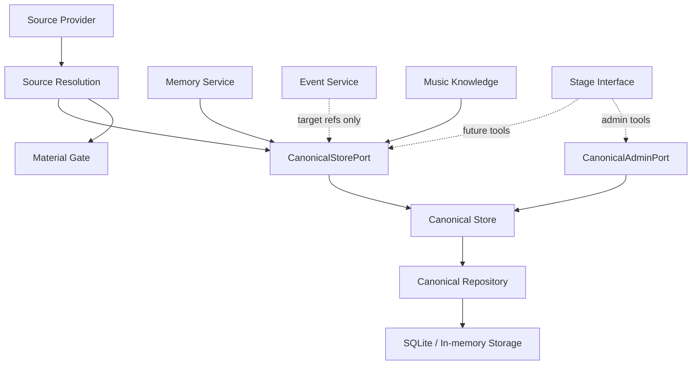
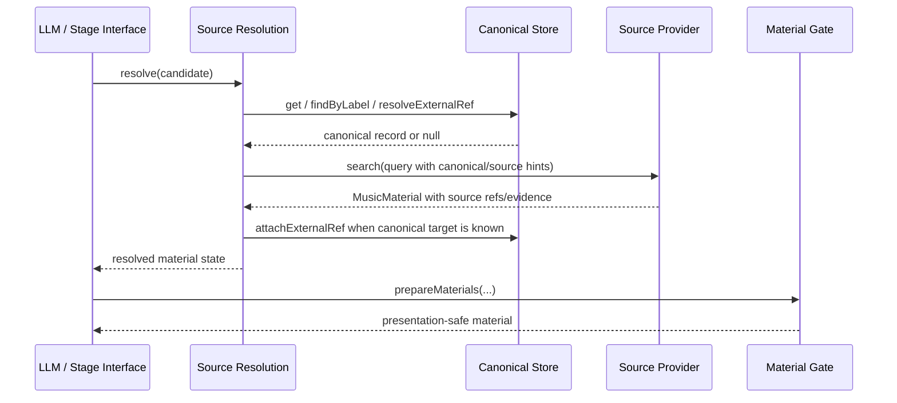

# Canonical Store Design

## Status

Design document. Canonical Store implementation progress is tracked separately
in `docs/canonical-store/progress.md`.

## Purpose

Canonical Store is MineMusic's identity ledger.

It answers:

```text
Which MineMusic-owned identity are we talking about?
```

It does not answer:

```text
Is this playable right now?
Should this be recommended?
Does the user like this?
Can a provider account access this?
```

Those questions belong to Source Resolution, Material Gate, Memory Service,
Effect Boundary, or the LLM.

## Core Responsibilities

Canonical Store owns:

- MineMusic canonical refs.
- canonical records.
- provisional identity records.
- external source or knowledge evidence attached to canonical records.
- alias lookup for identity matching.
- merge/rejection state once admin operations exist.

Canonical Store does not own:

- source provider search.
- playable links.
- provider account state.
- user preference.
- recommendation scoring.
- event history.
- memory decisions.
- playback or external effects.

## Entity Model

The durable storage model is specified in
`docs/canonical-store/storage-model.md`.

The first canonical entity kinds should align with the current contract and
music metadata references:

```text
artist
work
recording
release_group
```

MVP behavior should prioritize `recording`, because most source-backed playable
materials map to concrete recordings. `work`, `artist`, and `release_group`
remain available for future memory and knowledge use.

Source-context `track` ids should normally remain external refs rather than
MineMusic canonical kinds.

## Status Model

Canonical records use:

```text
active
provisional
merged
rejected
```

Meaning:

| Status | Meaning | Normal Lookup |
| --- | --- | --- |
| `active` | accepted MineMusic identity anchor | yes |
| `provisional` | useful but not fully settled identity anchor | yes, with visible provisional state |
| `merged` | historical identity redirected into another canonical record | no by default |
| `rejected` | invalid or intentionally discarded identity candidate | no by default |

`merged` and `rejected` records exist for auditability. They should not appear
as ordinary `findByLabel` or `resolveExternalRef` hits unless the caller
explicitly asks for historical state.

## Component Boundaries



Rules:

- Providers never call Canonical Store directly.
- Stage Interface does not call repositories directly.
- Memory Service must not convert source refs into canonical refs by itself.
- Event Service records refs passed by callers; it should not create identity.
- Material Gate never queries Canonical Store.
- Admin operations are separate from normal recommendation flow.

## Normal Resolution Flow



Source Resolution may use Canonical Store to check known identities and attach
evidence. It still owns material state upgrades such as `confirmed_playable` and
`source_only_playable`.

## Provisional Creation Flow

Canonical Store should create provisional records only when the caller has a
reason to preserve identity across events or memory.

Examples:

- user explicitly confirms "yes, this version".
- user gives wrong-version feedback.
- memory needs a durable target and only source evidence exists.

Before creating a provisional record, Canonical Store should:

1. check every evidence ref through `resolveExternalRef`.
2. check normalized label and aliases for the same kind.
3. reuse an existing active/provisional record when found.
4. otherwise create a new provisional identity and attach evidence.

This prevents accidental duplicate provisional records.

## External Evidence

External refs are evidence rows, not canonical authority.

Example:

```text
source:netease / track / 22644323
```

This can support:

```text
minemusic:recording:<id>
```

but it is not itself MineMusic identity.

`resolveExternalRef` should be understood as:

```text
Find the canonical record already attached to this external ref.
```

It is not fuzzy matching and should not infer identity from a search result by
itself.

## Domain Events

The existing MVP docs list these domain events:

```text
canonical.provisional.created
canonical.external_ref.attached
```

The current code does not yet wire Canonical Store to a domain-event publisher.
The implementation should not fake this. When event infrastructure is ready,
Canonical Store should publish these events from the same transaction boundary
or record enough data for an outbox-style event.

## Implementation Phases

### Phase 1: Durable Identity Skeleton

Implement SQLite-backed storage for:

- canonical entities.
- external refs.
- aliases.

Keep the existing public MVP methods:

- `get`
- `findByLabel`
- `resolveExternalRef`
- `createProvisional`
- `attachExternalRef`

Add tests that create records, reopen storage, and prove lookup still works.

### Phase 2: Identity Hygiene

Add:

- alias handling.
- duplicate provisional prevention.
- status filtering.
- stricter external-ref conflict behavior from database constraints.

### Phase 3: Admin Operations

Add a separate admin interface for:

- activate.
- reject.
- merge.
- list.

These operations change identity semantics and should not be available through
normal recommendation flow.

### Phase 4: Domain Events

Wire canonical domain events after the event/outbox boundary is chosen.

## Code References

| Concern | File | Key Symbols |
| --- | --- | --- |
| Current Canonical Store | `src/canonical/index.ts` | `createCanonicalStore` |
| Public ports | `src/ports/index.ts` | `CanonicalStorePort` |
| Shared contracts | `src/contracts/index.ts` | `CanonicalRecord`, `Ref`, `DomainEventType` |
| In-memory storage | `src/storage/index.ts` | `createInMemoryCanonicalRecordRepository` |
| Source integration | `src/source/index.ts` | `createSourceResolutionService` |
| Current tests | `test/canonical/canonical-store.test.ts` | canonical store runtime tests |
| Storage design | `docs/canonical-store/storage-model.md` | table and transaction model |
| Progress | `docs/canonical-store/progress.md` | implementation status and verification |

## Open Decisions

- Whether `track` is ever a MineMusic canonical kind, or always source-context
  evidence for `recording`.
- Whether `get` should follow merge redirects automatically.
- Whether admin operations are CLI-only or later exposed through a governed
  Stage Interface tool.
- How domain events are persisted: direct Event Service record, domain event
  bus, or outbox table.
