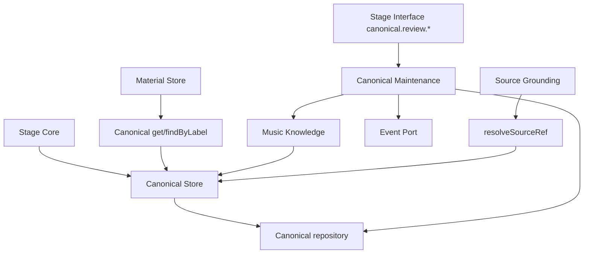

# Canonical Store Design

Canonical Store is the canonical identity subdomain inside Material Store. It
owns MineMusic canonical records, canonical identity evidence, provisional
relations and hints, and Canonical Maintenance review state.

Current implementation lives under `src/material/store/canonical/**`.

## Boundary

Canonical Store owns:

- canonical records and statuses;
- label lookup and current-record lookup;
- canonical source-ref evidence in the current `canonical_source_refs` schema;
- provisional relations and provisional hints used by review;
- Canonical Maintenance inspection, apply, auto-update, and review-state
  workflows.

Canonical Store does not own:

- Source Entity Store records or Source Library membership;
- ordinary source-to-canonical binding for imported provider-library items;
- Material Registry `materialRef` identity;
- Collection items;
- provider search or provider transport;
- playable-link availability;
- recommendation selection or Stage Interface compact output.

## Components

| Component | Code | Responsibility |
| --- | --- | --- |
| Canonical Store service | `src/material/store/canonical/index.ts` | Implements `CanonicalStorePort` over canonical storage. |
| Canonical Storage helper | `src/material/store/canonical/storage.ts` | Repository-backed lookup, write mapping, redirect following, relations, hints, and review state. |
| Canonical Maintenance | `src/material/store/canonical/maintenance.ts` | Implements `CanonicalMaintenancePort` for review list/inspect/apply/auto-update. |
| Review qualification | `src/material/store/canonical/review-qualification.ts` | Internal deterministic qualification for auto-update and ordering. |
| SQLite repository | `src/storage/sqlite/canonical-repository.ts` | Durable canonical records, source refs, relations, hints, and review state. |

## Current Flow

Material Store consumes only canonical `get` and `findByLabel`. Stage Interface
canonical review tools consume `CanonicalMaintenancePort`, not repositories.

Source Grounding still consumes `CanonicalStorePort.resolveSourceRef`; that
conflicts with ADR-0002 and is tracked as `AI-002`.

## Canonical Source Refs

The current canonical schema still persists `canonical_source_refs` and
`CanonicalStorePort` still exposes `resolveSourceRef` / `attachSourceRef`.
In the current architecture, Source Entity Store and Confirmed Canonical
Bindings are the ordinary source-library binding path. Canonical source refs
remain canonical evidence and review support, not Source Library state.

## Current Inconsistencies

- `AI-002`: ADR-0002 says ordinary business modules should stop using
  `CanonicalStorePort.resolveSourceRef`; Source Grounding still uses it for
  source material normalization.

## Related Documents

- `docs/canonical-store/ports.md`
- `docs/canonical-store/provisional-review.md`
- `docs/canonical-store/storage-model.md`
- `docs/canonical-store/progress.md`
- `docs/material-store/design.md`
- `docs/adr/0002-material-store-boundary.md`
- `docs/archive/canonical-store/README.md`
