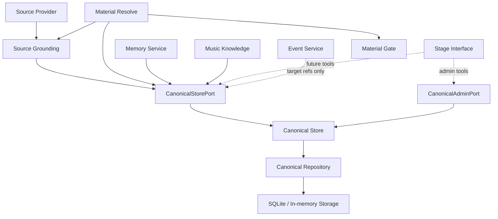
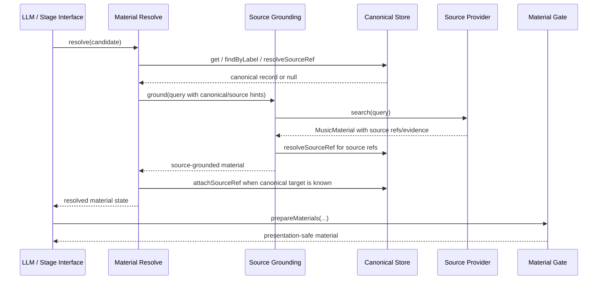

# Canonical Store Design

## Status

Design document. Canonical Store implementation progress is tracked separately
in `docs/canonical-store/progress.md`.

## Purpose

Canonical Store is MineMusic's identity ledger.

It answers:

```text
Which MineMusic-owned identity are we talking about?
```

It does not answer:

```text
Is this playable right now?
Should this be recommended?
Does the user like this?
Can a provider account access this?
```

Those questions belong to Material Resolve, Source Grounding, Material Gate,
Memory Service, Effect Boundary, or the LLM.

## Core Responsibilities

Canonical Store owns:

- MineMusic canonical refs.
- canonical records.
- provisional identity records.
- source-ref or knowledge evidence attached to canonical records.
- alias lookup for identity matching.
- merge/rejection state once admin operations exist.

Canonical Store does not own:

- source provider search.
- playable links.
- provider account state.
- user preference.
- recommendation scoring.
- event history.
- memory decisions.
- playback or external effects.

## Entity Model

The durable storage model is specified in
`docs/canonical-store/storage-model.md`.

The first canonical entity kinds should align with the current contract and
music metadata references:

```text
artist
work
recording
release_group
release
```

MVP behavior should prioritize `recording`, because most source-backed playable
materials map to concrete recordings. `release` is needed when platform account
libraries expose concrete album saves. `work`, `artist`, and `release_group`
remain available for future memory, knowledge, and edition-grouping use.

Source-context `track` ids should normally remain source refs rather than
MineMusic canonical kinds.

## Status Model

Canonical records use:

```text
active
provisional
merged
rejected
```

Meaning:

| Status | Meaning | Normal Lookup |
| --- | --- | --- |
| `active` | accepted MineMusic identity anchor | yes |
| `provisional` | useful but not fully settled identity anchor | yes, with visible provisional state |
| `merged` | historical identity redirected into another canonical record | no by default |
| `rejected` | invalid or intentionally discarded identity candidate | no by default |

`merged` and `rejected` records exist for auditability. They should not appear
as ordinary `findByLabel` or `resolveSourceRef` hits unless the caller
explicitly asks for historical state.

## Component Boundaries



Rules:

- Providers never call Canonical Store directly.
- Stage Interface does not call repositories directly.
- Memory Service must not convert source refs into canonical refs by itself.
- Event Service records refs passed by callers; it should not create identity.
- Material Gate never queries Canonical Store.
- Admin operations are separate from normal recommendation flow.

## Normal Resolution Flow



Material Resolve may use Canonical Store to check known identities and attach
source evidence. Source Grounding may use Canonical Store to recognize known
source refs and normalize source-backed material state such as
`confirmed_playable` and `source_only_playable`.

## Provisional Creation Flow

Canonical Store should create provisional records only when the caller has a
reason to preserve identity across events or memory.

Examples:

- user explicitly confirms "yes, this version".
- user gives wrong-version feedback.
- memory needs a durable target and only source evidence exists.

Before creating a provisional record, Canonical Store should:

1. check every evidence ref through `resolveSourceRef`.
2. reuse an existing active/provisional record only when an evidence ref is
   already bound.
3. keep normalized label and alias lookup available for candidate discovery and
   later review, but do not treat label-only matches as automatic identity
   proof.
4. otherwise create a new provisional identity and attach evidence.

This prevents duplicate provisional records for already-bound evidence without
falsely merging same-title recordings.

Different source refs also do not prove different recordings. Separate
provisional records created from separate source refs are source-bound
placeholders, not a final assertion that the recordings are distinct. Later
review/admin merge can collapse them when stronger identity evidence exists.

Provisional records may have provisional relations. For imported recordings,
Library Import can record provider-hint context and, when stable provider
source refs are available, link those relations to provisional artist and
release canonical records:

- `performed_by` with an artist label and optional artist `objectRef`.
- `appears_on_release` with a release label and optional release `objectRef`.
- `has_duration_ms` with a duration value.

These relations are part of the provisional graph. They let later catalog
queries navigate from a recording to its artist and release when source-ref
hints are present. They help later review, dedupe, and merge work, but they
are not automatic identity proof.

Provisional records may also have separate source-side provisional hints. For
recording review, `source_recording_context` stores facts such as source title,
artist labels, release context, duration, and source release track position.
These hints are attached to the provisional recording and provider source ref.
They are review evidence for ruling out plausible alternatives, not canonical
relations and not identity proof.

## Source-Ref Evidence

Source refs are evidence rows, not canonical authority.

Example:

```text
source:netease / track / 22644323
```

This can support:

```text
minemusic:recording:<id>
```

but it is not itself MineMusic identity.

`resolveSourceRef` should be understood as:

```text
Find the canonical record already attached to this source ref.
```

It is not fuzzy matching and should not infer identity from a search result by
itself.

## Domain Events

The existing MVP docs list these domain events:

```text
canonical.provisional.created
canonical.source_ref.attached
```

The current code does not yet wire Canonical Store to a domain-event publisher.
The implementation should not fake this. When event infrastructure is ready,
Canonical Store should publish these events from the same transaction boundary
or record enough data for an outbox-style event.

## Implementation Phases

### Phase 1: Durable Identity Skeleton

Implement SQLite-backed storage for:

- canonical entities.
- source refs.
- aliases.

Keep the existing public MVP methods:

- `get`
- `findByLabel`
- `resolveSourceRef`
- `createProvisional`
- `attachSourceRef`

Add tests that create records, reopen storage, and prove lookup still works.

### Phase 2: Identity Hygiene

Add:

- alias handling.
- duplicate provisional prevention.
- status filtering.
- stricter source-ref conflict behavior from database constraints.

### Phase 3: Admin Operations

Add a separate admin interface for:

- activate.
- reject.
- merge.
- list.

These operations change identity semantics and should not be available through
normal recommendation flow.

### Phase 4: Domain Events

Wire canonical domain events after the event/outbox boundary is chosen.

## Current Implementation Boundary

The completed MVP implementation covers Phase 1 and Phase 2 behavior for the
existing `CanonicalStorePort` methods:

- durable SQLite-backed canonical repository.
- evidence reuse for provisional identity creation, with label and alias lookup
  kept as candidate discovery rather than automatic identity merging.
- provisional relation recording/listing for provider-hint context, including
  optional linked artist/release `objectRef`s.
- provisional hint recording/listing for source-side review context, kept
  separate from `CanonicalRelation`.
- active/provisional filtering for ordinary lookup.
- idempotent same-record source-ref attachment.
- Stage Core repository injection with in-memory storage as the default.
- restart-style persistence coverage through a temp SQLite database.

Still outside the implementation:

- public alias write method.
- admin activate/reject/merge/list operations.
- merge redirects.
- canonical domain-event publication.

## Code References

| Concern | File | Key Symbols |
| --- | --- | --- |
| Current Canonical Store | `src/canonical/index.ts` | `createCanonicalStore` |
| Canonical normalization | `src/canonical/normalization.ts` | `normalizeCanonicalLabel`, `sameRef` |
| Canonical storage mechanics | `src/canonical/storage.ts` | `createCanonicalStorage` |
| Public ports | `src/ports/index.ts` | `CanonicalStorePort` |
| Shared contracts | `src/contracts/index.ts` | `CanonicalRecord`, `CanonicalRelation`, `Ref`, `DomainEventType` |
| In-memory storage | `src/storage/index.ts` | `createInMemoryCanonicalRecordRepository` |
| SQLite schema | `src/storage/sqlite/canonical-schema.ts` | `initializeCanonicalSchema` |
| SQLite repository | `src/storage/sqlite/canonical-repository.ts` | `createSqliteCanonicalRecordRepository` |
| Stage Core wiring | `src/stage_core/index.ts` | `canonicalRepository`, `canonicalDatabasePath` factory options |
| Material Resolve integration | `src/material_resolve/index.ts` | `createMaterialResolveService` |
| Source Grounding integration | `src/source/index.ts` | `createSourceGroundingService` |
| Current tests | `test/canonical/canonical-store.test.ts` | canonical store runtime tests |
| Persistence tests | `test/integration/canonical-persistence.test.ts` | Stage Core persistence test |
| Storage design | `docs/canonical-store/storage-model.md` | table and transaction model |
| Progress | `docs/canonical-store/progress.md` | implementation status and verification |

## Open Decisions

- Whether `track` is ever a MineMusic canonical kind, or always source-context
  evidence for `recording`.
- Whether `get` should follow merge redirects automatically.
- Whether admin operations are CLI-only or later exposed through a governed
  Stage Interface tool.
- How domain events are persisted: direct Event Service record, domain event
  bus, or outbox table.
