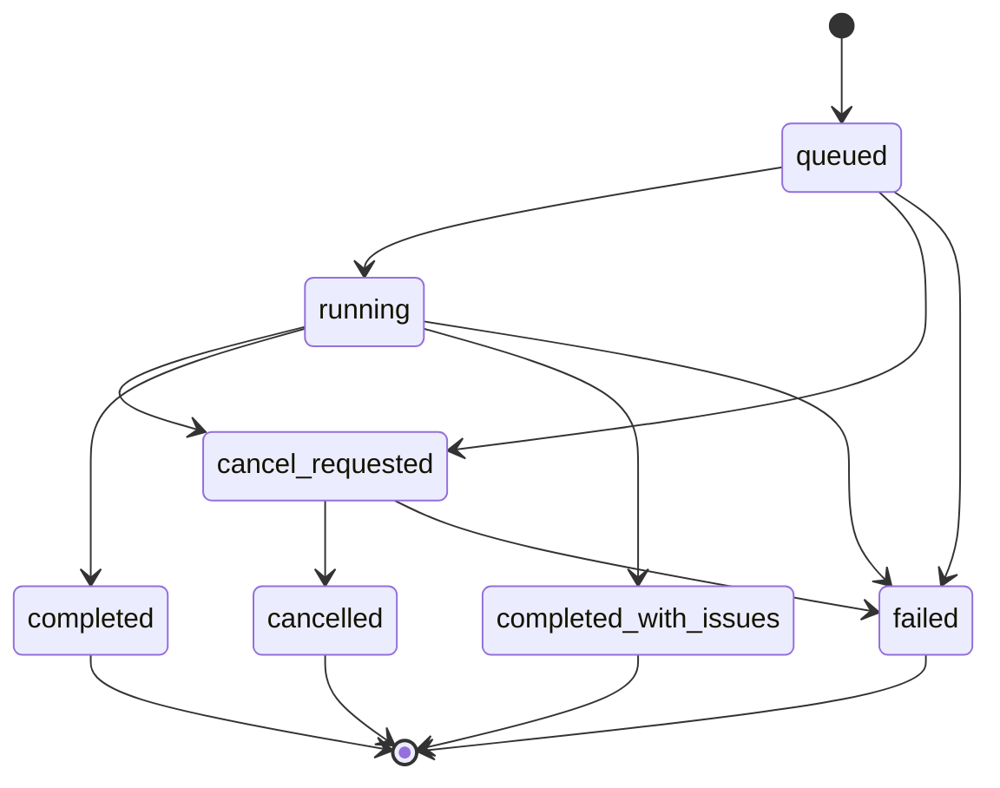

# Phase 26 Local Source Scan Management - Decisions

> Status: Planning (grilling decisions locked; implementation not started)
> Owner: Music Data Platform, with filesystem access and machine-path
> configuration supplied by Server Host / runtime composition
> Evidence input:
> `docs/music-data-platform/local-source-scan-songloft-investigation.md`
> Authority inputs: `ARCHITECTURE.md`, ADR-0042, ADR-0043, the formal glossary,
> and the implemented Phase 25 Local Source root-path identity

## Why This Document

Phase 25 established Local Source identity and registration, but it deliberately
did not implement discovery or scan management. This phase turns configured
user-owned music directories into observable, resumable local-file intake while
preserving MineMusic's existing Source, Material, owner catalog, projection,
Background Work, and Stage Interface boundaries.

This document was written during a design grilling pass. It records decisions
that are already forced by current authority or explicitly confirmed during the
discussion, then translates them into an implementation-ready architecture and
slice plan.

## Decision Status Convention

- **[grilled]** - explicitly settled during this discussion.
- **[authority-forced]** - already settled by current architecture, glossary,
  ADR, or implemented source contract.
- **[invariant]** - a rule the implementation and tests must enforce.

## Confirmed Decisions

### D0. Intake and ownership model - [authority-forced] [invariant]

Local scan is Music Data Platform-owned intake of local audio files. It is not
a Platform Library Provider, not a provider-shaped Source Library mirror, and
not a new top-level Library area.

- A discovered file becomes a `Local Source` through the existing
  `createLocalSource({ rootId, relativePath, contentMd5, ... })` command
  boundary.
- Local Source identity remains `rootId + normalized relativePath`.
  `contentMd5` is a non-unique content fact and must not infer path moves,
  Source identity, or Material identity.
- The reserved Main Local Source Root (`rootId = "main"`) remains the managed
  destination for MineMusic-localized downloads. User-owned scanned libraries
  use separately configured scan roots.
- Machine-specific absolute root paths and filesystem access stay at the Server
  Host / runtime boundary. Durable Music Data Platform facts use root ids and
  normalized root-relative paths.
- Scan orchestration may call filesystem read capabilities and Music Data
  Platform commands. It must not write repositories directly.
- Background Work owns execution mechanics. Music Data Platform owns scan batch
  semantics, item outcomes, current scan-root membership, and reconciliation.
- Stage Interface may expose compact scan controls and status through an
  MDP-owned stage adapter; it must not expose arbitrary absolute paths, parser
  payloads, or storage rows.

## Decision Map

The grilling pass resolved these branches:

1. scan-root cardinality and configuration lifecycle;
2. first-scan and rescan semantics;
3. changed, moved, and disappeared file behavior;
4. metadata and media-asset scope;
5. progress, failure, retry, and cancellation behavior;
6. manual, startup, watcher, or scheduled triggers;
7. internal module API and deferred public management surfaces;
8. catalog membership and scan-root scopes;
9. implementation slices, guards, verification, and acceptance.

### D1. Multiple Scan Roots - [grilled]

Phase 26 supports multiple configured Scan Roots from the first version. This
is a product capability, not merely storage schema reserved for later.

- Each Scan Root has its own stable `rootId`, display label, machine-path
  mapping, scan policy, current status, and scan history.
- Every scan targets exactly one Scan Root. Cross-root "scan all" orchestration
  is not required for v1.
- A Local Source belongs to the root named by its identity; identical relative
  paths in different roots remain different Local Sources.
- Root-specific batches and membership prevent one unavailable drive or NAS
  share from blocking reconciliation of another root.

### D2. Module-first scope - [grilled]

Phase 26 first builds the Local Source Scan module as an internal, independently
callable and testable capability. Workbench/Web UI, native directory pickers,
and UI configuration protocols are deferred.

The module boundary must not depend on a future UI shape. A later UI or Stage
Adapter may call the same internal capabilities without moving scan semantics,
filesystem traversal, or durable writes into the presentation boundary.

### D3. Startup-injected, runtime-read-only roots - [grilled] [invariant]

Server Host supplies the complete Scan Root configuration set when composing
the runtime. Phase 26 does not support adding, updating, or removing roots while
the process is running.

The composition input is conceptually:

```ts
type LocalSourceScanRootConfig = {
  rootId: string;
  rootDir: string;
  label: string;
  excludes?: readonly LocalSourceScanExclude[];
};
```

- `rootDir` is the machine-specific absolute path and remains inside Server
  Host/runtime configuration and the filesystem adapter.
- Music Data Platform durable scan facts refer to the stable `rootId`; they do
  not persist `rootDir` as Source identity or expose it through agent-facing
  output.
- The module may list the injected roots and their availability, but its root
  set is immutable for the lifetime of the composed runtime.
- Configuration changes require runtime restart in v1. Dynamic Host config
  persistence and root lifecycle commands are deferred with the UI.

### D4. One reconcile scan mode - [grilled] [invariant]

Phase 26 exposes one scan operation rather than separate `incremental` and
`reimport` modes. The caller asks the module to reconcile one Scan Root; the
module owns change detection and work selection.

Every scan:

1. traverses the full configured root and observes every supported file path;
2. registers and parses new files;
3. reparses files whose stored change evidence no longer matches;
4. marks unchanged files observed without reparsing them;
5. records per-file outcomes; and
6. reconciles disappeared membership only when traversal reaches trusted root
   exhaustion.

The module may persist size, modification time, or another explicit cheap
change-evidence tuple to avoid repeated metadata extraction and content hashing
for unchanged files. Those values are scan bookkeeping, not Local Source
identity.

Forced full metadata reimport is deferred. It may later be introduced as a
maintenance operation without changing the ordinary scan contract.

### D5. Same-path content drift is explicit - [grilled] [invariant]

When a previously registered Local Source path is observed with a different
`contentMd5`, ordinary scan does not update the Source snapshot or change its
Material binding.

- The path remains the same Local Source identity under ADR-0042.
- The scan item becomes `drifted` and records a compact `content_changed`
  outcome for the batch.
- Existing Source, Material, binding, and owner facts remain unchanged.
- Ordinary scan does not guess whether the change was a tag edit, audio
  replacement, or a different recording copied over the path.
- Refresh/rebind is a future explicit maintenance operation. Its policy must
  decide whether to preserve or replace the Material binding before changing
  the Source snapshot.
- Repeated reconcile scans remain stable: the unresolved drift is reported
  again without creating duplicate Sources or Materials.

### D6. A moved path is a different Local Source - [authority-forced]

Scan does not infer rename or move from matching content hashes. If
`A/track.flac` disappears and `B/track.flac` appears, the new path is registered
as a new Local Source and the old path is handled by disappeared-membership
reconciliation. A future explicit move command may migrate identity; ordinary
scan does not.

### D7. Disappeared files enter deletion - [grilled]

When a trusted complete scan proves that a previously scanned path no longer
exists, Phase 26 must delete rather than retain that path as a long-lived
`absent` scan membership.

The deletion boundary and cascade scope are fixed by D8. An interrupted,
cancelled, partial, or root-unavailable scan never proves disappearance and
must not run this deletion path.

### D8. Delete the scanned Source, not shared music truth - [grilled] [invariant]

For each path proved missing, reconciliation atomically deletes:

- the current Scan Root membership/item record;
- the corresponding Local Source record; and
- that Local Source's source-material binding.

The command does not cascade into the bound Material, owner relations,
Collection membership, or any other provider/local Source. Projection
invalidation must cover the removed membership, the affected Material, and any
search/catalog read models derived from the deleted Source or binding.

The scan workflow calls one owning Music Data Platform deletion command. It
must not orchestrate repository deletes itself.

### D9. Orphan Material cleanup is separate - [grilled]

Phase 26 does not automatically archive or delete a Material after deleting its
last Source, even when no current owner relation or Collection membership is
known.

Material orphan detection must account for every current and future Material
reference. It belongs to a separate explicit maintenance/garbage-collection
command, not to Scan Root reconciliation. Scan-triggered projection
invalidation still removes the deleted Source's facts and membership from
current catalog/search views.

Consequence: deleting a Source whose Material has no other Source leaves an
orphaned Material that may still be referenced by Collections, saved/favorite
owner relations, or other owner facts (D8 preserves all of them). Such a
Material becomes a non-playable "ghost" entry in those owner views until orphan
cleanup or explicit rebind runs. Because D36 keeps no tombstone, re-adding the
same file later mints a new Material and does not restore the old Collection
entry's playability. This is the deliberate cost of not letting scan delete
user-owned music truth; Phase 26 accepts it and surfaces it here rather than
silently.

### D10. Complete path census gates deletion - [grilled] [invariant]

A batch may delete previously scanned paths that were not observed only when
the filesystem adapter proves that the configured root traversal reached
complete exhaustion.

- Every directory that belongs to the scan policy must be enumerated
  successfully.
- A corrupt audio file, tag-parser failure, or metadata read failure is a
  per-file outcome. Because the path was observed, it does not invalidate the
  root path census or block deletion of other genuinely missing paths.
- An unreadable directory, unavailable root, traversal failure, cancellation,
  interruption, or bounded/partial scan makes the census untrusted. The batch
  may retain completed item work but must not run disappeared-file deletion.
  This is census-fatal and resolves to `failed`, never to a per-file issue
  outcome (see D27).
- The trusted-complete signal comes from the filesystem adapter contract; scan
  orchestration must not infer it from counters or an empty page alone.

### D11. One active batch per Scan Root - [grilled] [invariant]

At most one non-terminal scan batch may exist for a given `rootId`. Starting a
second scan for that root returns a declared `scan_already_active` failure with
the existing `batchId` available to the internal caller.

Different roots may have submitted/non-terminal batches at the same time.
Background Work configuration owns actual worker concurrency and may execute
those batches concurrently or queue them. Music Data Platform does not impose a
global single-scan lock.

### D12. Descriptive and audio-technical Source facts - [grilled]

The first version extracts the descriptive fields modeled by the existing
`LocalSourceDescriptiveMetadata` type (defined in
`src/music_data_platform/local_source_commands.ts` as a `Pick<SourceTrack, ...>`;
`SourceTrack` itself lives in `src/contracts/music_data_platform.ts`). The
authoritative field set is that type; scan must not re-list or re-invent it.
Scanned files populate label-level fields only:

- `title` / `label`, with filename-stem fallback per D29;
- `artistLabels` and `albumLabel`;
- `trackPosition`;
- `durationMs`; and
- `versionInfo` when the parser has explicit evidence.

`artistSourceRefs` and `albumSourceRef` are deliberately left absent for scanned
files: resolving refs requires canonicalization/matching, which is outside
Phase 26. The adapter must not fabricate `Unknown Artist` / `Unknown Album`
labels (D29).

Phase 26 also adds optional Source-level `AudioTechnicalMetadata`:

```ts
type AudioTechnicalMetadata = {
  codec?: string;
  bitrateBps?: number;
  sampleRateHz?: number;
  bitDepth?: number;
  channels?: number;
};
```

These values describe the concrete audio file behind a Source. They do not
participate in Source identity, Material identity, binding, duplicate
detection, or canonical matching. `bitrateBps` uses an explicit bits-per-second
unit. This is a new explicit-unit field, not a continuation of an existing
convention: the existing `DownloadSource.bitrate` carries no declared unit, so
the parser adapter must convert its native bitrate into bps and must not assume
provider-side values already use bps.

Embedded/sidecar lyrics, cover art, ISRC, Chromaprint, and directory-derived
Collection creation remain outside Phase 26 because they require separate
fact-family, media-asset, or analysis decisions.

### D13. Built-in audio format allowlist - [grilled]

Supported formats are a module capability, not per-root user configuration.
Phase 26 uses one case-insensitive built-in extension allowlist:

```text
mp3, flac, m4a, aac, ogg, opus, wav, aiff, aif, ape, wv, dsf, dff
```

- The extension filter selects candidate files cheaply; it does not prove that
  a file contains valid audio.
- A candidate whose content cannot be parsed produces a per-file failure.
- Files outside the allowlist are ignored and do not receive outcome rows.
- Adding a format later requires parser capability and fixture verification,
  not a Scan Root configuration migration.

### D14. Name and root-relative subtree exclusions - [grilled]

Each startup-injected Scan Root may define:

```ts
type LocalSourceScanExclusions = {
  directoryNames?: readonly string[];
  relativePaths?: readonly string[];
};
```

- A directory-name rule skips an exact path segment at any depth.
- A relative-path rule skips that normalized root-relative path and all of its
  descendants.
- v1 does not support glob, regex, or arbitrary predicate configuration.
- Hidden files/directories are not excluded merely because their names start
  with `.`.
- The module provides a small built-in directory exclusion set:
  `@eaDir`, `.AppleDouble`, `System Volume Information`, and `$RECYCLE.BIN`.
- Configured exclusions are combined with the built-in set and applied before
  descending into a directory.

### D15. Ignore symbolic links - [grilled]

Phase 26 does not follow symbolic links. Both file and directory symlink entries
are skipped before format filtering or descent.

- Symlink targets do not participate in the root path census.
- A symlink is not registered as a Local Source and does not produce a parser
  failure.
- Ignoring a symlink is expected policy, so its presence does not make an
  otherwise complete traversal untrusted.
- If a previously scanned regular audio file is replaced by a symlink at the
  same relative path, the former regular-file Source is treated as disappeared
  during trusted reconciliation.
- Following symlinks later is a policy expansion that must define containment,
  cycle handling, and duplicate-path behavior explicitly.

### D16. Ten-second stability window - [grilled]

The scanner does not read, hash, or parse a candidate whose modification time
is less than ten seconds before the batch's fixed `startedAt`.

- The path is observed for the root census.
- The batch records an `unstable_file` item outcome.
- An existing Source at that path is neither updated nor treated as missing.
- A new unstable file is imported by a later reconcile scan after it becomes
  stable.
- Unstable files do not make an otherwise complete directory traversal
  untrusted and do not block reconciliation of unrelated missing paths.

### D17. Durable Background Work batch - [grilled] [invariant]

`startScan({ rootId })` creates a durable Music Data Platform scan batch,
submits Background Work, and returns its `batchId` without waiting for the root
scan to finish. Status and item outcomes survive process restart.

Workers stream discovery/processing and commit through bounded Music Data
Platform command transactions. They must not collect all file observations in
one in-memory array or hold one database transaction for the whole root.

Background Work owns claiming, retry, scheduling, and worker lifecycle. Music
Data Platform owns batch phase/status, counters, item outcomes, trusted-complete
qualification, and reconciliation. Job payloads contain compact ids and
checkpoints, not parser payloads or an array of discovered files.

The internal module provides at least:

```ts
type LocalSourceScanService = {
  startScan(input: { rootId: string }): Promise<Result<{ batchId: string }>>;
  getScanStatus(input: {
    batchId: string;
  }): Promise<Result<LocalSourceScanBatchSummary>>;
};
```

### D18. Cooperative domain-owned cancellation - [grilled] [invariant]

The module provides `requestScanCancellation({ batchId })`. Cancellation is a
Music Data Platform batch transition, not a generic Background Work backend
operation.

- A `queued` batch or a `running` batch still in `discovering` / `processing`
  moves to `cancel_requested`.
- Workers check cancellation between bounded units of work. The current file or
  transaction may finish before the request is observed.
- Already committed Local Sources and item outcomes remain committed; scan
  cancellation does not roll them back.
- The worker finishes the batch as `cancelled` and submits no further scan work.
- A cancelled batch is never trusted complete and never runs
  disappeared-file deletion.
- Repeating cancellation against `cancel_requested` or `cancelled` is
  idempotent. Cancelling a reconciling or another terminal batch returns a
  declared invalid-state failure rather than changing history.

### D19. Complete-with-issues is distinct from batch failure - [grilled]

Terminal batch statuses include:

- `completed`: trusted-complete traversal and no issue outcomes;
- `completed_with_issues`: trusted-complete traversal with one or more failed,
  drifted, or unstable file outcomes;
- `failed`: the root census or required system work could not complete;
- `cancelled`: a cancellation request was observed and finalized.

`completed_with_issues` remains eligible for disappeared-file deletion because
individual file processing failures do not invalidate the complete path census.
`failed` and `cancelled` are never eligible.

Non-terminal status/phase are separate concerns: status communicates lifecycle,
while phase may identify `discovering`, `processing`, or `reconciling` for
progress reporting.

### D20. Explicit start only - [grilled]

Phase 26 starts work only through an explicit internal
`startScan({ rootId })` call.

Server startup does not automatically scan, and v1 adds no filesystem watcher,
recurring schedule/cron, or cross-root scan-all coordinator. Future trigger
policies call the same module API and do not own scan semantics.

### D21. No Stage Interface tools in Phase 26 - [grilled]

Phase 26 exposes no `library.scan.*` tools and makes no Stage Interface schema,
tool-registration, Handbook, or public-output changes.

The slice is verified through the internal service API plus integration and
live smoke tests. A later Stage Adapter may map compact start/status/cancel and
issue-detail tools onto this module without changing scan semantics or durable
write ownership.

### D22. Active Scan Root membership enters Owner Catalog - [grilled]

Every active Scan Root membership projects a positive
`owner_material_entries` row with a new internal `entry_kind = "scan_root"`.

- Scanned materials automatically participate in the aggregate owner-visible
  `library` baseline.
- Existing material lifecycle and blocked-relation filters apply unchanged.
- Deleting disappeared membership invalidates and removes the corresponding
  active catalog entry.
- Scan Root entries carry root provenance, local first-seen/last-observed scan
  timing, and the aggregated file-system modified time used as local catalog
  recency; they do not reuse `source_library` entry kind or provider
  provenance.
- The `owner_material_entries.entry_kind` CHECK constraint gains `scan_root`
  (current values are `source_library`, `collection`, `owner_relation`). The
  existing `UNIQUE(owner_scope, entry_kind, entry_ref_key, material_ref_key)`
  must remain satisfiable with `entry_ref_key` carrying the root id; verify no
  collision with other entry kinds.
- Projection writes and invalidation remain owned by Music Data Platform.

### D23. Internal per-root catalog scope - [grilled]

`LibraryCatalogReadScope` adds an internal
`{ kind: "scan_root", rootId }` variant for recording materials. Every existing
non-`library` scope in `src/music_data_platform/library_catalog_read.ts` carries
a `ref: Ref` subject plus a material-kind filter, so this variant must either
reuse that shape (root identity expressed as a Ref) or explicitly justify
carrying a bare `rootId` string. Implementation pins the choice; the durable key
remains `rootId` either way.

The scope selects active `scan_root` owner catalog entries belonging to the
requested root and orders them by the root entry's file-system modified-time
recency rather than unrelated owner-wide catalog provenance. Phase 26 verifies
this read port directly but does not add `scan_root` to Stage Interface scope
schemas or availability output.

### D24. Persist root descriptors without machine paths - [grilled] [invariant]

Music Data Platform persists `local_source_scan_roots` descriptors containing:

```text
root_id
owner_scope
label
config_fingerprint
created_at
updated_at
```

Server Host registers/validates every startup-injected root before scan workers
start. The descriptor never stores `rootDir`. Its fingerprint covers the
scan-policy snapshot supplied at composition, such as exclusions and scanner
policy version, without exposing the absolute machine path or participating in
Local Source identity.

`config_fingerprint` is a non-branching provenance field: a stable hash of the
scan-policy snapshot (exclusions, built-in exclude set version, scanner policy
version, and label) supplied at composition. It is copied from the root
descriptor onto each batch so an observer can tell which config a batch or
item-state was established under. It is deliberately NOT a reconciliation
authority: trusted-complete deletion (D38) is driven by comparing the current
census to current items, and missing-root readiness (D39) is driven by comparing
durable roots to current Server Host configuration. A fingerprint mismatch never
deletes, retains, or blocks anything on its own. `owner_scope` reuses the
existing `assertOwnerScope` / `DEFAULT_OWNER_SCOPE` capability
(`src/music_data_platform/owner_scope.ts`); it is not a new concept.

Batch and membership records reference `root_id`. Runtime availability comes
from current Server Host configuration. Under D39, omitting an already
registered active root is a readiness error until a future explicit root
lifecycle capability exists.

### D25. Only verified active items enter the catalog - [grilled]

The `scan_root` owner catalog projection includes only current Scan Root items
whose state is `active`.

- A `drifted` item remains in scan management state but is removed from the
  Scan Root catalog projection until explicit repair succeeds.
- An existing item observed while still inside the stability window is likewise
  not presented as verified active content until a later scan confirms it.
- Local Source, Material, binding, and owner facts remain durable while the
  scan item is hidden.
- Projection invalidation occurs whenever an item's active visibility changes.

### D26. Keep success summaries and issue details - [grilled]

Phase 26 does not retain one permanent success outcome row per file per batch.

Durable long-lived state consists of:

- current Scan Root item state;
- batch lifecycle, phase, counters, timestamps, and terminal summary; and
- issue outcomes such as `failed`, `drifted`, and `unstable`.

The module may use one durable work row per observed path while a batch is
running so retries and checkpoints are idempotent. After terminal summary and
eligible reconciliation commit, ordinary `imported` / `unchanged` work rows are
deleted. Current item timestamps and batch aggregate counts preserve the useful
success evidence.

Issue-outcome retention/compaction may be added later; Phase 26 must at least
retain issue rows durably for diagnosis.

### D27. Retry transient system failures, retain deterministic issues - [grilled]

Retry classification is owned at the filesystem/parser/storage boundaries:

- temporary filesystem I/O, temporarily unavailable roots, database failures,
  worker interruption, and other retryable system failures fail the current
  bounded job so Background Work can retry it;
- malformed tags, corrupt audio, stable file permission failures, and other
  deterministic per-file failures become issue outcomes and do not loop inside
  the batch;
- a per-FILE failure (corrupt audio, bad tags, one unreadable file) is an issue
  outcome, but a per-DIRECTORY failure (unreadable directory listing) is
  census-fatal under D10, not an issue — it makes the traversal untrusted, fails
  the batch, and prohibits reconciliation. Directory and root failures must not
  be recorded as per-file issues;
- retry exhaustion for required root/system work fails the batch and prohibits
  reconciliation;
- per-file issues may still yield `completed_with_issues` after a trusted path
  census; and
- work-row, item, Source, counter, and reconciliation commands are idempotent
  under job replay.

### D28. `music-metadata` adapter, no required ffprobe - [grilled]

Core scan orchestration consumes a narrow `LocalAudioMetadataReader` port. The
first concrete adapter uses `music-metadata`, which exposes the required common
tags and optional codec, bitrate, sample rate, bit depth, channel, and duration
facts for the selected v1 formats.

Capability evidence:
<https://github.com/Borewit/music-metadata#features>

Phase 26 does not require an installed FFmpeg/ffprobe binary. Optional facts
that the parser cannot establish remain absent rather than causing fabricated
defaults. A future ffprobe fallback may be added behind the same adapter port
without changing Music Data Platform contracts or persisted fact meaning.

### D29. Embedded title first, filename fallback - [grilled]

Metadata normalization uses one fixed policy across Scan Roots:

1. a non-blank embedded title is authoritative Source metadata;
2. otherwise the normalized relative path's filename stem becomes `title`;
3. `label` equals that resulting title;
4. absent artist and album tags remain absent rather than becoming fabricated
   `Unknown Artist` / `Unknown Album` facts; and
5. v1 does not apply Songloft-style directory spam-tag repair or a configurable
   title-source switch.

### D30. Durable census before bounded processing - [grilled] [invariant]

A scan batch runs as three ordered phases:

1. `discovering`: stream the root traversal and upsert one durable work row per
   supported regular-file path with cheap filesystem evidence;
2. `processing`: consume pending work rows in bounded jobs, hash/parse only as
   required, and call owning Music Data Platform commands;
3. `reconciling`: only after a trusted-complete census and completed processing,
   delete disappeared scanned Sources and rebuild affected projections.

The discovery phase may restart from the root under job retry; work-row upsert
is idempotent by `batchId + normalized relativePath`. Processing claims work in
a stable sequence and checkpoints durable outcomes. Reconciliation is a
separate idempotent command and is never inferred merely from an empty work
page.

After terminal summary, ordinary successful work rows are cleaned according to
D26 while issue details remain.

### D31. Trust size and modification time for ordinary rescans - [grilled]

Current scan items store file size plus modification time as cheap change
evidence from their last verified processing.

- Matching size and modification time yields `unchanged`; the worker does not
  open, hash, or parse the file.
- New paths or either evidence value changing trigger full content-md5 and
  metadata processing after the stability-window check.
- A deliberately replaced file whose bytes, size, and modification time are all
  preserved may escape ordinary v1 change detection. A future explicit full
  verify operation may re-hash every file without changing the normal reconcile
  contract.
- Change evidence is scan bookkeeping and never participates in Source or
  Material identity.
- First scan of a root hashes every supported file in full (Songloft, by
  contrast, does not hash content because it uses file-path identity). This is
  a MineMusic-specific cost driven by drift detection (D5), not identity. The
  unchanged fast path only mitigates rescans; the performance checks must
  exercise a synthetic first-scan of 10k/100k files and confirm bounded
  throughput on slow storage. A deferred/partial-hash strategy is a possible
  future optimization that must not weaken drift detection.

### D32. Phase-aware honest progress - [grilled]

`getScanStatus` returns compact durable batch state:

- `batchId`, `rootId`, `status`, and `phase`;
- `startedAt`, `updatedAt`, and optional `finishedAt`;
- counts for `discovered`, `processed`, `imported`, `unchanged`, `drifted`,
  `unstable`, `failed`, and `deleted`; and
- optional compact batch-level failure code/message.

Progress is phase-aware:

```ts
type LocalSourceScanProgress =
  | { kind: "indeterminate"; phase: "discovering"; discovered: number }
  | {
      kind: "determinate";
      phase: "processing";
      completed: number;
      total: number;
    }
  | {
      kind: "determinate";
      phase: "reconciling";
      completed: number;
      total: number;
    }
  | { kind: "complete"; total: number };
```

Discovery cannot report a truthful percentage before traversal establishes the
total. Processing uses `processed / discovered`; bounded reconciliation uses
handled deletions over the known deletion-candidate count. Status does not
invent weighted overall percentages or expose a misleading single
`currentFile` under concurrent workers.

### D33. Paginated issue details - [grilled]

The internal module provides a separate paginated issue read:

```ts
listScanIssues(input: {
  batchId: string;
  cursor?: string;
  limit: number;
}): Promise<Result<{
  items: readonly LocalSourceScanIssue[];
  nextCursor?: string;
}>>;
```

Each issue contains only its stable batch sequence, root-relative path, issue
kind (`failed | drifted | unstable`), compact code, and compact message. Results
page in stable sequence order.

Absolute paths, parser-native payloads, stack traces, and storage rows remain at
the filesystem/parser/logging boundaries. `getScanStatus` returns counts rather
than embedding issue arrays.

### D34. Five-operation internal service - [grilled]

The Phase 26 caller-facing port is:

```ts
type LocalSourceScanService = {
  listRoots(): Promise<readonly LocalSourceScanRootSummary[]>;

  startScan(input: {
    rootId: string;
  }): Promise<Result<{ batchId: string }>>;

  getScanStatus(input: {
    batchId: string;
  }): Promise<Result<LocalSourceScanBatchSummary>>;

  requestScanCancellation(input: {
    batchId: string;
  }): Promise<Result<LocalSourceScanBatchSummary>>;

  listScanIssues(input: {
    batchId: string;
    cursor?: string;
    limit: number;
  }): Promise<Result<LocalSourceScanIssuePage>>;
};
```

Expected caller failures such as unconfigured root, active-batch conflict,
unknown batch, invalid cursor, and invalid cancellation state use `Result`.
Database/system failures, corrupt durable state, and broken internal contracts
throw at their owning boundary; handlers must not turn them into empty roots,
empty issues, or fabricated successful batches.

### D35. Bounded four-file processing concurrency - [grilled]

Root discovery traverses sequentially. Processing one root uses a bounded pool
with default `maxConcurrentFilesPerRoot = 4`, configurable by Server Host at
startup.

Each item still commits through its owning short Music Data Platform command
transaction. Workers do not share one root-sized transaction. Background Work
controls job concurrency across roots; Host configuration may lower per-root
file concurrency to one for slow NAS or mechanical-disk workloads.

### D36. No restore tombstone - [grilled]

Disappeared-file deletion retains no path-to-former-Material tombstone. If the
same root-relative path later becomes a regular audio file again, scan
recreates the deterministic Local Source ref from the same root-relative path
(the ref is the digest of `rootId + normalized relativePath` per ADR-0042; file
facts are not part of the ref) and, with no surviving binding, creates a new
Material from current file facts.

The module does not restore the former binding or transfer saved/favorite,
Collection, or other owner facts from an orphaned former Material. Matching the
former content hash does not change this rule.

### D37. No automatic duplicate collapse - [authority-forced]

Different root paths are different Local Sources even when `contentMd5` or
metadata match. Ordinary scan supplies no `materialRef` for new files, so each
new Local Source creates its own Material anchor. Duplicate suggestions and
explicit merge/rebind are later review capabilities; scan does not collapse
files automatically.

### D38. Exclusions remove scanned content on trusted reconciliation - [grilled]

Changing startup configuration requires a restart. On the next trusted scan,
paths under a newly configured exclusion are intentionally outside that Scan
Root census and enter the same deletion command as other disappeared scanned
files.

Removing an exclusion makes matching files eligible for fresh intake on the
next scan. Exclusion changes do not preserve hidden active membership or create
a second inactive library state.

### D39. Missing registered root configuration fails readiness - [grilled]

During startup registration, every durable active Scan Root descriptor must have
one current Server Host configuration entry. Omitting an already registered root
fails scan-module readiness with `scan_root_configuration_missing`.

Configuration omission does not delete Sources, disable catalog membership, or
create an implicit removed-root state. Explicit root removal is a future
lifecycle command with its own cascade decision.

### D40. Unavailable configured roots are isolated - [grilled]

A configured root whose machine path is currently missing or unreadable does
not block scan-module readiness or other roots.

- `listRoots()` reports it as unavailable.
- `startScan({ rootId })` returns retryable `scan_root_unavailable` without
  creating a batch when unavailability is known at start.
- If the root becomes unavailable during a batch, bounded work follows D27
  retry policy and eventually fails the batch if retries exhaust.
- Unavailable or failed traversal never qualifies disappearance and never runs
  deletion.

### D41. Reject overlapping configured roots - [grilled] [invariant]

Runtime configuration rejects Scan Root paths that are equal to, ancestors of,
or descendants of another Scan Root path. Scan Roots must also not overlap the
Main Local Source Root.

Configuration always validates unique ref-safe `rootId` values (excluding the
reserved `main`), non-blank labels, and absolute root paths. Unavailable paths
receive lexical normalized overlap checks; available paths additionally use
canonical filesystem paths to catch aliases. Symlink traversal remains disabled
under D15.

### D42. One self-driving advance job type - [grilled]

Background Work registers one job type:

```text
music_data_platform.local_source_scan_advance
payload: { batchId }
```

Each handler invocation reads the durable batch phase, advances one bounded
unit, and submits the next job only when the batch remains non-terminal. Job
payloads never carry absolute paths, directory/file arrays, parser output, or
scan counters. Background Work executes and retries jobs; Music Data Platform
owns the scan state machine.

Deduplication is keyed by the stable string
`local_source_scan:advance:<batchId>:<advanceGeneration>`. The scan job passes
it as the `idempotencyKey` field on the existing Background Work submit input
(`BackgroundWorkSubmitInput.idempotencyKey` in `src/background_work/backend.ts`,
the same field every other advance job uses — e.g.
`src/music_data_platform/library_import_commands.ts`); the background_work
backend (`src/background_work/pg_boss_backend.ts`) hashes that key into a
deterministic job `id`, and pg-boss v12 — which exposes no `idempotencyKey` send
option — returns null on id collision, which the backend resolves to the
existing job. The Music Data Platform scan module passes the key and never
imports pg-boss or hand-rolls the hash; doing so would violate the MDP import
guard. The `advance_generation` counter is the replay/idempotency authority,
and the work-row compare-and-set is a second layer, not the only one.

### D43. Reconciliation is an uncancellable commit phase - [grilled]

Cancellation is accepted only while a batch is queued, discovering, or
processing. Once the batch enters `reconciling`, cancellation returns
`scan_batch_invalid_state`; the bounded reconciliation chain continues to a
completed terminal status.

This prevents a `cancelled` batch from having already deleted only part of its
trusted disappearance set.

### D44. Process termination resumes durable work - [invariant]

Every work completion and each disappeared-file deletion is one atomic command
transaction. Process termination therefore leaves the unit either committed or
pending; retry never observes half a membership/binding/Source deletion.

On restart, runtime initialization queries non-terminal batches after root
readiness validation and idempotently submits their current advance generation:

- `queued`, `discovering`, `processing`, and `reconciling` batches resume;
- `cancel_requested` batches resume only to finalize `cancelled`; and
- terminal batches are never resubmitted.

This startup recovery closes the crash window after an MDP advance transaction
commits but before the handler submits its next job. If both a prior pg-boss job
retry and startup recovery submit, both derive the same deterministic
generation-keyed job id (`local_source_scan:advance:<batchId>:<advanceGeneration>`)
and pg-boss collapses the duplicate; the compare-and-set work-row and counter
transitions are additionally idempotent. During reconciliation, already deleted
Sources are no longer candidates; remaining candidates continue until the fixed
deletion total is complete.

This startup-resubmit capability is new runtime behavior. The existing
source-library import advance loop does not query non-terminal batches on
restart and has the same latent strand window; Phase 26 introduces the recovery
for scan batches only and does not retrofit source-library import. The recovery
must be exercised by the process-restart test in the state-machine suite.

## Goal

Deliver an internal, durable Local Source Scan module that can reconcile
multiple configured Scan Roots into Local Sources, Materials, current Scan Root
membership, owner catalog entries, and search metadata while remaining safe
under retry, cancellation, process restart, partial filesystem failure, content
drift, and disappeared files.

## Non-Goals

- No Workbench/Web UI, native directory picker, or settings protocol.
- No Stage Interface `library.scan.*` tools or public scope schema changes.
- No dynamic root add/update/remove command.
- No startup, watcher, cron, or scan-all trigger.
- No forced full reimport/full-verify mode.
- No content-drift repair, explicit move/rename, duplicate merge, or orphan
  Material garbage collection.
- No cover art, lyrics, ISRC, fingerprint, ReplayGain, waveform, or media-asset
  ingestion.
- No directory-derived Collection or playlist creation.
- No ffprobe runtime requirement.
- No old local-source data compatibility or migration shim.

## Architecture Scope

### Owners

| Responsibility | Owner |
| --- | --- |
| Scan Root descriptor, batch, work, item, issue, and reconciliation semantics | Music Data Platform |
| Local Source/Material/binding writes and deletion | Music Data Platform commands |
| Owner catalog and search projection invalidation/rebuild | Music Data Platform |
| Absolute root paths, path overlap validation, filesystem access, and Node adapters | Server Host / runtime composition |
| Job claiming, retry, scheduling, and worker lifecycle | Background Work |
| Agent-facing schemas and compact public output | Deferred Stage Interface stage adapter |

### Allowed Reads

- Startup-injected Scan Root descriptors/policies without exposing `rootDir` to
  durable Music Data Platform state.
- Root availability, directory entries, file stats, file bytes, hashes, and
  normalized metadata through narrow Server Host-provided ports.
- Current scan items, scan batches/work/issues, Source records, current
  source-material bindings, and affected Material records through MDP read
  ports.
- Projection maintenance state needed to invalidate/rebuild affected targets.

### Owned Writes

- Root descriptors, batches, durable work rows, current scan items, and issue
  outcomes through `LocalSourceScanCommands`.
- Local Source registration through one transaction-scoped registration helper
  shared with the existing `createLocalSource` command, preserving Phase 25
  semantics without nesting transactions.
- Disappeared Local Source, binding, and membership deletion through one new
  atomic MDP command.
- Owner catalog/search dirty targets through existing source-of-truth write and
  projection invalidation boundaries.

### Forbidden Dependencies And Writes

- MDP core must not import `node:fs`, `node:path`, `music-metadata`, Server
  Host, Stage Interface, or Background Work concrete adapters.
- Server/filesystem/parser adapters must not construct repositories or write
  scan, Source, Material, binding, catalog, or projection tables.
- Scan service/job orchestration must not call repository write methods or SQL
  write primitives directly.
- Stage Interface and Workbench code must not enter this phase.
- Absolute paths, parser-native objects/errors, and job backend records must
  not enter MDP entities, records, issues, or service outputs.
- No catch/fallback may turn database, filesystem, parser-contract, or runtime
  failure into empty roots, empty scans, unchanged files, or successful batch
  completion.

## Contract Additions

### Source Facts

`SourceTrack` gains optional Source-level audio technical facts:

```ts
type AudioTechnicalMetadata = {
  codec?: string;
  bitrateBps?: number;
  sampleRateHz?: number;
  bitDepth?: number;
  channels?: number;
};

type SourceTrack = SourceEntityBase & {
  // existing fields...
  audioTechnicalMetadata?: AudioTechnicalMetadata;
};
```

Boundary validation requires finite positive numbers when a numeric field is
present and rejects fabricated zero/default values. Parser absence leaves a
field absent.

### Runtime Root Configuration

The existing `localSources.rootDir` remains the Main Local Source Root. Server
Host adds Scan Root configuration conceptually shaped as:

```ts
type LocalSourceScanRootConfig = {
  rootId: string;
  rootDir: string;
  label: string;
  exclusions?: {
    directoryNames?: readonly string[];
    relativePaths?: readonly string[];
  };
};

type LocalSourceScanConfig = {
  roots: readonly LocalSourceScanRootConfig[];
  maxConcurrentFilesPerRoot?: number;
};
```

The exact config nesting may follow current `MineMusicRuntimeConfig` style, but
the semantic split between the Main Root and Scan Roots is mandatory.

## Provided And Consumed Ports

### Provided

The provided `LocalSourceScanService` is exactly D34's five-operation API.
`listRoots` returns `rootId`, label, availability, active batch id when present,
and compact last-batch summary; it never returns `rootDir`.

Music Data Platform also provides the internal catalog scope from D23 and
transaction-scoped scan command/read capabilities for its own service/job
implementation. Repositories remain low-level and are not module APIs.

### Consumed

The scan module consumes narrow capabilities such as:

```ts
type LocalSourceScanFilesystemPort = {
  checkRoot(input: { rootId: string }): Promise<Result<{
    availability: "available" | "unavailable";
  }>>;

  listDirectory(input: {
    rootId: string;
    relativeDirectoryPath: string;
  }): Promise<Result<readonly LocalSourceScanDirectoryEntry[]>>;

  inspectAudioFile(input: {
    rootId: string;
    relativePath: string;
  }): Promise<Result<{
    contentMd5: string;
    metadata: LocalSourceDescriptiveMetadata;
    audioTechnicalMetadata?: AudioTechnicalMetadata;
  }>>;
};
```

The Server Host adapter owns root-id-to-absolute-path resolution and constructs
the `music-metadata` reader. `inspectAudioFile` must compute `contentMd5` and
parse metadata from a single file read (e.g. one stream tee'd into both the
hash and `music-metadata`); reading the file twice is unacceptable for large
files and slow NAS under the D35 four-file concurrency default. Returned paths
are already root-relative and pass through the existing MineMusic normalizer at
the MDP boundary. Directory entries distinguish regular file, directory, and
symlink and carry file size and modification time when applicable.

## Durable Data Model

### `local_source_scan_roots`

One row per stable Scan Root descriptor:

```text
root_id PK
owner_scope
label
config_fingerprint
created_at
updated_at
```

No absolute path is stored. Startup registration is command-owned and rejects
durable roots missing from current config under D39.

### `local_source_scan_batches`

One durable run boundary:

```text
batch_id PK
root_id FK
owner_scope
config_fingerprint
status
phase
advance_generation
discovered_count
processed_count
imported_count
unchanged_count
drifted_count
unstable_count
failed_count
deletion_candidate_count
deleted_count
failure_code?
failure_message?
cancel_requested_at?
started_at
updated_at
finished_at?
```

A partial unique index permits at most one batch per root whose status is
`queued`, `running`, or `cancel_requested`.

### `local_source_scan_work_items`

Durable retry/checkpoint state for one batch:

```text
batch_id FK
sequence
entry_kind                 directory | audio_file
relative_path
status                     pending | succeeded | issue
size_bytes?
modified_at_ms?
created_at
updated_at
PRIMARY KEY(batch_id, relative_path)
UNIQUE(batch_id, sequence)
```

The root directory uses an explicit directory-work representation rather than
pretending the empty path is a Local Source path. Directory jobs enqueue sorted
child directories/files idempotently. Discovery becomes complete only when no
pending directory work remains and every included directory was listed
successfully.

Workers read bounded pending rows without committing a durable in-progress
claim before external I/O. Completion uses a compare-and-set transition from
`pending`; duplicate/replayed work may repeat external reads, but only the first
successful command transition changes counters or durable outcome. This avoids
stale processing leases after process death.

Ordinary successful file rows are deleted after terminal summary. Directory
rows and other non-issue execution rows are likewise temporary durable work,
not permanent scan history. Note: the `entry_kind` column here is a work-item
classifier (`directory | audio_file`) and is unrelated to
`owner_material_entries.entry_kind`; the `status` value is a coarse execution
flag (`pending | succeeded | issue`), while the specific issue kind
(`failed | drifted | unstable`) lives in `local_source_scan_issues` and is
mirrored on `local_source_scan_items.state`, so work rows need not distinguish
kinds.

### `local_source_scan_items`

Current root/path management state:

```text
root_id FK
relative_path
source_ref_key?
state                      active | drifted | unstable | failed
observed_size_bytes
observed_modified_at_ms
observed_content_md5?
first_seen_at
last_observed_at
last_batch_id
PRIMARY KEY(root_id, relative_path)
UNIQUE(source_ref_key) WHERE source_ref_key IS NOT NULL
```

`source_ref_key` is absent for a new path that has not produced a Local Source,
and for a `failed` item whose parse failed before registration. The partial
`UNIQUE(source_ref_key) WHERE source_ref_key IS NOT NULL` permits many null-key
items to coexist. Reconciliation deletion of a candidate with no
`source_ref_key` removes only the item row; it does not touch
`source_material_bindings` or `source_records` because no Source was ever
created. Only `active` rows with a current Source binding project into Owner
Catalog. `observed_content_md5` records current-file evidence for drift
diagnosis; it does not update the Local Source's authoritative `contentMd5`
while drift is unresolved.

### `local_source_scan_issues`

Durable issue detail:

```text
batch_id FK
sequence
relative_path
issue_kind                 failed | drifted | unstable
code
message
created_at
PRIMARY KEY(batch_id, sequence)
```

No parser payload, stack trace, absolute path, or generic serialized error is
stored. Issue cursor identity is batch id plus stable sequence.

## Batch State Machine



Within `running`, phase moves only forward:

```text
discovering -> processing -> reconciling -> terminal
```

The forward phase transitions are driven by work exhaustion, not by a separate
census flag: `completeCensus` advances discovering -> processing when no pending
directory work remains (fixing the discovered-file total), and
`prepareReconciliation` advances processing -> reconciling when no pending audio
work remains. Cancellation never moves into reconciliation.

## End-To-End Workflow

1. Runtime initialization validates root ids/paths/overlap, initializes schema,
   registers durable root descriptors, registers the single advance job
   handler, and resubmits non-terminal batches before workers start.
2. `startScan` checks current root availability, creates a `queued` batch and
   root-directory work row transactionally, then submits the first advance job.
3. A discovery advance lists a bounded number of directories, applies built-in
   and configured exclusions plus the fixed extension allowlist, ignores
   symlinks, and inserts sorted child work idempotently.
4. Directory exhaustion marks the census complete and moves the batch to
   `processing` with a fixed discovered-file total.
5. Processing claims a bounded file chunk and uses up to four concurrent file
   reads per root. Unchanged evidence skips file reads. Unstable files and
   deterministic parser failures become issue state. New verified files are
   registered and admitted atomically through MDP commands. Content mismatch
   marks drift without changing Source/binding facts.
6. When file work is exhausted, a command computes disappeared active item
   candidates from current items versus this batch's complete census, records
   the reconciliation total, and moves to `reconciling`.
7. Reconciliation advances in bounded deletion chunks. Each deletion atomically
   removes the scan item, the `source_material_bindings` row keyed by that
   Source's ref, and the Local Source record; it invalidates catalog/search
   projections. There is no Material-side source-set aggregate — the binding is
   a source-keyed lookup row, so deleting it is the entire update. It never
   deletes Material or owner facts.
8. Finalization selects `completed` or `completed_with_issues`, persists fixed
   counts/timestamps, cleans ordinary work rows, and submits accumulated
   projection jobs only after source-of-truth transactions commit.
9. Every committed advance increments `advance_generation`; a non-terminal
   handler submits the next job with deterministic job id
   `local_source_scan:advance:<batchId>:<advanceGeneration>` (passed through the
   existing pg-boss deterministic-id backend, since pg-boss v12 has no
   `idempotencyKey` option). Submission failure marks the batch failed with a
   compact code; retry exhaustion is translated only at the job handler boundary.

## Command Boundaries

The transaction-scoped command set must cover at least:

- register/validate root descriptors;
- create batch and initial work;
- enqueue/complete directory discovery;
- claim/checkpoint file work;
- record unchanged, imported, unstable, failed, and drifted outcomes;
- request/finalize cancellation;
- mark batch failed after retry exhaustion or chained-submit failure;
- prepare reconciliation from trusted census;
- delete one disappeared scanned Local Source atomically;
- finish terminal summary and clean ordinary work.

The imported-file command must atomically preserve these facts together:

```text
SourceRecord + MaterialRecord when new + source_material_binding
+ local_source_scan_item + batch/work counters + projection invalidation
```

To avoid nested transactions, extract the existing Local Source registration
logic into a transaction-scoped internal capability reused by both
`createLocalSource` and scan commands. This is reuse of one owning write model,
not a second registration implementation. The `runSourceOfTruthWrite` callback
today owns entity construction and writes, while the `Result` failure-code
translation (`CREATE_LOCAL_SOURCE_RESULT_FAILURE_CODES`) sits outside that
callback; the extraction must route both through the shared helper so scan does
not silently diverge from Phase 25 failure semantics.

## Projection Integration

`owner_material_entries.entry_kind` adds `scan_root`. Projection maintenance
adds root-scoped and material-scoped targets analogous to, but distinct from,
Source Library targets:

```text
owner_catalog_scan_root
owner_catalog_scan_root_material
```

Root item writes dirty the root target. Material lifecycle/source changes dirty
the material target when they can alter active visibility or projected facts.
Search metadata is dirtied for Materials whose bound Sources or Source facts
change. Source binding deletion must not leave stale Source attribution in
`search_metadata_documents`.

The owner catalog projection joins active Scan Root items through current
source-material bindings and active Materials. Provenance contains `kind =
scan_root`, `rootId`, label where useful internally, first-seen scan time, last
observed scan time, and the aggregated file-system modified time used for local
catalog recency; it contains no absolute path.

## Error Semantics

Declared service errors include at least:

```text
music_data.scan_root_not_configured
music_data.scan_root_unavailable
music_data.scan_already_active
music_data.scan_batch_not_found
music_data.scan_batch_invalid_state
music_data.scan_issue_cursor_invalid
music_data.scan_job_submit_failed
```

`scan_root_configuration_missing` (D39, a startup readiness failure when a
durable registered root lacks a current Server Host config entry) is distinct
from `scan_root_not_configured` above (a runtime caller failure when `startScan`
targets a `rootId` not in the active root set, per D34). They are different
boundaries and both are legitimate; do not unify them.

Root/path/config contract violations at initialization fail readiness. Corrupt
records, impossible state transitions, malformed adapter success values, and
writer invariant violations throw. Filesystem and parser adapters translate
expected external failures once into typed retryable/non-retryable results;
core code does not catch them again to invent fallback data.

## Implementation Slices

### Slice 26A - Contracts, config, and filesystem/parser adapters

- Add `AudioTechnicalMetadata` and SourceTrack validation.
- Add Scan Root config parsing/validation and path-overlap checks.
- Add narrow filesystem/metadata ports plus Node `music-metadata` adapter.
- Verify format fixtures, exclusions, hidden paths, symlink ignore, stability
  evidence, path normalization, and root availability.

### Slice 26B - Durable scan foundation

- Add root/batch/work/item/issue schema and records/read ports.
- Add root registration/readiness validation.
- Add batch state/counter/cancellation commands and the active-root unique
  guard.
- Add service list/start/status/cancel/issue reads without running jobs yet.

### Slice 26C - Discovery and processing

- Add the one advance job contract and self-chaining handler.
- Add durable directory discovery and trusted-census completion.
- Add size/mtime unchanged selection, stability window, hashing, metadata
  normalization, four-file bounded processing, issue recording, and retry
  classification.
- Extract transaction-scoped Local Source registration and atomically admit
  verified scan items.
- When extracting Local Source registration, share the existing
  `CREATE_LOCAL_SOURCE_RESULT_FAILURE_CODES` translation rather than
  duplicating it; the extracted helper receives `(db, writes)` and the scan
  command keeps the `Result` failure-code mapping at its own boundary so Phase
  25 semantics are preserved.

### Slice 26D - Reconciliation and projections

- Add atomic disappeared Local Source/binding/item deletion.
- Add bounded trusted reconciliation and terminal cleanup.
- Add `scan_root` owner catalog projection entries, projection-maintenance
  targets, internal per-root catalog scope, and search metadata invalidation.
- Verify no Material/owner/Collection/other-Source cascade.

### Slice 26E - Runtime wiring, smoke, and authority sync

- Wire configuration, adapters, service, schemas, handler registration, retry
  policy, and runtime accessor through Server Host composition.
- Add a live temporary-directory smoke covering start -> progress -> catalog ->
  delete-on-disappearance.
- Update MDP design/ports/progress and required root state documents only after
  implementation evidence exists.

## Expected Files

Likely additions/changes include:

```text
package.json
package-lock.json
src/contracts/music_data_platform.ts
src/server/config.ts
src/server/local_source_scan_filesystem_adapter.ts
src/server/music_data_platform_runtime_module.ts
src/music_data_platform/local_source_commands.ts
src/music_data_platform/local_source_scan_schema.ts
src/music_data_platform/local_source_scan_records.ts
src/music_data_platform/local_source_scan_read_model.ts
src/music_data_platform/local_source_scan_commands.ts
src/music_data_platform/local_source_scan_service.ts
src/music_data_platform/local_source_scan_job.ts
src/music_data_platform/owner_catalog_schema.ts
src/music_data_platform/owner_catalog_projection.ts
src/music_data_platform/library_catalog_read.ts
src/music_data_platform/projection_maintenance_commands.ts
src/music_data_platform/projection_maintenance_runner.ts
src/music_data_platform/source_of_truth_write_commands.ts
src/music_data_platform/index.ts
test/formal/music-data-platform-local-source-scan.test.ts
test/formal/server-local-source-scan-adapter.test.ts
test/formal/server-music-data-platform-runtime-module.test.ts
test/formal/music-data-platform-owner-catalog.test.ts
test/formal/music-data-platform-projection-maintenance.test.ts
test/run-stage-core-tests.ts
docs/music-data-platform/design.md
docs/music-data-platform/ports.md
docs/music-data-platform/progress.md
```

Exact file splitting may follow nearby source-library/projection patterns, but
ownership and guards above may not be weakened to reduce file count.

## Guards And Tests

- Config guard: unique/ref-safe non-`main` root ids, absolute paths, no
  root/root or root/main overlap, and durable-root completeness at readiness.
- Filesystem adapter tests: supported formats, case-insensitive extensions,
  built-in/configured exclusions, hidden files, symlink ignore, unavailable
  roots, unreadable directories, recently modified files, and no root escape.
- Parser contract tests: normalized descriptive facts, explicit units,
  optional technical fields, filename fallback, and no parser payload leak.
- State-machine tests: exact allowed transitions, one active batch per root,
  different-root coexistence, pre-reconciliation cancellation, reconciliation
  cancellation rejection, job replay, process-restart recovery, submit failure,
  and retry exhaustion.
- Trusted-census tests: item parse failures still allow reconciliation;
  directory/root failure, interruption, cancellation, and partial discovery do
  not.
- Write tests: imported item atomicity, unchanged fast path, drift without
  Source update, unstable visibility, and no duplicate count under replay.
- Deletion tests: only membership + binding + Local Source are deleted; Material,
  owner relations, Collections, and other Sources survive; no tombstone restore.
- Projection tests: only active items project, aggregate library and per-root
  scope agree, blocked filtering still applies, and Source deletion refreshes
  search attribution.
- Import guards: MDP core cannot import Server Host, Stage Interface,
  `node:fs`, `node:path`, `music-metadata`, or pg-boss; adapters cannot import
  repositories.
- Writer capability guard: service/job exact command-port key sets contain no
  repository write methods.
- Leak tests: absolute paths, parser errors/payloads, database rows, and job
  backend records never appear in service summaries/issues.
- Performance checks: bounded memory on synthetic 10k/100k path inventories,
  indexed active-batch lookup, work claiming, issue paging, current-item lookup,
  and EXPLAIN-backed disappeared-item reconciliation.

## Verification

Run the narrow checks first, then the full project-native suite:

```bash
npm run typecheck
npm run build:test
node ./.tmp-test/test/formal/server-local-source-scan-adapter.test.js
node ./.tmp-test/test/formal/music-data-platform-local-source-scan.test.js
node ./.tmp-test/test/formal/music-data-platform-owner-catalog.test.js
node ./.tmp-test/test/formal/music-data-platform-projection-maintenance.test.js
npm test
```

The implementation slice should add a deterministic temporary-directory smoke
command and document its exact invocation when the file name is settled.

## Acceptance Criteria

Phase 26 is accepted only when:

1. multiple startup-configured, non-overlapping roots initialize with no
   absolute path persisted in MDP;
2. explicit start returns a durable batch and one root cannot have two active
   batches;
3. discovery survives retry, reports honest progress, and distinguishes
   complete census from partial/error traversal;
4. new/unchanged/unstable/failed/drifted files follow D4-D16 exactly;
5. verified files atomically create Local Source/Material/binding/membership
   and become owner-catalog visible;
6. cancellation preserves committed work and never deletes missing items;
7. trusted reconciliation deletes only scan item, binding, and Local Source;
8. retry/replay does not duplicate Sources, Materials, outcomes, counters, or
   projection work;
9. process termination before, during, or after a reconciliation transaction
   resumes without half deletion or a stranded non-terminal batch;
10. status and paginated issues contain no absolute paths or raw parser/storage
   state;
11. internal per-root catalog reads and aggregate library membership are
    correct after import, drift, block, disappearance, and projection rebuild;
12. implementation and import guards pass; and
13. state-sync documents describe only behavior proven by the landed code.

## Stopping Condition

Stop Phase 26 after the internal module, durable execution, reconciliation,
catalog/search integration, runtime wiring, tests, smoke, and authority sync are
complete. Do not continue into Stage tools, UI, automatic triggers, drift
repair, root removal, duplicate review, cover/lyrics/fingerprint enrichment, or
orphan cleanup under the same phase.
