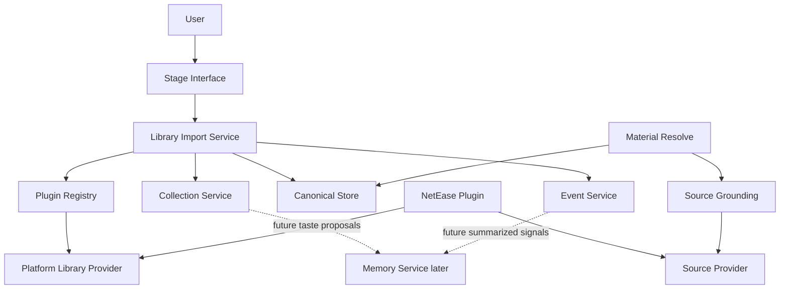
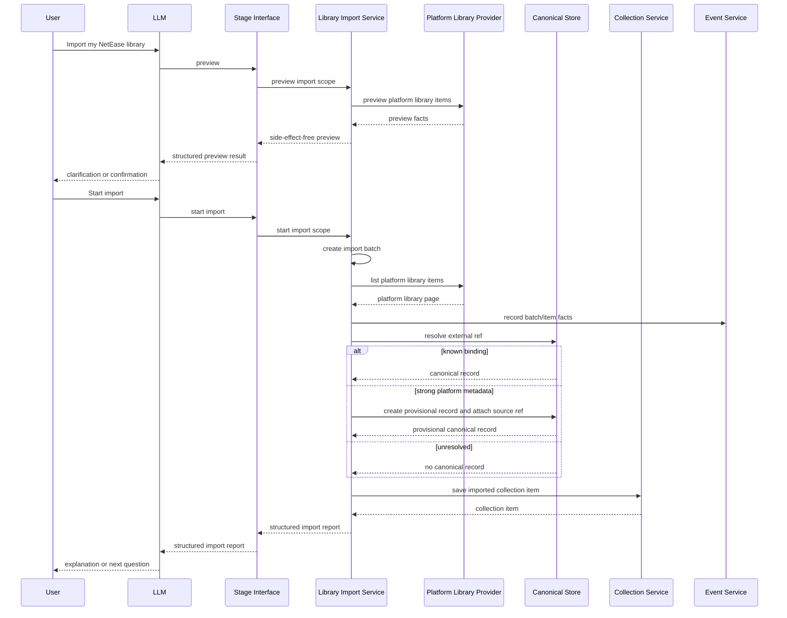

# Library Import Design

## Status

Design document. Library Import Service and Platform Library Provider are not
implemented yet.

This document describes the product path for importing and updating a user's
external platform library in MineMusic.

## Purpose

Library Import brings an external platform account library into MineMusic-owned
user assets and keeps those imported assets updateable over time.

It answers:

```text
What music has this user already saved, followed, collected, or organized on a
platform such as NetEase?
```

It does not answer:

```text
What does the user generally like?
Which MineMusic identity is unquestionably correct?
Is this object playable right now?
Should this be recommended next?
Should MineMusic write back to the external platform?
```

Those questions belong to Memory Service, Canonical Store, Material Resolve,
Source Grounding, the LLM, and Effect Boundary.

## Product Motivation

The important first-run problem is not memory. The important problem is
switching cost. After the first import, the important continuing problem is
keeping MineMusic aligned with the user's platform library changes.

A user who has spent years on NetEase, Spotify, Apple Music, or another music
platform already has music assets there:

- saved songs.
- saved albums.
- followed artists.
- playlists.
- playlist items.
- liked or favorited items.
- recent plays or listening history, where the platform exposes it.

MineMusic should let the user bring those assets in without forcing them to
rebuild taste, collections, and known music from scratch.

## Naming

The provider capability should be called `Platform Library Provider`, not
`Import Provider`.

Reason:

- The provider is not only a one-time importer.
- The same platform capability can later support refresh, diff, preview,
  account-library reads, recent-play reads, and sync planning.
- "Context" is too broad and collides with Session Context. A platform library
  may inform context later, but the provider's direct job is reading platform
  library data.

The service that orchestrates imports and later updates should be called
`Library Import Service`. Preview is a supporting readout for import/update
decisions; it is not the main Library Import function.

## Architecture



The key rule is that a platform plugin may implement multiple capability slots.
NetEase should not be split into unrelated product concepts just because it can
serve multiple roles.

```text
NetEase Plugin
  -> Source Provider
       search, playable links, source refs
  -> Platform Library Provider
       saved songs, albums, followed artists, playlists, history when available
  -> Effect Provider later
       write-back, external library mutation, or other approved side effects
```

## Truth Model

Imported platform data has two different truth levels.

### Platform Fact

A platform fact is confirmed only as a statement about the provider response.

Example:

```text
NetEase returned that this user has saved track id 22644323.
```

MineMusic can store that fact with:

- provider id.
- provider account id.
- source ref.
- fetched time.
- the minimal platform metadata needed to support the Collection write and
  Canonical Store binding.
- import batch id.

This is not the same as proving the MineMusic canonical identity.

### MineMusic Identity Binding

A MineMusic identity binding connects a platform source ref to a MineMusic
canonical record.

Example:

```text
source:netease / track / 22644323
binds to
canonical:minemusic / recording / ...
```

The binding can be:

- already active, if Canonical Store already knows the source ref.
- provisional, if import creates a MineMusic record from platform metadata.
- absent, if MineMusic keeps the asset as source-only until it can resolve it.
- rejected or corrected later, if the source ref was bound to the wrong
  canonical object.

The source ref must be preserved even when a canonical binding exists. If a
binding is wrong, the user's imported asset must not disappear.

## Core Responsibilities

### Platform Library Provider

Owns platform-specific account-library reads.

It owns:

- platform API calls.
- platform auth or account session details.
- provider pagination.
- provider rate-limit handling.
- platform ids and raw metadata.
- mapping platform account-library responses into MineMusic import items.
- reporting whether each requested library area was read completely or only
  partially.

It does not own:

- MineMusic canonical identity decisions.
- Collection Service writes.
- Event Service writes.
- Memory creation.
- final recommendation policy.

For the first NetEase implementation, MineMusic does not store NetEase
credentials, passwords, or cookies. The NetEase Platform Library Provider should
assume the configured local NetEase API service already has any required
account session. If account-library reads fail because that service is not
logged in, import preview should return a structured login-required result
rather than asking MineMusic to manage provider credentials.

The provider should expose a stable provider account identity when account
library reads are account-scoped. Library Import may store this identity, such
as a NetEase user id or configured local account id, but not provider
credentials.

If a provider cannot expose a stable account id, Library Import may still run
with an explicit fallback account id such as a local configuration id. The batch
and report should mark that provider account identity as unstable. Stable and
unstable provider account identities must not be mixed as the same update
baseline.

### Library Import Service

Owns the import orchestration.

It owns:

- selecting a Platform Library Provider.
- import preview, import start, and later library update.
- creating an import batch when the user starts an import or update.
- executing an explicit import scope supplied by the LLM-facing caller.
- import batch status and counts.
- import batch and item snapshots used for update baselines.
- item-level idempotency.
- update diffing and reconciliation for previously imported platform assets.
- mapping provider items to collection writes, canonical lookup/create, and
  event records.
- returning an LLM-facing structured import report.

Library Import needs its own repository boundary for its working state. It
should not store import batches, area snapshots, item provenance, or update
baselines inside Collection Service, Canonical Store, or Event Service
repositories.

Library Import should still record factual import and update events through
Event Service. The Library Import repository stores computable state for
preview, status, summary, idempotency, and update baselines; Event Service
stores factual history for audit and possible future memory evidence.

It does not own:

- platform API details.
- Collection Service storage schema.
- canonical merge/reject/admin policy.
- playable-link freshness.
- deciding which parts of a user's platform library they meant to import.
- external write-back.
- long-term taste summaries.

### Collection Service

Owns explicit user assets after import.

Imported saved songs, saved albums, and followed artists should become
collection items only after Library Import has a
`canonicalRef` to write. The `canonicalRef` may point to an existing active
Canonical Store record or a newly created provisional canonical record.

Provider account identity is import/update provenance, not Collection
ownership. Multiple provider accounts imported into the same `ownerScope` merge
into the same owner-scoped saved Collections. If two provider accounts map to
the same canonical object, Collection Service should still keep one idempotent
Collection item for that canonical ref.

Collection items do not store source refs. Source refs remain recoverable
through Canonical Store external refs and import event provenance.

Library Import should retain item-level provenance that connects provider id,
provider account id, import scope, source ref, and canonical ref for imported
assets. This provenance belongs to Library Import, not CollectionItem identity.
Checking or repairing provenance after later canonical rebinding belongs to
repository consistency or Canonical Store review workflows, not ordinary Library
Import or Library Update.

Platform saved, liked, collected, or followed library facts should map to the
owner's matching `saved` system Collection. They do not imply MineMusic
`favorite`; `favorite` is reserved for a stronger MineMusic-side user signal.

Library updates must not remove MineMusic Collection items just because the
asset no longer appears in the current platform library response. Platform
removal is a platform fact, not a MineMusic unsave action. Removing a Collection
item requires an explicit MineMusic-side action.

Library updates should record when a previously imported platform asset is no
longer present in the current platform response. That record is update
provenance only and must not change Collection membership.

This record is a Platform Library Absence. It is derived by comparing the latest
eligible complete baseline snapshot with the current complete provider read. It
is not a provider-returned item from the current read. It should retain enough
baseline facts to explain what is absent, such as provider id, provider account
id, import scope, source ref, canonical ref when known, last known label,
baseline batch id, current update batch id, and a reason such as
`platform_not_returned`.

Library Import must not create Platform Library Absence records for a scope or
area when the current update read is partial, failed, canceled before
completion, or otherwise not marked complete by the provider. In that case the
batch should report a warning or partial result, because missing items may be a
read failure rather than a real platform-library absence.

Library updates may add newly observed platform saved, liked, collected, or
followed assets to the matching MineMusic saved Collection after canonical
binding. Update is additive for Collection membership unless the user performs
an explicit MineMusic-side remove action.

Library Update preview and completed reports should return factual change
categories only:

- newly observed platform assets that would be or were added to Collection.
- platform assets still present and already represented in Collection.
- previously imported platform assets no longer returned by the provider, with
  MineMusic Collection membership left unchanged.
- failed or skipped items.

Library Import should not turn platform disappearance into a cleanup
recommendation. The LLM may explain these facts and ask the user what they want
to do, but MineMusic itself only reports structured update state.

Library Import does not keep an import-level blocklist for items the user
removed from a MineMusic Collection. If a later platform update still reports
the asset, the update may add it back through the normal saved Collection path.

Initial import and later update should use the same Import Batch and report
model, with a batch kind such as `initial_import` or `library_update`. Status,
summary, counts, warnings, failures, and retryability should not require a
separate Update Job model.

Import Batch status should include:

```text
pending
running
completed
completed_with_warnings
failed
canceled
```

`completed_with_warnings` means the batch produced usable results but at least
one requested scope or area had a warning, partial result, or recoverable
failure. Update baseline eligibility still depends on each scope or area's
complete snapshot state, not only on the top-level batch status.

A `canceled` batch may still provide update baselines for scopes or areas that
completed and stored complete snapshots before cancellation. Incomplete scopes
or areas from a canceled batch must not be used as baselines.

Library Update should compare against the latest complete successful snapshot
for the same `ownerScope`, provider id, provider account id, and import scope
or library area. A partially failed Import Batch can still provide a baseline
for the scopes or areas that completed successfully. Failed or incomplete
scopes and areas must not be used as baselines. If no successful baseline exists
for a scope, a `library_update` should behave like an initial import for that
scope.

Update diffing should use Library Import-owned batch and item snapshots. Event
Service records factual history and audit events, but Library Import should not
reconstruct update baselines by scanning Event Service logs.

For each successfully read scope or library area, Library Import should retain
the complete source-ref set observed in that batch and mark that scope or area
snapshot as complete. Change-only snapshots are not enough for update diffing
because later updates need to detect platform assets that disappeared from the
current response.

Pagination mechanics belong to the Platform Library Provider. Library Import
should not manage provider pages directly; it should trust the provider's
structured complete or partial result for each requested area.

Newly observed platform assets during Library Update use the same canonical
binding flow as initial import: exact source-ref lookup first, provisional
canonical creation only when no binding exists and metadata is strong enough,
and unresolved or skipped state when no usable canonical binding can be
established.

Previously unresolved or skipped platform assets are not permanently skipped.
If a later Library Update returns the same source ref again, Library Import
should retry the normal canonical binding flow using the current provider facts.
If metadata is now strong enough, the update may create or reuse a canonical
record and then add the Collection item.

Listening history is different. It is context and memory evidence, not a saved
Collection item. If imported, it should become factual listening-history data
and may later seed memory proposals.

### Canonical Store

Owns MineMusic identity anchors and external ref bindings.

During import, Canonical Store is used to:

- resolve known source refs.
- reuse existing records when an external ref is already bound.
- create provisional records for explicit imported user assets when provider
  metadata is strong enough.
- attach external refs to canonical records through the public canonical port.

Canonical Store should not treat a platform id as a canonical id.

### Event Service

Owns factual import records.

It records what happened:

- import batch started.
- provider item imported.
- provider item skipped.
- provider item failed.
- import batch completed.

Events are not memory by themselves.

### Memory Service

Memory is downstream and later.

Library import can later create memory proposals such as "this user often saves
city-pop albums" or "this user follows many shoegaze artists", but the first
product value is bringing over concrete user assets. MineMusic should not
summarize away the user's library before preserving it.

Platform listening history is closer to context and memory than to Collection.
It should remain raw listening-history evidence until MineMusic has enough
evidence and user permission to propose a durable memory.

## Provider Item Shape

Design-only provider contract:

```ts
export interface PlatformLibraryProvider {
  id: string;

  preview(input: PlatformLibraryPreviewInput): Promise<Result<PlatformLibraryPreview>>;

  listItems(input: PlatformLibraryListInput): Promise<Result<PlatformLibraryPage>>;
}
```

Provider item:

```ts
export type PlatformLibraryItem = {
  providerId: string;
  sourceRef: Ref;
  itemKind:
    | "saved_recording"
    | "saved_album"
    | "saved_release"
    | "followed_artist"
    | "playlist"
    | "playlist_item"
    | "liked_item"
    | "recent_play";
  label: string;
  targetKind:
    | "recording"
    | "release_group"
    | "release"
    | "artist"
    | "playlist"
    | "source_item";
  addedAt?: string;
  occurredAt?: string;
  playlistSourceRef?: Ref;
  position?: number;
  canonicalHints?: {
    label?: string;
    artistLabels?: string[];
    albumLabel?: string;
    durationMs?: number;
  };
  raw?: unknown;
};
```

The provider item is a platform-library fact. It is not a Collection item and
not a Canonical record.

## Import Flow



### Saved Track

Provider item:

```text
source:netease / track / 22644323
itemKind: saved_recording
targetKind: recording
```

Saved or liked platform tracks should be written to the owner's saved
`recording` Collection.

Import behavior:

1. Resolve the source ref in Canonical Store.
2. If known, save the collection item with `canonicalRef`.
3. If unknown but metadata is usable, create a provisional `recording` record
   and bind the NetEase source ref.
4. If canonical creation fails or metadata is too weak, mark the item as
   unresolved or skipped without writing a Collection item.

### Saved Album

Platform album saves should preserve the platform fact. If NetEase returns a
concrete album id, Library Import should treat that imported asset as a
`release`, create or reuse a provisional `release` canonical record, attach the
NetEase album source ref, and write the Collection item to the owner's saved
`release` Collection.

`release_group` is still useful for grouping editions later, but Library Import
should not collapse a concrete platform album save into `release_group` during
the first import.

### Followed Artist

Followed artists target `artist` and should be written to the owner's saved
`artist` Collection.

### Recent Play Or History

Recent-play data should not be saved as Collection items. It is factual
listening history: useful context evidence now and possible memory evidence
later. The first implementation can skip it, or import it only with explicit
user intent, retention limits, and a clear path that keeps raw history separate
from durable memory.

## Idempotency

Repeated import must update rather than duplicate.

Suggested dedupe keys:

```text
import batch:
  ownerScope + provider id + startedAt

collection item:
  collection id + canonical ref

playlist item:
  ownerScope + playlist source ref + item source ref + provider position key

canonical external ref:
  source ref namespace + kind + id
```

On repeated import, Library Import should first use the platform source ref to
recognize the same external asset and ask Canonical Store for the existing
canonical record. Collection Service then keeps the Collection item idempotent
by `collectionId + canonicalRef`. Re-importing the same platform asset should
not create a second provisional canonical record or a second Collection item.

If an imported asset already exists, import may update retained provider
snapshots and use a better canonical binding when one is available.

Retained provider snapshots should be minimal. Library Import should keep only
the fields needed to justify or repeat the Collection write, Canonical Store
binding, and later update baseline, such as provider id, provider account id,
import scope, source ref, item kind, target kind, label, strong canonical hints,
fetched time, and import batch id. It should not retain full raw provider
responses by default.

After the user starts an import, Library Import should eagerly bind each
imported saved or followed asset to a canonical record before writing
Collection items. "Eagerly bind" means:

1. resolve the platform source ref through Canonical Store.
2. reuse an existing canonical record when found.
3. create a provisional canonical record only when no binding exists and
   provider metadata is strong enough.
4. mark the item unresolved or skipped when neither reuse nor provisional
   creation is possible.

The first implementation should not defer canonical binding until a later
recommendation or collection-read flow.

## Stage Interface Tools

Do not expose database-shaped tools.

Expose user-semantic tools:

```text
music.library.import.preview
music.library.import.start
music.library.update.preview
music.library.update.start
music.library.import.status
music.library.import.summary
```

Import and update use separate preview/start tools because they represent
different user intents. They share the same Import Batch/report model underneath,
so status and summary can remain batch-id based and shared.

Import scope names should be MineMusic-owned and platform-neutral:

```text
discovery
saved_recordings
saved_releases
saved_artists
```

Initial import and library update should use the same scope names.

Provider adapters translate these scopes into platform-specific endpoints and
terms. Platform-specific item kinds may remain in provider item facts, but
Stage Interface import scopes should not use provider-specific names such as
NetEase liked songs or collected albums.

Expected behavior:

- `music.library.import.preview` checks the requested initial import scope and
  gives counts when the platform supports counts.
- `music.library.import.preview` may also accept a discovery-style scope for
  "show me what can be imported" and return provider-supported library areas
  with counts or availability notes.
- `music.library.update.preview` checks the requested update scope against the
  latest eligible Library Import baseline and reports what `update.start` would
  do without writing.
- `music.library.update.preview` should report factual update categories:
  would add, already present, no longer returned by the provider with
  Collection unchanged, and failed or skipped.
- Discovery preview may include provider-visible library areas that MineMusic
  does not yet support importing, such as playlists, as structured
  `unsupported` availability facts.
- Preview counts should be explicit about certainty: exact count, at-least
  count from a partial page, or unknown count. Unknown count must not be
  represented as zero.
- Preview may return partial results with structured warnings when one requested
  library area fails but others succeed. Only global failures, such as provider
  unavailable, login required for all requested account reads, or a completely
  unreadable requested scope, should fail the whole preview call.
- Both preview tools may return bounded structured sample items, such as 3-5
  provider item facts per requested library area, so the LLM can reason about
  whether the account and scope look right.
- Preview sample items should remain provider facts. Per-sample canonical or
  Collection status is not needed in the first preview contract; binding and
  Collection estimates are aggregate counts.
- Both preview tools should estimate canonical binding outcomes without writing:
  already bound to an existing canonical record, would create a provisional
  canonical record on start, or unresolved/skipped because metadata is too weak.
- Preview canonical binding estimates should use exact source-ref lookup only.
  Provider metadata can indicate whether provisional creation would be possible,
  but preview should not use fuzzy label, artist, or album matching to claim an
  existing binding.
- Preview does not audit whether an existing canonical binding is semantically
  correct. Binding correction belongs to later Canonical Store review/admin
  flows, not import preview.
- Both preview tools should estimate Collection outcomes without writing:
  already present in the target Collection, would add to the target Collection,
  would add after provisional canonical creation, or skipped because no
  canonical binding can be established.
- Preview does not write Canonical Store records, Collection items, import
  events, or import batches. It may read from the platform provider and from
  MineMusic state to estimate what `start` would do.
- Preview is not a required precondition for start. If the LLM-facing caller has
  an explicit provider, account/default-account choice, and import or update
  scope, it may call the relevant start tool directly.
- `music.library.import.start` creates an `initial_import` batch with a batch
  id, then begins the import with the explicit import scope.
- `music.library.update.start` creates a `library_update` batch with a batch id,
  then begins the update with the explicit update scope.
- `music.library.import.status` reports progress, partial failures, and current
  counts for any Library Import batch id.
- `music.library.import.summary` returns the completed structured report for any
  Library Import batch id.

The LLM should not call Canonical Store, storage repositories, or provider APIs
directly for this flow.
The LLM owns interpretation, judgment, user-facing wording, and any follow-up
questions. MineMusic returns structured facts and state only.
Preview samples are structured provider facts, not MineMusic commentary.

MineMusic does not choose a default import scope when the user says something
ambiguous like "import my NetEase library." The LLM should clarify the user's
intent in conversation, then call preview or start with the understood scope.
If the user asks to see what can be imported, the LLM may call preview with a
discovery scope, but it should not call start until the user has given a
specific import scope.

For local MVP use, Stage Interface import tools may default missing
`ownerScope` to `local_profile:default`, matching the current Collection and
Material Resolve tools.

## Module Placement

Design-only additions:

| Concern | Proposed location | Notes |
| --- | --- | --- |
| Provider contract types | `src/contracts/index.ts` | Add `PlatformLibraryProvider` and import item types when implementing. |
| Capability slot | `src/contracts/index.ts`, `src/plugins/index.ts` | Add `platform_library` only when implementation starts. |
| Library import service | `src/library_import/index.ts` | New Core Capability. |
| Library import repository | `src/storage/**` | Stores import batches, area snapshots, item provenance, provider account identity, baseline state, warnings, and failures. |
| Collection service | `src/collection/index.ts` | Owns saved/favorite/list/remove semantics. |
| NetEase provider | `src/providers/netease/**` | Same plugin/module can export source and platform-library providers. |
| Stage Interface tools | `src/stage_interface/**` | User-semantic import tools only. |
| MCP surface | `src/surfaces/mcp/server.ts` | Should derive tools from Stage Interface descriptors. |

No implementation should make the NetEase provider call Canonical Store or
Collection Service directly. It should only return provider data through the
Platform Library Provider contract.

## Events

Design-only event types:

```text
library_import.batch.started
library_import.item.imported
library_import.item.not_returned
library_import.item.skipped
library_import.item.failed
library_import.batch.completed
```

Useful event payload fields:

```text
batchId
providerId
providerAccountId
sourceRef
itemKind
collectionItemId?
canonicalRef?
skipReason?
failureCode?
baselineBatchId?
absenceReason?
retryable?
```

Event records should describe what happened. They should not create memory or
authorize external effects automatically.

Failures should carry structured `failureCode` and `retryable` fields. Examples
of retryable failures include provider timeouts, temporary rate limits, and
transient local API failures. Examples of non-retryable failures include an
unsupported import scope or provider metadata that is too weak to create a
provisional canonical record. MineMusic should return these fields as state; it
should not turn them into user-facing advice.

## Import / Update Report

The completed report should include:

- provider id.
- batch id.
- imported item counts by kind.
- for `library_update` batches, factual update counts: added to Collection,
  already present, no longer returned by the provider with Collection
  unchanged, and failed or skipped.
- for Platform Library Absence records, enough baseline-derived item facts to
  identify what was absent without treating it as a current provider item.
- collection item counts created and updated.
- canonical records reused, created, and left unresolved.
- skipped items with reasons.
- failed items with `failureCode` and `retryable`.
- retried previously unresolved or skipped items that became bound during this
  batch.

The preview result should include:

- provider id.
- requested import scope.
- provider-supported library areas and availability notes.
- unsupported provider-visible library areas when discovery was requested.
- item counts by provider item kind when available, with count certainty such
  as exact, at least, or unknown.
- bounded sample provider facts.
- estimated canonical binding counts: already bound, would create provisional,
  unresolved, or skipped.
- estimated Collection counts: already present, would add, would add after
  provisional canonical creation, or skipped.
- for `music.library.update.preview`, factual update counts: would add, already
  present, no longer returned by the provider with Collection unchanged, and
  failed or skipped.
- for update preview absence estimates, enough baseline-derived item facts to
  let the LLM explain what would be marked absent.
- structured provider/account errors such as login required.
- structured warnings for partial provider or scope failures.

## MVP Scope

First useful slice:

1. Implement a NetEase Platform Library Provider behind a new
   `platform_library` slot.
2. Import saved songs, saved albums, and followed artists when the local NetEase
   service exposes them.
3. Create or reuse provisional canonical records for imported saved/followed
   assets when metadata is strong enough.
4. Report unresolved or skipped items without creating source-only Collection
   items when metadata is too weak for a provisional canonical record.
5. Write explicit collection items through Collection Service.
6. Record import batch and item events.
7. Expose Stage Interface import and update preview/start tools, plus shared
   batch status/summary tools.
8. Let the user ask for recommendations from imported assets.

History/recent-play import can be a later slice because it needs retention,
privacy, and preference-policy decisions.

Playlist import is a later feature because playlist organization needs its own
model for playlist identity, ordered membership, and user organization.

Platform saved albums are concrete `release` assets for Library Import. They
should not be collapsed into `release_group` during import.

## Open Decisions

No open decisions remain for the first NetEase import preview line.
