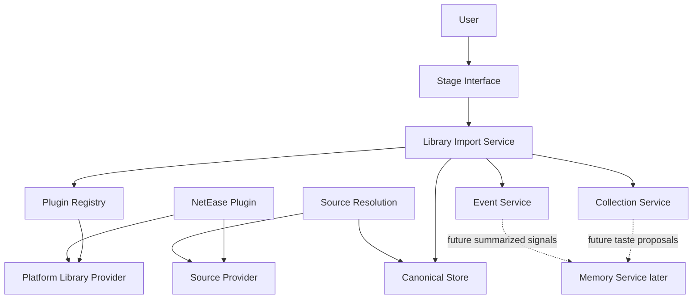
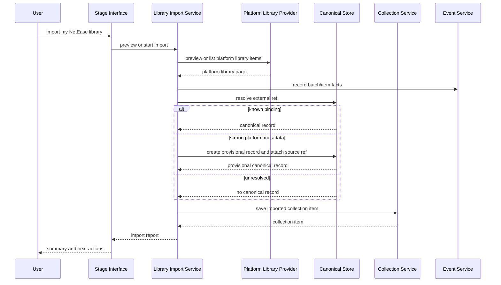

# Library Import Design

## Status

Design document. Library Import Service and Platform Library Provider are not
implemented yet.

This document describes the product path for helping a user who has listened
for years on another platform switch into MineMusic quickly.

## Purpose

Library Import turns an external platform account library into MineMusic-owned
user assets.

It answers:

```text
What music has this user already saved, followed, collected, or organized on a
platform such as NetEase?
```

It does not answer:

```text
What does the user generally like?
Which MineMusic identity is unquestionably correct?
Is this object playable right now?
Should this be recommended next?
Should MineMusic write back to the external platform?
```

Those questions belong to Memory Service, Canonical Store, Source Resolution,
the LLM, and Effect Boundary.

## Product Motivation

The important first-run problem is not memory. The important problem is
switching cost.

A user who has spent years on NetEase, Spotify, Apple Music, or another music
platform already has music assets there:

- saved songs.
- saved albums.
- followed artists.
- playlists.
- playlist items.
- liked or favorited items.
- recent plays or listening history, where the platform exposes it.

MineMusic should let the user bring those assets in without forcing them to
rebuild taste, collections, and known music from scratch.

## Naming

The provider capability should be called `Platform Library Provider`, not
`Import Provider`.

Reason:

- The provider is not only a one-time importer.
- The same platform capability can later support refresh, diff, preview,
  account-library reads, recent-play reads, and sync planning.
- "Context" is too broad and collides with Session Context. A platform library
  may inform context later, but the provider's direct job is reading platform
  library data.

The service that orchestrates imports should be called `Library Import Service`.

## Architecture



The key rule is that a platform plugin may implement multiple capability slots.
NetEase should not be split into unrelated product concepts just because it can
serve multiple roles.

```text
NetEase Plugin
  -> Source Provider
       search, playable links, source refs
  -> Platform Library Provider
       saved songs, albums, followed artists, playlists, history when available
  -> Effect Provider later
       write-back, external library mutation, or other approved side effects
```

## Truth Model

Imported platform data has two different truth levels.

### Platform Fact

A platform fact is confirmed only as a statement about the provider response.

Example:

```text
NetEase returned that this user has saved track id 22644323.
```

MineMusic can store that fact with:

- provider id.
- source ref.
- fetched time.
- platform metadata snapshot.
- import batch id.

This is not the same as proving the MineMusic canonical identity.

### MineMusic Identity Binding

A MineMusic identity binding connects a platform source ref to a MineMusic
canonical record.

Example:

```text
source:netease / track / 22644323
binds to
canonical:minemusic / recording / ...
```

The binding can be:

- already active, if Canonical Store already knows the source ref.
- provisional, if import creates a MineMusic record from platform metadata.
- absent, if MineMusic keeps the asset as source-only until it can resolve it.
- rejected or corrected later, if the source ref was bound to the wrong
  canonical object.

The source ref must be preserved even when a canonical binding exists. If a
binding is wrong, the user's imported asset must not disappear.

## Core Responsibilities

### Platform Library Provider

Owns platform-specific account-library reads.

It owns:

- platform API calls.
- platform auth or account session details.
- provider pagination.
- provider rate-limit handling.
- platform ids and raw metadata.
- mapping platform account-library responses into MineMusic import items.

It does not own:

- MineMusic canonical identity decisions.
- Collection Service writes.
- Event Service writes.
- Memory creation.
- final recommendation policy.

### Library Import Service

Owns the import orchestration.

It owns:

- selecting a Platform Library Provider.
- import preview and import start.
- import batch status and counts.
- item-level idempotency.
- mapping provider items to collection writes, canonical lookup/create, and
  event records.
- returning a user-readable import report.

It does not own:

- platform API details.
- Collection Service storage schema.
- canonical merge/reject/admin policy.
- playable-link freshness.
- external write-back.
- long-term taste summaries.

### Collection Service

Owns explicit user assets after import.

Imported saved songs, saved albums, followed artists, playlists, and playlist
items should become collection items. Collection items keep both:

- `canonicalRef` when MineMusic has one.
- `sourceRef` so the imported platform asset remains recoverable.

Listening history is different. It should not become a saved collection item by
default. If imported, it should become factual event/history data and may later
seed memory proposals.

### Canonical Store

Owns MineMusic identity anchors and external ref bindings.

During import, Canonical Store is used to:

- resolve known source refs.
- reuse existing records when an external ref is already bound.
- create provisional records for explicit imported user assets when provider
  metadata is strong enough.
- attach external refs to canonical records through the public canonical port.

Canonical Store should not treat a platform id as a canonical id.

### Event Service

Owns factual import records.

It records what happened:

- import batch started.
- provider item imported.
- provider item skipped.
- provider item failed.
- import batch completed.

Events are not memory by themselves.

### Memory Service

Memory is downstream and later.

Library import can later create memory proposals such as "this user often saves
city-pop albums" or "this user follows many shoegaze artists", but the first
product value is bringing over concrete user assets. MineMusic should not
summarize away the user's library before preserving it.

## Provider Item Shape

Design-only provider contract:

```ts
export interface PlatformLibraryProvider {
  id: string;

  preview(input: PlatformLibraryPreviewInput): Promise<Result<PlatformLibraryPreview>>;

  listItems(input: PlatformLibraryListInput): Promise<Result<PlatformLibraryPage>>;
}
```

Provider item:

```ts
export type PlatformLibraryItem = {
  providerId: string;
  sourceRef: Ref;
  itemKind:
    | "saved_recording"
    | "saved_album"
    | "saved_release"
    | "followed_artist"
    | "playlist"
    | "playlist_item"
    | "liked_item"
    | "recent_play";
  label: string;
  targetKind:
    | "recording"
    | "release_group"
    | "release"
    | "artist"
    | "playlist"
    | "source_item";
  addedAt?: string;
  occurredAt?: string;
  playlistSourceRef?: Ref;
  position?: number;
  canonicalHints?: {
    label?: string;
    artistLabels?: string[];
    albumLabel?: string;
    durationMs?: number;
  };
  raw?: unknown;
};
```

The provider item is a platform-library fact. It is not a Collection item and
not a Canonical record.

## Import Flow



### Saved Track

Provider item:

```text
source:netease / track / 22644323
itemKind: saved_recording
targetKind: recording
```

Import behavior:

1. Resolve the source ref in Canonical Store.
2. If known, save the collection item with `canonicalRef` and `sourceRef`.
3. If unknown but metadata is usable, create a provisional `recording` record
   and bind the NetEase source ref.
4. If canonical creation fails or metadata is too weak, save a source-only
   collection item.

### Saved Album

Ordinary album saves should target `release_group` by default. If the provider
clearly returns a specific edition, region, remaster, or deluxe version, the
design needs a `release` canonical kind before edition-level identity becomes
authoritative.

### Followed Artist

Followed artists target `artist`.

### Playlist

Playlists are user organization assets. Import should preserve:

- playlist source ref.
- playlist title.
- provider owner/visibility metadata when available.
- ordered playlist items when available.

Playlist items should keep their own source refs and their containing playlist
source ref.

### Recent Play Or History

Recent-play data should not be saved as Collection items by default. It is
factual listening history. The first implementation can skip it, or import it
only into Event Service with explicit user permission and retention limits.

## Idempotency

Repeated import must update rather than duplicate.

Suggested dedupe keys:

```text
import batch:
  user scope + provider id + startedAt

collection item:
  user scope + collection kind + source ref

playlist item:
  user scope + playlist source ref + item source ref + provider position key

canonical external ref:
  source ref namespace + kind + id
```

If a collection item already exists, import should update snapshots and
canonical refs when better identity is available. It should not create a second
saved item for the same platform asset.

## Stage Interface Tools

Do not expose database-shaped tools.

Expose user-semantic tools:

```text
music.library.import.preview
music.library.import.start
music.library.import.status
music.library.import.summary
```

Expected behavior:

- `preview` checks what the provider can import and gives counts when the
  platform supports counts.
- `start` begins the import with selected item kinds.
- `status` reports progress, partial failures, and current batch counts.
- `summary` returns the completed import report and suggested next user actions.

The LLM should not call Canonical Store, storage repositories, or provider APIs
directly for this flow.

## Module Placement

Design-only additions:

| Concern | Proposed location | Notes |
| --- | --- | --- |
| Provider contract types | `src/contracts/index.ts` | Add `PlatformLibraryProvider` and import item types when implementing. |
| Capability slot | `src/contracts/index.ts`, `src/plugins/index.ts` | Add `platform_library` only when implementation starts. |
| Library import service | `src/library_import/index.ts` | New Core Capability. |
| Import batch storage | `src/storage/**` | Needed for long-running or resumable imports. |
| Collection service | `src/collections/index.ts` | Owns saved/favorite/list/remove semantics. |
| NetEase provider | `src/providers/netease/**` | Same plugin/module can export source and platform-library providers. |
| Stage Interface tools | `src/stage_interface/**` | User-semantic import tools only. |
| MCP surface | `src/surfaces/mcp/server.ts` | Should derive tools from Stage Interface descriptors. |

No implementation should make the NetEase provider call Canonical Store or
Collection Service directly. It should only return provider data through the
Platform Library Provider contract.

## Events

Design-only event types:

```text
library_import.batch.started
library_import.item.imported
library_import.item.skipped
library_import.item.failed
library_import.batch.completed
```

Useful event payload fields:

```text
batchId
providerId
sourceRef
itemKind
collectionItemId?
canonicalRef?
skipReason?
failureCode?
```

Event records should describe what happened. They should not create memory or
authorize external effects automatically.

## Import Report

The completed report should include:

- provider id.
- batch id.
- imported item counts by kind.
- collection item counts created and updated.
- canonical records reused, created, and left unresolved.
- skipped items with reasons.
- failed items with retryability.
- next actions the user can take, such as "show imported playlists" or
  "recommend from my NetEase saves".

## MVP Scope

First useful slice:

1. Implement a NetEase Platform Library Provider behind a new
   `platform_library` slot.
2. Import saved songs, saved albums, followed artists, playlists, and playlist
   items when the local NetEase service exposes them.
3. Create or reuse provisional canonical records for imported saved/followed
   assets when metadata is strong enough.
4. Preserve source-only collection items when canonical identity is unresolved.
5. Write explicit collection items through Collection Service.
6. Record import batch and item events.
7. Expose Stage Interface import preview/start/status/summary tools.
8. Let the user ask for recommendations from imported assets.

History/recent-play import can be a later slice because it needs retention,
privacy, and preference-policy decisions.

## Open Decisions

- Exact capability slot name: `platform_library` or `library`.
- User scope: whether imports are scoped by session, local profile, or a future
  MineMusic user account.
- NetEase auth shape for account library reads.
- Whether to add `release` as a Canonical Store kind before edition-level album
  import.
- Whether large imports create provisional canonical records eagerly or keep
  more source-only items and resolve on demand.
- How much raw provider metadata to retain for debugging without creating a
  privacy problem.
- Whether recent-play/history import is supported in the first implementation.
