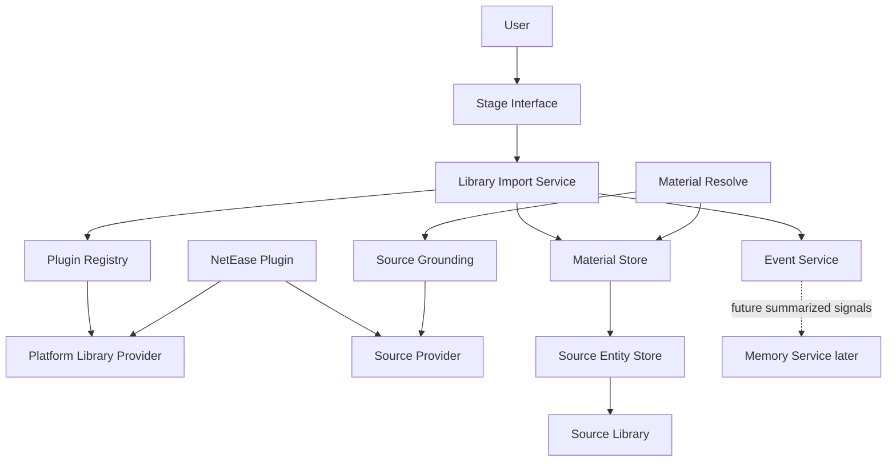
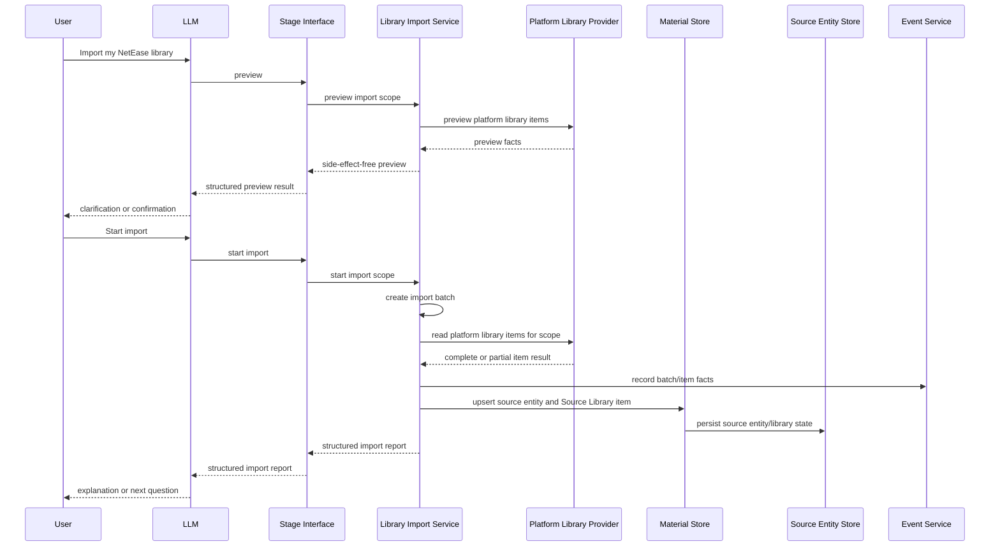

# Library Import Design

This document describes the product path for importing and updating a user's
external platform library in MineMusic.

## Purpose

Library Import brings an external platform account library into MineMusic-owned
user assets and keeps those imported assets updateable over time.

It answers:

```text
What music has this user already saved, followed, collected, or organized on a
platform such as NetEase?
```

It does not answer:

```text
What does the user generally like?
Which MineMusic identity is unquestionably correct?
Is this object playable right now?
Should this be recommended next?
Should MineMusic write back to the external platform?
```

Those questions belong to Material Store, Canonical Maintenance, Material
Resolve, Source Grounding, Memory Service, the LLM, and Effect Boundary.

## Product Motivation

The important first-run problem is not memory. The important problem is
switching cost. After the first import, the important continuing problem is
keeping MineMusic aligned with the user's platform library changes.

A user who has spent years on NetEase, Spotify, Apple Music, or another music
platform already has music assets there:

- saved songs.
- saved albums.
- followed artists.
- playlists.
- playlist items.
- liked or favorited items.
- recent plays or listening history, where the platform exposes it.

MineMusic should let the user bring those assets in without forcing them to
rebuild taste, collections, and known music from scratch.

## Naming

The provider capability should be called `Platform Library Provider`, not
`Import Provider`.

Reason:

- The provider is not only a one-time importer.
- The same platform capability can later support refresh, diff, preview,
  account-library reads, recent-play reads, and sync planning.
- "Context" is too broad and collides with Session Context. A platform library
  may inform context later, but the provider's direct job is reading platform
  library data.

The service that orchestrates imports and later updates should be called
`Library Import Service`. Preview is a supporting readout for import/update
decisions; it is not the main Library Import function.

## Architecture

Library Import is a Source Entity Store flow inside Material Store. Its direct
job is to put provider library facts into Source Entity Store and Source
Library, then ensure a durable MaterialRecord exists for each imported
`sourceRef`. Ordinary import/update does not write Collection or
depend on Confirmed Canonical Bindings.



The key rule is that a platform plugin may implement multiple capability slots.
NetEase should not be split into unrelated product concepts just because it can
serve multiple roles.

```text
NetEase Plugin
  -> Source Provider
       search, playable links, source refs
  -> Platform Library Provider
       saved songs, albums, followed artists, playlists, history when available
  -> Effect Provider later
       write-back, external library mutation, or other approved side effects
```

## Truth Model

Imported platform data has two different truth levels.

### Platform Fact

A platform fact is confirmed only as a statement about the provider response.

Example:

```text
NetEase returned that this user has saved track id 22644323.
```

MineMusic can store that fact with:

- provider id.
- provider account id.
- source ref.
- fetched time.
- the minimal platform metadata needed to maintain Source Library state.
- import batch id.

This is not the same as proving the MineMusic canonical identity.

### MineMusic Identity Binding

A MineMusic identity binding connects a platform source ref to a MineMusic
canonical record.

Example:

```text
source:netease / track / 22644323
binds to
canonical:minemusic / recording / ...
```

The binding can be:

- confirmed, if Source Entity Store has an explicit Confirmed Canonical Binding.
- absent, if MineMusic keeps the platform fact in Source Library without
  confirmed canonical identity.
- rejected or corrected later, if the source ref was bound to the wrong
  canonical object.

The source ref must be preserved even when a canonical binding exists. If a
binding is wrong, the user's imported asset must not disappear.

## Core Responsibilities

### Platform Library Provider

Platform Library Provider is the `platform_library` capability slot, specified
in `docs/platform-library-provider/design.md`.

Library Import consumes this slot; it does not define the slot contract. It may
store the provider account identity and stability flag returned by the slot for
batch provenance and update baselines, but not provider credentials.

### Library Import Service

Owns the import orchestration.

It owns:

- selecting a Platform Library Provider.
- import preview, import start, and later library update.
- creating an import batch when the user starts an import or update.
- executing an explicit import scope supplied by the LLM-facing caller.
- import batch status and counts.
- import batch and item snapshots used for update baselines.
- item-level idempotency.
- update diffing and reconciliation for previously imported platform assets.
- mapping provider items to Source Entity Store writes, Source Library state,
  and event records.
- returning an LLM-facing structured import report.

Library Import needs its own repository boundary for its working state. It
should not store import batches, area snapshots, item provenance, or update
baselines inside Collection Service, Canonical Store, or Event Service
repositories.

Library Import should still record factual import and update events through
Event Service. The Library Import repository stores computable state for
preview, status, summary, idempotency, and update baselines; Event Service
stores factual history for audit and possible future memory evidence.

It does not own:

- platform API details.
- Collection Service storage schema.
- canonical identity creation.
- canonical merge/reject/admin policy.
- playable-link freshness.
- deciding which parts of a user's platform library they meant to import.
- external write-back.
- long-term taste summaries.

### Collection Service

Owns explicit MineMusic-side user assets. Ordinary Library Import does not
write Collection.

Provider account identity is import/update provenance, not Collection
ownership. Imported platform facts remain Source Library facts until a separate
explicit workflow decides to write MineMusic Collection membership.

Future import-to-Collection behavior must not use `canonicalRef` or confirmed
binding as the Collection write handle. It should materialize a stable
`materialRef` through Material Store / Material Flow and then call Collection
Service explicitly.

Library Import should retain item-level provenance that connects provider id,
provider account id, import scope, source ref, item kind, source entity kind,
and last-seen import status. This provenance belongs to Library Import, not
CollectionItem identity. Checking or repairing provenance after later canonical
rebinding belongs to Source Entity Store binding workflows or canonical review
workflows, not ordinary Library Import or Library Update.

Provider `canonicalHints` are preserved in item provenance as the audit copy of
source facts, including platform-neutral `trackPosition` when a provider can
derive it from source release context. Ordinary Library Import does not project
those hints into Canonical Store or create canonical relations. A later binding
or canonical maintenance workflow may inspect Source Library facts when it needs
source-side evidence.

Platform saved, liked, collected, or followed library facts should be stored as
Source Library membership. They do not imply MineMusic `favorite`, and they do
not automatically create MineMusic `saved` Collection membership.

Library updates must not remove MineMusic Collection items just because the
asset no longer appears in the current platform library response. Platform
removal is a platform fact, not a MineMusic unsave action. Removing a Collection
item requires an explicit MineMusic-side action.

Library updates should record when a previously imported platform asset is no
longer present in the current platform response. That record is update
provenance only and must not change Collection membership.

This record is a Platform Library Absence. It is derived by comparing the latest
eligible complete baseline snapshot with the current complete provider read. It
is not a provider-returned item from the current read. It should retain enough
baseline facts to explain what is absent, such as provider id, provider account
id, import scope, source ref, last known label, baseline batch id, current
update batch id, and a reason such as
`platform_not_returned`.

Library Import must not create Platform Library Absence records for a scope or
area when the current update read is partial, failed, canceled before
completion, unavailable, or otherwise not marked `complete` by the provider's
per-area read status. In that case the batch should report a warning or partial
result, because missing items may be a read failure rather than a real
platform-library absence.

Library Update preview and completed reports should return factual change
categories only:

- newly observed platform assets that would be or were imported into Source
  Library.
- platform assets still present and already represented in Source Library.
- previously imported platform assets no longer returned by the provider.
- failed items.

Library Import should not turn platform disappearance into a cleanup
recommendation. The LLM may explain these facts and ask the user what they want
to do, but MineMusic itself only reports structured update state.

Library Import does not keep an import-level blocklist for items the user
removed from a MineMusic Collection. If a later platform update still reports
the asset, Library Import should refresh Source Library provenance only; any
Collection restore requires an explicit Collection workflow.

Initial import and later update should use the same Import Batch and report
model, with a batch kind such as `initial_import` or `library_update`. Status,
summary, counts, warnings, failures, and retryability should not require a
separate Update Job model.

Import Batch status should include:

```text
pending
running
completed
completed_with_warnings
failed
canceled
```

`completed_with_warnings` means the batch produced usable results but at least
one requested scope or area had a warning, partial result, or recoverable
failure. Update baseline eligibility still depends on each scope or area's
provider read status and complete snapshot state, not only on the top-level
batch status.

A `canceled` batch may still provide update baselines for scopes or areas that
completed and stored complete snapshots before cancellation. Incomplete scopes
or areas from a canceled batch must not be used as baselines.

Library Update should compare against the latest eligible complete snapshot for
the same `ownerScope`, provider id, provider account id, and import scope or
library area. A partially failed Import Batch can still provide a baseline for
the scopes or areas that completed successfully. Failed or incomplete scopes and
areas must not be used as baselines. If no eligible complete baseline exists
for a scope, a `library_update` should behave like an initial import for that
scope.

For `full`, no eligible baseline means the update may read the full provider
area, write Source Library state, and store a complete snapshot, but it must not
derive absences for that area. For `latest_until_seen`, no existing Source
Library stop point means the update continues from newest first until the
provider area ends, effectively importing the current newest-first area without
deriving absences.

Library Update has two distinct product modes:

```text
full
latest_until_seen
```

`full` is authoritative reconciliation. It starts from the provider's current
first page for each requested area and reads the complete current area. It
updates Source Library rows for returned source refs, records new source refs as
newly observed Source Library items, and derives Platform Library Absence
records only after the requested area has completed. It is the only update mode
that may say a previously imported source ref was not returned by the platform.

`latest_until_seen` is fast newest-first import/update. It is valid only for
provider areas that declare newest-first ordering. It starts at the current
first page, imports newly observed source refs, and stops the area when it
encounters a source ref that is already present in the owner's Source Library.
It does not use an old provider cursor. It must not derive Platform Library
Absence records, update a complete baseline, or claim the platform library was
fully reconciled.

Library Import should decide whether `latest_until_seen` is allowed by reading
provider-owned area capability metadata. It must not hard-code provider-specific
endpoint behavior.

`latest_until_seen` is useful for bringing in newly saved, collected, or
followed platform items. It is not a substitute for `full` when the caller needs
deletion/absence detection or a complete current baseline.

Internal preview/update planning and `library.update.start` default to `full`
when the caller does not provide a mode. `latest_until_seen` must be requested
explicitly.

Preview and start should use the same mode semantics. `full` preview may
estimate newly observed items and possible absences without writing state.
`latest_until_seen` preview estimates newest-first additions only, stops at the
first already present source ref or preview read boundary, and must not estimate
absences.

If a caller requests `latest_until_seen` for an area whose provider capability
does not support newest-first ordering, the update should fail clearly for that
request instead of silently skipping the area.

In `latest_until_seen`, the first already present source ref is the stop point
for that provider area. The batch should keep newly observed items before that
point, stop the area, and avoid deriving absences or complete-baseline state.
A successful `latest_until_seen` batch may finish with normal `completed`
status because it completed the requested mode. The report must still carry the
mode and must not imply full reconciliation.

Update diffing should use Library Import-owned batch and item snapshots. Event
Service records factual history and audit events, but Library Import should not
reconstruct update baselines by scanning Event Service logs.

For each successfully read scope or library area, Library Import should retain
the complete source-ref set observed in that batch and mark that scope or area
snapshot as complete. Change-only snapshots are not enough for update diffing
because later updates need to detect platform assets that disappeared from the
current response.

Pagination mechanics belong to the Platform Library Provider. Library Import
should not manage pagination cursors or provider batching directly; it should
trust the provider's structured complete or partial result for each requested
area.

Newly observed platform assets during Library Update use the same Source Entity
Store flow as initial import: upsert the source entity and update Source
Library state. Existing source refs are refreshed internally but should not be
reported as user-visible update results. Previously absent or previously unseen
platform assets are not special cases; if a later Library Update returns the
same source ref again, Library Import should retry the normal Source Entity
Store flow using the current provider facts.

Agent-facing Library Update output should separate progress from change
results. Progress may report scanned or processed item counts and whether more
work remains. Change counts should report only newly observed items, absence
records, failures, and warnings. Unchanged existing source refs are internal
refresh state and must not be returned as item reports or counted as update
results.

Listening history is different. It is context and memory evidence, not a saved
Collection item. If imported, it should become factual listening-history data
and may later seed memory proposals.

### Material Store

Owns MineMusic material identity and source-material state.

During import, Material Store is used to:

- upsert Source Track, Source Release, or Source Artist records.
- update Source Library items for the owner/provider/account/library kind.

Canonical Store is the canonical identity subdomain inside Material Store. It
does not create canonical records as an ordinary import side effect, and it
should not treat a platform id as a canonical id.

### Event Service

Owns factual import records.

It records what happened:

- import batch started.
- provider item imported.
- previously imported provider item not returned by the current complete read.
- provider item failed.
- import batch completed.

Events are not memory by themselves.

### Memory Service

Memory is downstream and later.

Library import can later create memory proposals such as "this user often saves
city-pop albums" or "this user follows many shoegaze artists", but the first
product value is bringing over concrete user assets. MineMusic should not
summarize away the user's library before preserving it.

Platform listening history is closer to context and memory than to Collection.
It should remain raw listening-history evidence until MineMusic has enough
evidence and user permission to propose a durable memory.

## Import Flow



### Saved Track

Provider item:

```text
source:netease / track / 22644323
itemKind: saved_source_track
targetKind: recording
```

Saved or liked platform tracks should be written to the owner's saved
Source Library as source-track observations.

Import behavior:

1. Upsert a Source Track and Source Library item.
2. Record an item report in source-layer terms: imported, already present, or
   failed.

### Saved Album

Platform album saves should preserve the platform fact. If NetEase returns a
concrete album id, Library Import should treat that imported asset as a
Source Release and update Source Library. It must not write the owner's saved
`release` Collection during ordinary import.

`release_group` is still useful for grouping editions later, but Library Import
should not collapse a concrete platform album save into `release_group` during
the first import.

### Followed Artist

Followed artists become Source Artist records and Source Library items. They
must not be written to the owner's saved `artist` Collection during ordinary
import.

### Recent Play Or History

Recent-play data should not be saved as Collection items. It is factual
listening history: useful context evidence now and possible memory evidence
later. The first implementation can skip it, or import it only with explicit
user intent, retention limits, and a clear path that keeps raw history separate
from durable memory.

## Idempotency

Repeated import must update rather than duplicate.

Suggested dedupe keys:

```text
import batch:
  ownerScope + provider id + provider account id + batch kind + import scope/library area + startedAt

source entity:
  source ref namespace + kind + id

source library item:
  owner scope + provider id + provider account id + source ref + library kind
```

On repeated import, Library Import should first use the platform source ref to
recognize the same source asset and upsert Source Entity Store and Source
Library state. Re-importing the same platform asset should not create a second
source entity or Source Library item.

Readable provider items without stable `sourceRef` are not importable. Library
Import should skip them or report provider warnings rather than writing Source
Library items or update baselines.

Library Import must treat provider `sourceRef` values as opaque stable source
keys. It must not branch on provider-specific `sourceRef.kind` values. Import
behavior should use the provider-slot `itemKind` and `targetKind` fields.

If an imported asset already exists, import may update retained provider
snapshots and Source Library last-seen state.

Retained provider snapshots should be minimal. Library Import should keep only
the fields needed to justify or repeat the Source Library update and later
update baseline, such as provider id, provider account id, import scope,
source ref, item kind, target kind, label, provider hints, fetched time, and
import batch id. It should not retain full raw provider responses by default.

After the user starts an import, Library Import should eagerly bind each
imported saved or followed asset as a source entity. "Eagerly store" means:

1. upsert the Source Track, Source Release, or Source Artist.
2. update Source Library state for the owner/provider/account/library kind.
3. record source-layer provenance and report status.

The first implementation should not defer Source Entity Store writes until a
later recommendation or collection-read flow.

## Stage Interface Tools

Do not expose database-shaped tools or low-value preview tools to agents.

Expose user-semantic tools:

```text
library.import.start
library.import.continue
library.update.start
library.update.continue
library.import.status
library.import.summary
library.import.items.list
```

Agent-facing import and update start tools share the same Import Batch/report
model underneath, so continuation, status, and summary can remain batch-id
based and shared. Preview remains an internal service capability and is not part
of the normal agent tool surface.

Import scope names should be MineMusic-owned and platform-neutral:

```text
discovery
saved_source_tracks
saved_source_releases
saved_source_artists
```

Initial import and library update should use the same scope names.

Provider adapters translate these scopes into platform-specific endpoints and
terms. Platform-specific item kinds may remain in provider item facts, but
Stage Interface import scopes should not use provider-specific names such as
NetEase liked songs or collected albums.

Library Import may show preview facts for provider areas marked `previewable`,
`unsupported`, or `unavailable`, but it may only run import/update for areas the
Platform Library Provider marks `readable`.

Expected behavior:

- Internal preview may check the requested import or update scope before
  execution, but agent-facing workflows should go straight through
  `library.import.start` or `library.update.start`.
- Discovery preview may include provider-visible library areas that MineMusic
  does not yet support importing, such as playlists, as structured
  `unsupported` availability facts.
- Preview counts should be explicit about certainty: exact count, at-least
  count from a partial provider read, or unknown count. Count certainty is
  defined by the Platform Library Provider slot. Unknown count must not be
  represented as zero.
- Preview may return partial results with structured warnings when one requested
  library area fails but others succeed. Only global failures, such as provider
  unavailable, login required for all requested account reads, or a completely
  unreadable requested scope, should fail the whole preview call.
- Both preview tools may return bounded lightweight samples, such as 3-5 facts
  per requested library area, so the LLM can reason about
  whether the account and scope look right.
- Preview samples come from the Platform Library Provider slot and remain
  preview-only provider facts. They must not carry source refs, canonical
  hints, provider metadata, or per-sample item status; Source Library
  estimates are aggregate counts.
- Both preview tools should estimate Source Library outcomes without writing:
  already present in Source Library or would import into Source Library.
  The default agent-facing preview view should compress those estimates into
  decision-facing fields such as `wouldImport`, `newlyObserved`, and
  `absentItems`, rather than exposing raw nested estimate buckets.
- Preview does not write Canonical Store records, Collection items, import
  events, or import batches. It may read from the platform provider and from
  MineMusic state to estimate what `start` would do.
- Preview is not a required precondition for start. If the LLM-facing caller has
  an explicit provider, account/default-account choice, and import or update
  scope, it may call the relevant start tool directly.
- `library.import.start` creates an `initial_import` batch with a batch
  id, records the explicit import scope, and may process an initial bounded
  segment.
- `library.import.continue` continues an existing import batch by batch id. It
  may accept a MineMusic page size, but it must not require the caller to pass
  provider-specific cursors, offsets, or page tokens.
- `library.update.start` creates a `library_update` batch with a batch id,
  records the explicit update scope and mode, and may process an initial
  bounded segment.
- `library.update.continue` continues an existing update batch by batch id. It
  uses the same continuation model as import batches.
- `library.import.status` reports progress, partial failures, and current
  counts for any Library Import batch id, including whether more continuation
  work remains.
- `library.import.start` and `library.update.start` return compact batch status
  rather than the full per-item report.
- `library.import.summary` returns a compact completed summary for any Library
  Import batch id, including aggregate counts and `itemCount`, without dumping
  every item into the primary tool response.
- `library.import.items.list` pages through item-level import facts for a batch
  when the caller explicitly wants detail.

Library Import uses batch continuation, not a public cursor API. The public
caller continues a MineMusic import task; it does not page through a provider
API directly.

```text
library.import.start
  -> returns compact batch status, including batchId

library.import.continue({ batchId, pageSize? })
  -> processes the next segment
  -> returns current counts and whether more work remains

library.import.items.list({ batchId, limit?, cursor? })
  -> returns a bounded page of item-level facts only when explicitly requested
```

Provider pagination state is internal Library Import working state. The
repository may store provider-specific continuation details, such as offset,
cursor, page token, or provider read checkpoint, but those details must remain
opaque to Stage Interface callers. Different providers can use different
pagination models without changing MineMusic's public import tools.

Provider continuation state is only valid for the current running batch. It
must not be treated as a durable "resume from where the user left off last
month" marker, because provider libraries can change between pages and offset
or cursor positions can drift.

`sampleLimitPerArea` remains a bounded-read limit for preview or one-shot
tests. It is not a cursor and should not be used as a continuation token.

The LLM should not call Canonical Store, storage repositories, or provider APIs
directly for this flow.
The LLM owns interpretation, judgment, user-facing wording, and any follow-up
questions. MineMusic returns structured facts and state only.
Preview samples are lightweight provider facts, not MineMusic commentary.

MineMusic does not choose a default import scope when the user says something
ambiguous like "import my NetEase library." The LLM should clarify the user's
intent in conversation, then call preview or start with the understood scope.
If the user asks to see what can be imported, the LLM may call preview with a
discovery scope, but it should not call start until the user has given a
specific import scope.

For local MVP use, Stage Interface import tools may default missing
`ownerScope` to `local_profile:default`, matching the current Collection and
Material Resolve tools.

## Module Placement

Current and future module placement:

| Concern | Proposed location | Notes |
| --- | --- | --- |
| Provider contract types | `src/contracts/index.ts` | Add `PlatformLibraryProvider` and import item types when implementing. |
| Capability slot | `src/contracts/index.ts`, `src/plugins/index.ts` | Use the reserved `platform_library` slot. |
| Library import service | `src/material/store/source_entity/library-import.ts`, exported through `src/material/index.ts` | Source Entity Store-owned Core Capability. |
| Library import repository | `src/storage/**` | Stores import batches, area snapshots, item provenance, provider account identity, baseline state, warnings, and failures. |
| Collection service | `src/collection/index.ts` | Owns explicit saved/favorite/list/remove semantics; not called by ordinary Library Import. |
| NetEase provider | `src/providers/netease/**` | Same plugin/module can export source and platform-library providers. |
| Stage Interface tools | `src/stage_interface/**` | User-semantic import tools only. |
| MCP surface | `src/surfaces/mcp/server.ts` | Should derive tools from Stage Interface descriptors. |

No implementation should make the NetEase provider call Canonical Store or
Collection Service directly. It should only return provider data through the
Platform Library Provider contract.

## Events

Current event types:

```text
library_import.batch.started
library_import.item.imported
library_import.item.not_returned
library_import.item.failed
library_import.batch.completed
```

Useful event payload fields:

```text
batchId
batchKind
ownerScope
providerId
providerAccountId
importScope
libraryArea?
sourceRef
itemKind
sourceEntityKind?
failureCode?
baselineBatchId?
absenceReason?
retryable?
```

Event records should describe what happened. They should not create memory or
authorize external effects automatically.

Failures should carry structured `failureCode` and `retryable` fields. Examples
of retryable failures include provider timeouts, temporary rate limits, and
transient local API failures. Examples of non-retryable failures include an
unsupported import scope or a provider item that cannot be represented as a
stable source entity. MineMusic should return these fields as state; it should
not turn them into user-facing advice.

## Import / Update Report

The completed report should include:

- provider id.
- batch id.
- imported item counts by kind.
- for `library_update` batches, factual update counts: newly observed, already
  present, and no longer returned by the provider.
- for Platform Library Absence records, enough baseline-derived item facts to
  identify what was absent without treating it as a current provider item.
- failed items with `failureCode` and `retryable`.

The preview result should include:

- provider id.
- requested import scope.
- provider-supported library areas and availability notes.
- unsupported provider-visible library areas when discovery was requested.
- item counts by provider item kind when available, with count certainty such
  as exact, at least, or unknown.
- bounded lightweight provider samples.
- estimated Source Library counts: already present or would import.
- structured provider/account errors such as login required.
- structured account-selection errors such as `account_selection_required`.
- structured warnings for partial provider or scope failures.

Provider error and warning codes are defined by the Platform Library Provider
slot. Library Import should consume the standard codes rather than matching
provider-specific strings.

## MVP Scope

First useful slice:

1. Implement a NetEase Platform Library Provider behind the `platform_library`
   slot.
2. Import saved songs, saved albums, and followed artists when the local NetEase
   service exposes them.
3. Upsert Source Track/Release/Artist records and Source Library state for
   imported saved/followed assets.
4. Record import batch and item events.
5. Expose Stage Interface import and update start/continue tools plus shared
   batch status/summary/item-list tools. Preview remains a runtime/internal
   capability, not part of the normal current agent-facing tool surface.
6. Let the user ask for recommendations from imported assets.

History/recent-play import can be a later slice because it needs retention,
privacy, and preference-policy decisions.

Playlist import is a later feature because playlist organization needs its own
model for playlist identity, ordered membership, and user organization.

Platform saved albums are concrete `release` assets for Library Import. They
should not be collapsed into `release_group` during import.

## Current Authority

Implementation state belongs in `docs/library-import/progress.md`. Provided and
consumed ports belong in `docs/library-import/ports.md`. Historical
implementation planning is archived under `docs/archive/library-import/`.
