# MineMusic architecture improvement report

Repository reviewed: `Odefined/MineMusic`  
Review date: 2026-06-02  
Scope: context documents, ADRs, and targeted source/tests around candidate architecture seams. No implementation was performed.
Status sync: 2026-06-03. Candidate 1 has since been implemented on current `main` by PR #52 (`Clean up collection item boundary`), so GitHub issue #45 is closed as completed.

## Scope and governing constraints read

Context files reviewed:

- `AGENTS.md`
- `INDEX.md`
- `README.md`
- `ARCHITECTURE.md`
- `CURRENT_STATE.md`
- `PROGRESS.md`
- `CONTEXT.md`
- `docs/adr/0001-stage-core-runtime-composition.md`
- `docs/adr/0002-material-store-boundary.md`
- `docs/adr/0003-materialref-backed-collections.md`

Targeted source/tests reviewed:

- `src/stage_core/compose.ts`
- `src/stage_interface/dispatch.ts`
- `src/stage_interface/tool_definitions/index.ts`
- `src/stage_interface/tool_definitions/types.ts`
- `src/stage_interface/tool_definitions/music.ts`
- `src/stage_interface/tool_definitions/stage.ts`
- `src/stage_interface/tool_definitions/library.ts`
- `src/stage_interface/tool_definitions/canonical_review.ts`
- `src/stage_interface/outputs.ts`
- `src/stage_interface/outputs/material.ts`
- `src/stage_interface/outputs/recommendation.ts`
- `src/stage_interface/outputs/links.ts`
- `src/material/query/index.ts`
- `src/material/projection/index.ts`
- `src/material/materialization/index.ts`
- `src/material/store/index.ts`
- `src/contracts/index.ts`
- `src/ports/index.ts`
- `test/architecture/material-boundary.test.ts`
- `test/stage_interface/stage-interface-dispatch.test.ts`
- `test/material_query/material-query.test.ts`

The constraints are explicit. `AGENTS.md` says ordinary modules should receive the narrowest capability port they need, read-like modules should not receive write capabilities, Stage Interface owns agent-facing schemas and compact outputs, and architecture tests should guard new boundaries. `ARCHITECTURE.md` says Stage Interface owns compact output projection, Material Query should use narrow store dependencies and should not own broad Material Store mutation or compact output projection, and Tool Groups should receive only the ports needed by that work area. `ADR-0003` says public collection writes use `materialId`, while raw `materialRef`, source refs, repository rows, snapshots, and relation-scope internals are not ordinary public collection fields.

## Candidate ranking

| Status / Rank | Candidate | Strength |
|---:|---|---|
| Resolved | Compact collection outputs at the Stage Interface Seam | Strong; implemented by PR #52 |
| Resolved | Narrow Material-facing Collection capabilities and route Resolve relation policy through Policy | Strong; implemented on `codex/material-collection-policy-handoff` |
| 1 | Split the monolithic music Tool Group by work area, not by tool count | Worth exploring |
| 2 | Deepen Material Query internals around related-candidate and pool-catalog behavior | Worth exploring |
| 3 | Treat source-library pool output as a public protocol decision | Speculative |
| 4 | Move misplaced Stage Interface output/input helpers into their owning Modules | Worth exploring |

---

## Candidate 1: Compact collection outputs at the Stage Interface Seam

**Status:** Resolved on current `main` by PR #52 (`Clean up collection item boundary`). GitHub issue #45 is closed as completed after the 2026-06-03 sync.

**Original recommendation strength:** Strong

### Files

- `src/stage_interface/tool_definitions/music.ts`
- `src/stage_interface/outputs/collection.ts`
- `src/stage_interface/outputs/material.ts`
- `src/stage_interface/outputs/recommendation.ts`
- `src/contracts/index.ts`
- `test/stage_interface/stage-interface-dispatch.test.ts`
- `test/stage_interface/stage-interface.test.ts`
- `test/architecture/material-boundary.test.ts`
- Governing evidence: `AGENTS.md`, `ARCHITECTURE.md`, `docs/adr/0003-materialref-backed-collections.md`

### Current main shape

Stage Interface now owns compact collection projection in `src/stage_interface/outputs/collection.ts`.

Collection action tools in `src/stage_interface/tool_definitions/music.ts` now use compact output schema refs:

- `music.collection.save`, `unsave`, `favorite`, `unfavorite`, `block`, `unblock`, `item.add`, and `item.remove` use `CompactCollectionItemOutput`.
- `music.collection.create`, `update`, and `delete` use `CompactCollectionOutput`.
- `music.collection.list` uses `CompactCollectionListOutput`.

The compact outputs expose public ids and labels only:

- item output: `itemId`, `collectionId`, `materialId`.
- list item output: `itemId`, `collectionId`, `materialId`, `label`.
- collection output: `collectionId`, `label`.

The normal public collection surface no longer returns raw `Collection` or `CollectionItem` records.

### Resolution evidence

- `src/stage_interface/outputs/collection.ts` projects `Collection` and `CollectionItem` into compact public collection outputs.
- `src/stage_interface/tool_definitions/music.ts` applies those projections through each collection tool definition's `present` function.
- `test/stage_interface/stage-interface-dispatch.test.ts` asserts compact collection action/list outputs and checks that list items do not expose `materialRef` or storage timestamps.
- `test/stage_interface/stage-interface.test.ts` asserts public collection input schemas expose `materialId` rather than raw `canonicalRef`, `materialRef`, `materialSnapshot`, `relationScope`, or `identityRequirement`.

### Remaining follow-up

No implementation follow-up remains for issue #45.

If a future diagnostic or audit view needs raw-ish Collection Service details, it should be introduced as an explicit diagnostic surface rather than by widening the ordinary `music.collection.*` outputs.

### Before/After diagram

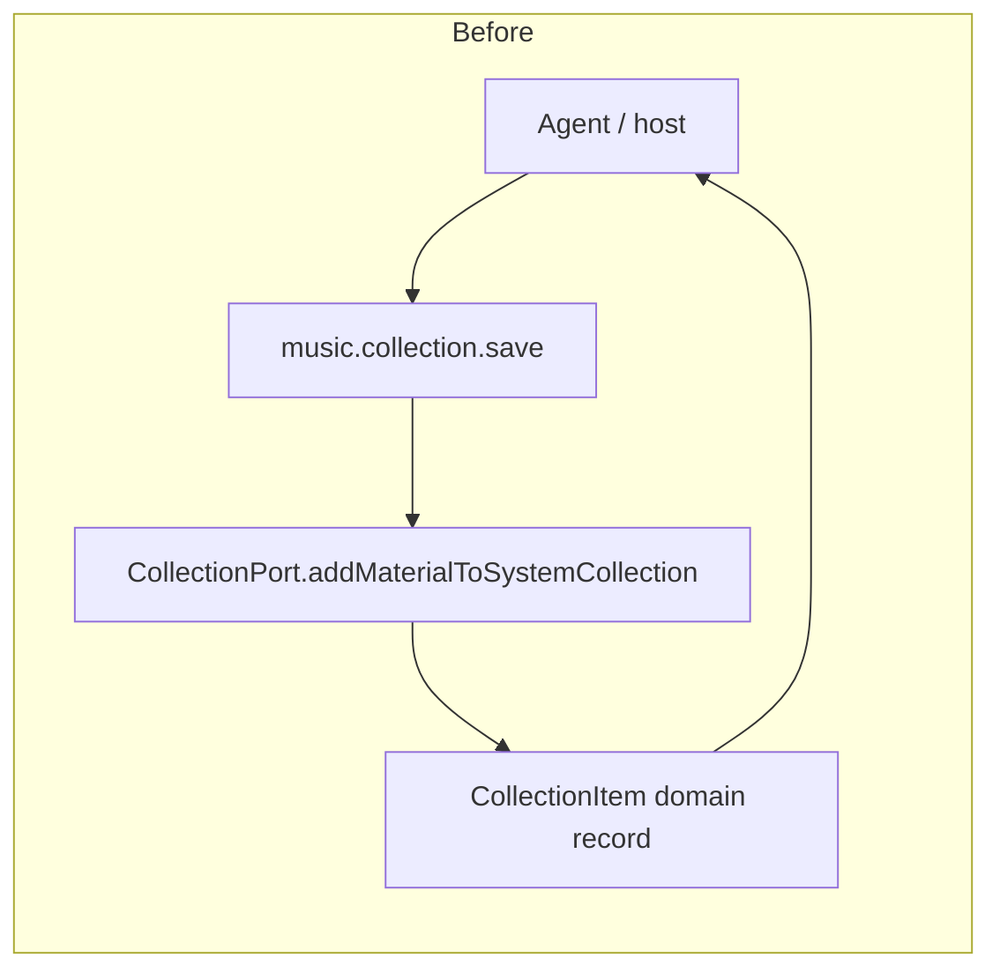

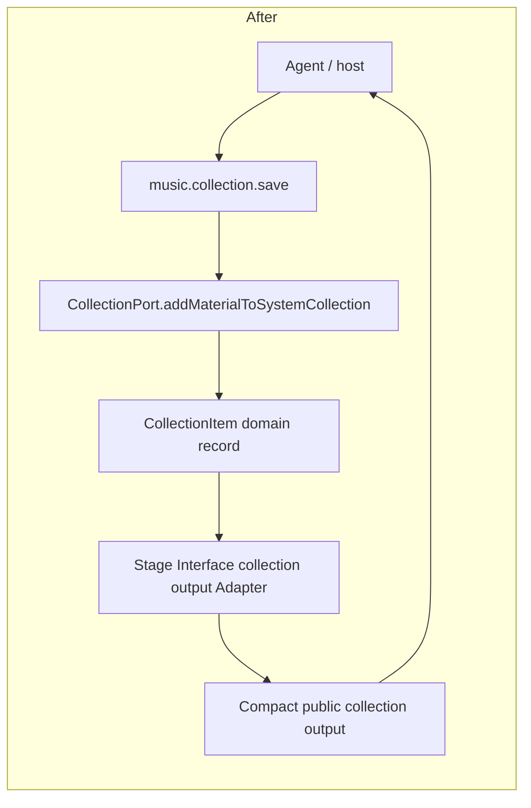

---

## Candidate 2: Narrow Material-facing Collection capabilities and route Resolve relation policy through Policy

**Status:** Implemented on branch `codex/material-collection-policy-handoff`; GitHub issue #46 can be closed on merge.

**Recommendation strength:** Strong

### Files

- `src/material/query/index.ts`
- `src/material/resolve/index.ts`
- `src/material/policy/index.ts`
- `src/ports/index.ts`
- `src/stage_core/compose.ts`
- `test/material_query/material-query.test.ts`
- `test/material_resolve/material-resolve.test.ts`
- `test/material_resolve/material-relation-filtering.test.ts`
- `test/material_policy/material-policy.test.ts`
- `test/architecture/material-boundary.test.ts`
- Governing evidence: `AGENTS.md`, `ARCHITECTURE.md`, `docs/adr/0003-materialref-backed-collections.md`

### Current shape

This candidate started as a Query-only broad-port issue, but owner review on 2026-06-03 exposed a deeper boundary conflict: Resolve currently reaches into Collection blocked filtering directly and projects material relations itself, while the architecture says Material Policy owns relation and collection-block policy.

`src/material/query/index.ts` defines:

```ts
export type MaterialQueryService =
  MaterialQueryPort &
  MaterialRelatedPort &
  MaterialContextBriefPort &
  MaterialPoolsPort;

export type MaterialQueryServiceOptions = {
  materialStore: MaterialQueryStorePort;
  materialResolve: MaterialResolvePort;
  materialSelector: MaterialSelectorPort;
  sourceLibraryMaterializer: MaterialSourceLibraryMaterializerPort;
  collection?: CollectionPort;
};
```

Material Query only uses `collection` for collection pool read paths:

- `collectionItemsForPool(...)` calls `collection.listCollections(...)` and `collection.listItems(...)`.
- `listPoolsForInput(...)` calls `collection.listCollections(...)` and `collection.listItems(...)` to build collection pool options and counts.

`src/material/resolve/index.ts` also receives `collection?: CollectionPort`, but only uses `collection.filterBlockedMaterials(...)` to mark resolved materials as blocked. Resolve also imports relation projection logic from Material Policy internals to apply `blocked`, `wrong_version`, `not_playable`, and `bad_match` relations.

`src/material/policy/index.ts` receives `collection?: CollectionPort` and uses `collection.filterBlockedMaterials(...)` for collection-backed blocked policy.

`CollectionPort` in `src/ports/index.ts` exposes all of these capabilities:

- `initializeOwnerCollections`
- `addMaterialToSystemCollection`
- `removeMaterialFromSystemCollection`
- `addMaterialToCollection`
- `removeMaterialFromCollection`
- `createCollection`
- `updateCollection`
- `removeCollection`
- `filterBlockedMaterials`

The tests show the cost. `test/material_query/material-query.test.ts` has `createCollectionPortStub(...)`, which must implement write methods even though Material Query only needs collection reads. Resolve tests cast partial objects to `CollectionPort` even though they only provide `filterBlockedMaterials`.

### Problem

This is a broad-port leak across Material-facing modules, and Resolve has a responsibility leak.

Material Query is supposed to be a Deep retrieval Module: it resolves pools, expands source-library tracks, delegates materialization, filters candidates, and delegates final selection. It should not even be able to write collections. The current Interface gives it that ability.

Material Resolve is supposed to own candidate lookup, Source Grounding orchestration, materialization, and resolve status aggregation. It should not directly read Collection blocked membership or apply relation policy evidence. `ARCHITECTURE.md` says Material Policy / Sort / Select owns relation, collection-block, availability, identity, and freshness policy. Resolve currently duplicates part of that policy responsibility.

The existing architecture guard catches broad `MaterialStorePort` imports under `src/material/query`, and it catches direct registry materialization writers. It does not catch `CollectionPort` under Material Query, Resolve, or Policy. That leaves avoidable testability and maintainability holes:

- a future Query change can call `createCollection(...)`, `addMaterialToCollection(...)`, or `removeMaterialFromCollection(...)` from a retrieval path without a type-level failure;
- Resolve can continue to bypass Material Policy for resolution-time relation and collection-block semantics;
- Policy tests and Resolve tests need broad or casted `CollectionPort` stubs for one method.

### Deletion test

Deleting Material Query would spread pool resolution, related lookup, candidate selection, source-library materialization delegation, pagination, and filtering across callers. The Module earns its keep.

Deleting `CollectionPort` from Material Query’s options and replacing it with a read-only collection Seam removes complexity. It does not spread behavior; it removes unused write authority.

Deleting direct relation and Collection blocked filtering from Resolve also removes complexity. Resolve still returns material-level `MaterialState` and candidate-level `MaterialResolveStatus`, but the decision about how resolution-time relation evidence is projected belongs in Material Policy.

### Deepening opportunity

Keep Material Query as the Deep Module for retrieval orchestration, but change the Collection boundary it sees. In plain English: Material Query should see “read collection items and collection headers for an owner,” not “the whole Collection capability.”

Keep Material Policy as the owner of relation and collection-block semantics. Policy should see “blocked membership evidence,” not “the whole Collection capability.”

Resolve should call Policy for resolution-time policy projection instead of reading Collection directly or applying relation projection itself. Introduce an internal `material_resolution` policy purpose. Under that purpose, `blocked`, `wrong_version`, and `not_playable` do not drop the material. `blocked` can still mark material-level `state: "blocked"`. `wrong_version` and `not_playable` should be represented at candidate level through `MaterialResolveStatus`, because they describe the result of resolving the candidate rather than the material's primary state. `bad_match` is not part of this slice.

Stage Core can still wire the concrete Collection Implementation into these narrow consumers by passing the concrete service directly. The repo's current pattern is type-level narrowing plus architecture guards, not runtime adapter objects.

### Benefits

**Locality:** Query code cannot accidentally perform collection writes. Collection write behavior remains in Collection Service and Stage Interface collection tools.

**Leverage:** A narrow Query collection read seam supports both collection pools and pool listing. A separate Policy collection-block seam supports collection-backed block evidence without mixing that evidence with collection pool reads.

**Availability:** Read-only collection pool browsing remains available even if collection write tools are unavailable or intentionally not wired in a future host.

**Responsibility clarity:** Resolve no longer bypasses Material Policy. Relation and collection-block semantics live in one policy owner, while Resolve keeps candidate lookup and status aggregation.

**Test improvement:** Material Query tests can use smaller stubs with only `listCollections` and `listItems`. Resolve tests no longer need `CollectionPort` stubs. Policy tests can stub only `filterBlockedMaterials`.

### Risks/tradeoffs

- If future Material Query behavior genuinely needs collection write semantics, this will force an explicit architecture decision instead of a local call. That is a feature, not a bug, but it adds friction.
- The repo already has many narrow Material Store port aliases. Adding another alias has naming cost; avoid a proliferation of tiny one-method aliases.
- Moving Resolve relation handling through Policy changes a call path. Resolution-time policy projection must not drop `blocked`, `wrong_version`, or `not_playable` materials. Blocked material remains visible as material-level `state: "blocked"` and candidate-level `status: "blocked"` when every resolved material is blocked. `wrong_version` and `not_playable` should become candidate-level `MaterialResolveStatus` values, not material-level `MaterialState` values.
- Do not collapse Query collection reads and Policy blocked evidence into one broad pseudo-read Interface. They are different capabilities.
- Do not add new `bad_match` resolve behavior in this slice. A provider no-match remains `unresolved` with resolve issues; `bad_match` is not the same concept and needs a separate owner decision before it becomes part of resolution semantics.

### Architecture guard

Add these guards:

1. Type keyset assertion for `MaterialQueryCollectionReadPort`: exactly `listCollections` and `listItems`.
2. Type keyset assertion for `MaterialPolicyCollectionBlockPort`: exactly `filterBlockedMaterials`.
3. Import/reference guard: files under `src/material/query` must not import `CollectionPort` and must not reference collection writer/filter methods outside `listCollections` and `listItems`.
4. Import/reference guard: files under `src/material/resolve` must not import `CollectionPort`, must not reference `filterBlockedMaterials`, and must not import Material Policy relation-projection internals directly.
5. Import/reference guard: files under `src/material/policy` must not import broad `CollectionPort` or collection writer/list methods.
6. Public Stage Interface schema guard: `material_resolution` must not be exposed through `music.material.select` policy input.

The existing `test/architecture/material-boundary.test.ts` is the right place because it already enforces narrow Material Store ports and direct writer bans.

### Minimal migration slice

First PR:

1. Add `MaterialQueryCollectionReadPort` and `MaterialPolicyCollectionBlockPort` in `src/ports/index.ts`.
2. Change Material Query's `collection` option from `CollectionPort` to `MaterialQueryCollectionReadPort`.
3. Change Material Policy's `collection` option from `CollectionPort` to `MaterialPolicyCollectionBlockPort`.
4. Add internal `MaterialPolicyPurpose` value `material_resolution`.
5. Extend `MaterialResolveStatus` with `wrong_version` and `not_playable`. Do not add `bad_match`.
6. Route Resolve relation policy through `MaterialPolicyEvaluatorPort` using `purpose: "material_resolution"`; remove Resolve's direct `CollectionPort` dependency and direct relation-projection import.
7. Update Material Query, Resolve, and Policy tests to use narrow stubs and preserve resolution-time behavior: `blocked`, `wrong_version`, and `not_playable` do not drop materials under `material_resolution`; `wrong_version` and `not_playable` are reported through candidate-level resolve status.
8. Add architecture guards.
9. Update `docs/material/design.md`, `docs/material/ports.md`, and area progress docs for the new boundary.

No public Stage Interface tool names or input schemas change. The resolve output object shape stays the same, but `MaterialResolveStatus` gains `wrong_version` and `not_playable` values.

### Before/After diagram

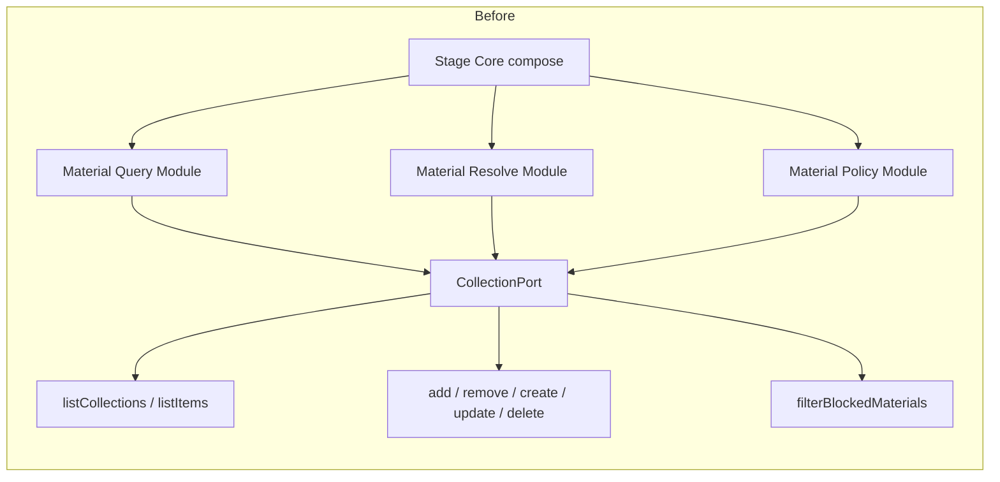

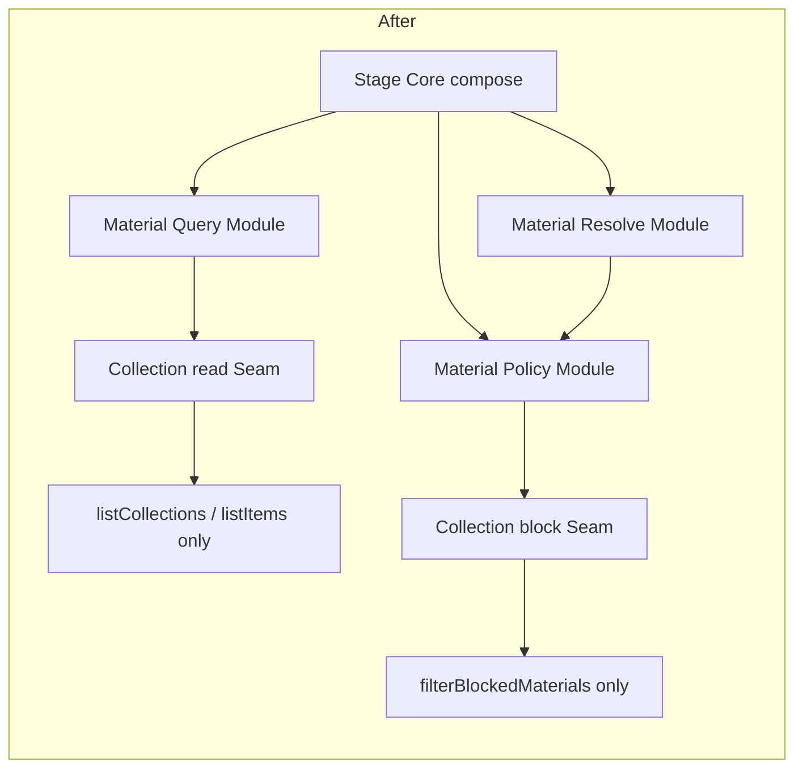

---

## Candidate 3: Split the monolithic music Tool Group by work area, not by tool count

**Recommendation strength:** Worth exploring

### Files

- `src/stage_interface/tool_definitions/music.ts`
- `src/stage_interface/tool_definitions/index.ts`
- `src/stage_interface/dispatch.ts`
- `test/stage_interface/stage-interface-dispatch.test.ts`
- Governing evidence: `ARCHITECTURE.md`, `CONTEXT.md`, `AGENTS.md`

### Current shape

`src/stage_interface/tool_definitions/music.ts` defines one large Tool Group with nineteen tool names:

- material resolve/query/related/select/context/pools
- link refresh
- system collection actions
- custom collection item actions
- custom collection create/update/delete/list

The group context contains all of these capabilities:

```ts
type MusicToolGroupContext = {
  materialResolve: MaterialResolvePort;
  materialQuery?: MaterialQueryPort & MaterialRelatedPort & MaterialContextBriefPort & MaterialPoolsPort;
  materialSelector?: MaterialSelectorPort;
  materialStore?: MaterialProjectionStorePort;
  source: SourceGroundingPort;
  collection?: CollectionPort;
};
```

`src/stage_interface/tool_definitions/index.ts` already has a registry model that can bind multiple definition arrays into one registry. The dispatch Interface does not require one file per instrument.

### Problem

The Module is not Shallow as a whole, but its internal work areas are too unrelated. Collection output changes, material query public schema changes, link refresh behavior, and material selector policy normalization all happen in one file with one group context.

That hurts Locality:

- A collection output fix touches the same Module as source grounding link refresh.
- `music.material.query` only needs the query capability but receives a context object that also contains collection, source, material store, material resolve, and selector.
- `music.context.brief` and `music.pools.list` are optional methods on the same `materialQuery` object, but each public tool has different availability and failure semantics.
- Helper functions at the bottom of the file mix public payload normalization, collection materialId conversion, material label lookup, missing-capability errors, and selector policy normalization.

This is not a call for one file per tool. That would create Shallow modules. The problem is that the current Module groups by the instrument label `music`, while the work areas have different Seams and different dependencies.

### Deletion test

Deleting `music.ts` would spread tool registration complexity across dispatch and tests. It earns its keep as the source of the music tool surface.

Deleting the “one Tool Group context for all music tools” assumption removes complexity. Splitting by work area lets each sub-Module have a narrower Interface without changing public tool names.

### Deepening opportunity

Keep the public `minemusic.music` instrument and all tool names stable. Internally, split the music Tool Definitions by work area:

- material browsing/resolve/select
- collection actions
- link refresh
- possibly material context/pools if those stay separate from query

In plain English: each tool-definition Module should own one kind of public workflow and receive only the capabilities that workflow needs. The registry can still publish one stable `musicToolNames` list.

### Benefits

**Locality:** Collection changes land in the collection tool-definition Module. Link refresh changes land in the link refresh Module. Query/schema changes land in the material browsing Module.

**Leverage:** The same Stage Interface registry machinery continues to bind definitions and derive descriptors/schemas.

**Availability:** Optional capabilities can be reported per work area. A host could wire material query without collection writes, or collection actions without source link refresh, without constructing misleading contexts.

**Test improvement:** Tests can build smaller dispatch fixtures per tool area. Current tests repeatedly stub unrelated ports just to exercise one cluster.

### Risks/tradeoffs

- Splitting too far creates Shallow Modules with little more than a name and a handler.
- Public tool ordering must remain stable. `stableToolNames`, handbook output, and dispatch tests should detect accidental changes.
- There is a naming risk: avoid a second public instrument unless owner explicitly wants that. This candidate is internal Module Locality, not a public tool taxonomy change.

### Architecture guard

Add Tool Group context keyset assertions:

- collection tool definitions must not receive `SourceGroundingPort`;
- link refresh must not receive `CollectionPort`;
- material query tools must not receive collection write capability;
- public `stableToolNames` order remains unchanged.

A lightweight import guard can also prevent `music_collection` definitions from importing `../outputs/material.ts` except through approved compact collection output helpers.

### Minimal migration slice

First PR:

1. Extract only `music.collection.*` definitions and collection helpers from `src/stage_interface/tool_definitions/music.ts` into a sibling Module.
2. Re-export and concatenate the definitions in `tool_definitions/index.ts` or a music index barrel.
3. Keep all tool names, schema refs, and behavior unchanged.
4. Add a test proving `stableToolNames` and handbook-exposed names are unchanged.

Do this separately from compact output migration if risk is a concern.

### Before/After diagram

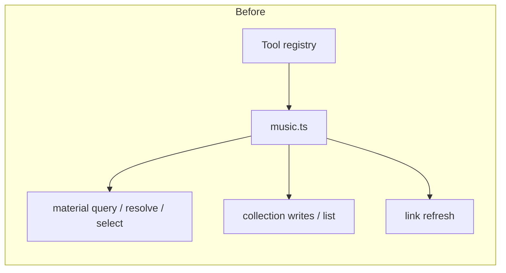

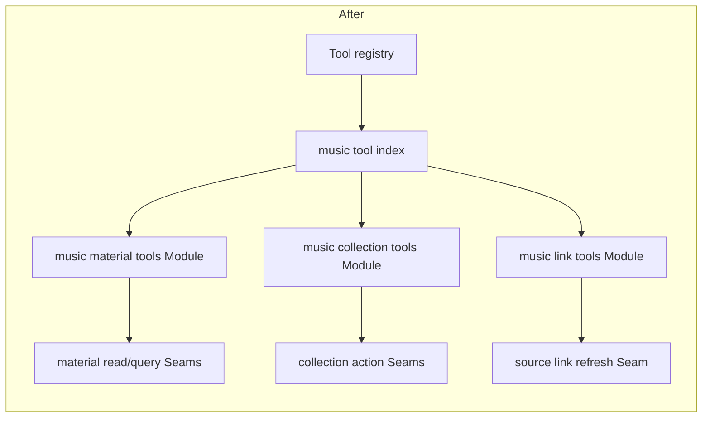

---

## Candidate 4: Deepen Material Query internals around related-candidate and pool-catalog behavior

**Recommendation strength:** Worth exploring

### Files

- `src/material/query/index.ts`
- `src/material/projection/index.ts`
- `src/material/materialization/index.ts`
- `test/material_query/material-query.test.ts`
- `test/architecture/material-boundary.test.ts`
- Governing evidence: `ARCHITECTURE.md`, `CONTEXT.md`, `AGENTS.md`

### Current shape

`src/material/query/index.ts` is a Deep Module by purpose. It owns domain retrieval and returns `MaterialQueryOutput`, `MaterialRelatedOutput`, `MaterialContextBriefOutput`, and `MaterialPoolsListOutput`.

Its Implementation currently contains all of these behaviors in one file:

- pool branching for `all`, `source_library`, `collection`, and `related`;
- source-library item reads and release-track expansion;
- materialization delegation for source-library items;
- collection pool lookup and collection-item fallback resolution;
- selector policy construction and sort policy construction;
- preference-hint string matching and scoring;
- excluded material redirect expansion;
- related candidate discovery for same artist and same album;
- confirmed binding lookup and source-entity scans;
- context brief projection;
- pool catalog generation and provider-account labels;
- cursor parsing and encoding;
- dedupe and ref comparison helpers.

The tests in `test/material_query/material-query.test.ts` reflect the breadth: saved-track query, source-library release expansion, related fallback behavior, pool listing, cursor pagination, preference hints, collection pools, relation exclusions, recency exclusions, context brief, and compact card non-leak checks all run through the same service.

### Problem

Do not split this Module merely because it is long. The Module has real Depth: deleting it would spread query orchestration into Stage Interface, Material Resolve, Material Projection, and tests.

The friction is more specific: unrelated algorithm clusters live in the same Implementation file and require bouncing within it for changes that should be local.

Examples:

- Related candidate generation (`relatedCandidates`, `sameArtistCandidates`, `sameAlbumCandidates`, canonical binding lookup, source entity scanning) sits beside pool catalog and context brief code.
- Pool catalog generation creates provider/account-facing labels and returns source-library pool specs, while query execution also validates and interprets those same specs.
- Context brief code reads Material Store records, canonical records, and source entities directly, even though Material Projection owns most material display projection rules. This may be justified because context brief has different fields, but it should be an explicit local rule, not incidental adjacency.

### Deletion test

Deleting Material Query spreads complexity. It is not Shallow.

Deleting specific internal clusters from `index.ts` and moving them behind private internal Seams can reduce cognitive load if the moved Modules have behavior, not just pass-through wrappers. A one-function extraction would be Shallow. A related-candidate Module or a pool-catalog Module likely has enough Depth.

### Deepening opportunity

Keep the public Material Query Interface intact. Deepen internal Seams only where behavior is cohesive:

- a private related-candidate Implementation that owns same-artist/same-album candidate discovery;
- a private pool-catalog Implementation that owns source-library and collection pool listing;
- later, a context-brief Implementation only if it can clarify its relationship to Material Projection.

Plain English: Material Query remains the caller-facing Module, but the algorithms with independent reasons to change stop sharing one file.

### Benefits

**Locality:** Same-artist/same-album changes no longer require scanning pool list and cursor code. Pool catalog changes no longer share a file with related candidate ranking.

**Leverage:** Tests can target the private behavior through public Material Query first, then narrower internal tests only if regressions justify them.

**Availability:** If pool listing becomes optional or host-specific, the query execution path can remain stable.

**Test improvement:** Architecture tests can guard the public Material Query Module while allowing internal submodules to evolve. Behavior tests can stay at the public service level.

### Risks/tradeoffs

- Over-extraction would create Shallow Modules whose Interface is almost the same as their Implementation.
- Internal modules can become fake public APIs if exported too widely.
- Related-candidate behavior is currently intertwined with Material Resolve and selector policy. Extract only the candidate discovery, not the whole query pipeline.

### Architecture guard

Add guards after extraction:

- `src/material/query/index.ts` remains the only public export point for `createMaterialQueryService`.
- private query submodules must not import Stage Interface output modules.
- private query submodules must not reference registry writer methods such as `getOrCreateBySourceRef`, `attachSourceRef`, `promoteToCanonical`, or `mergeMaterials`.
- existing Material Query narrow Material Store keyset assertions remain.

### Minimal migration slice

First PR:

1. Extract related candidate discovery from `src/material/query/index.ts` into a private internal Module.
2. Keep public `createMaterialQueryService(...)` unchanged.
3. Run existing `test/material_query/material-query.test.ts` unchanged.
4. Add no new public Interface.

Do not extract pool catalog in the same PR.

### Before/After diagram

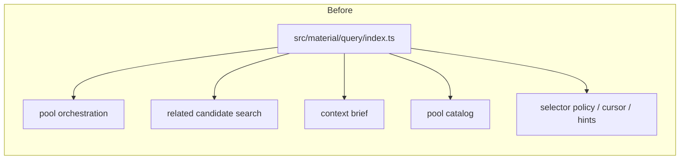

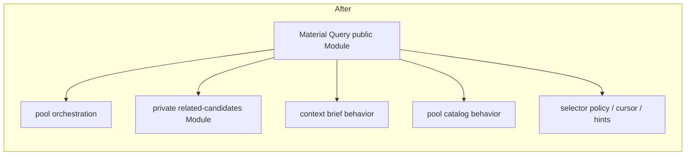

---

## Candidate 5: Treat source-library pool output as a public protocol decision

**Recommendation strength:** Speculative

### Files

- `src/contracts/index.ts`
- `src/material/query/index.ts`
- `src/stage_interface/tool_definitions/music.ts`
- `test/material_query/material-query.test.ts`
- `CURRENT_STATE.md`
- Governing evidence: `AGENTS.md`, `ARCHITECTURE.md`, `CURRENT_STATE.md`

### Current shape

`MaterialPoolsListOutput` returns pools whose `pool` field is an internal `MaterialPoolSpec`. For source-library pools, that spec includes:

```ts
{
  kind: "source_library";
  libraryKinds: PlatformLibraryItemKind[];
  providerId?: string;
  providerAccountId?: string;
  target?: SourceLibraryPoolTarget;
}
```

`src/material/query/index.ts` builds those pools from `SourceLibraryItem` groups using `providerId`, `providerAccountId`, and `libraryKind`. It also labels them as strings like:

```ts
`${providerId}/${providerAccountId} ${labelForLibraryKind(libraryKind)}`
```

`test/material_query/material-query.test.ts` explicitly verifies this behavior in `listPoolsDisambiguatesProviderAccountsInSourceLibraryLabels`: pool labels must include account identifiers to avoid collisions.

`src/stage_interface/tool_definitions/music.ts` exposes `music.pools.list` directly through `materialQuery.listPools(...)`; there is no Stage Interface output Adapter for source-library pool shape.

### Problem

This may be the right behavior, but it should be a deliberate public protocol decision.

The current public/tool output exposes provider/account shape through `pool.providerId`, `pool.providerAccountId`, and labels that embed those identifiers. That gives agents a concrete handle for account disambiguation, which is useful. It also ties the public Interface to storage/provider account concepts.

This is a weaker candidate than collection output leakage because the repository has a current test requiring account-disambiguated labels, and `CURRENT_STATE.md` says source library browsing now goes through `music.pools.list` and `music.material.query`. Still, the governing output rules say public outputs should avoid internal provider shape unless it is intentionally public.

This is not an ADR conflict today. It is a current-behavior/test conflict if the owner wants opaque pool handles. If owner judgment says provider/account identifiers are stable public protocol fields, document that and guard it as intentional.

### Deletion test

Deleting `music.pools.list` would reduce availability and push source-library discovery back into host prompts or hidden assumptions. That is worse.

Deleting raw provider/account pool shape and replacing it with a Stage Interface Adapter could remove public protocol coupling, but only if the replacement still gives agents a stable selector. That needs owner judgment.

### Deepening opportunity

Stage Interface should own the public pool selector shape. Material Query can keep internal `MaterialPoolSpec` with provider/account fields. The public tool can either keep provider/account fields intentionally, or present a stable opaque pool handle and keep provider details internal.

Plain English: decide whether provider/account identity is part of the public Interface. Do not leave that decision as an accidental consequence of returning `MaterialPoolSpec`.

### Benefits

**Locality:** Provider-account disambiguation policy moves to one Stage Interface output/input Adapter instead of being embedded in domain pool output.

**Leverage:** The same public pool selector can be used by `music.pools.list` and `music.material.query`.

**Availability:** If a future provider has unstable account ids, the public selector can remain stable.

**Test improvement:** Tests can assert either “provider/account is intentionally public” or “provider/account is hidden.” Either assertion is better than implicit leakage.

### Risks/tradeoffs

- Hiding provider/account identifiers may reduce agent debuggability and make multi-account selection harder.
- Opaque pool handles require lifecycle semantics: persistence, validity, and whether handles survive across sessions.
- Existing test expectations and possibly handbook prompts rely on visible provider/account labels.

### Architecture guard

Add one explicit guard depending on the owner decision:

- If provider/account is public: test that only `providerId` and `providerAccountId` are public, not `sourceRef`, repository ids, raw provider payloads, or `SourceLibraryItem` rows.
- If provider/account is internal: test that `music.pools.list` output lacks `providerAccountId`, raw `providerId`, `sourceRef`, and repository item ids, and that `music.material.query` can consume the public selector.

### Minimal migration slice

First PR should not change behavior. Add a characterization test for `music.pools.list` through Stage Interface, not just Material Query, documenting the current output shape and explicitly naming the owner decision needed.

If owner chooses to hide provider/account fields, a second PR can add the Stage Interface Adapter while keeping backward-compatible query input for one migration step.

### Before/After diagram

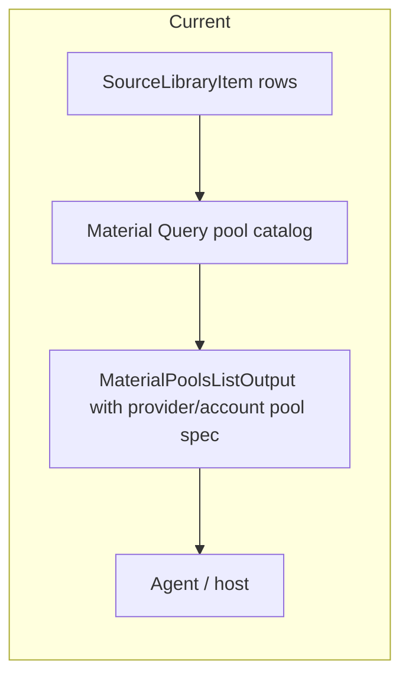

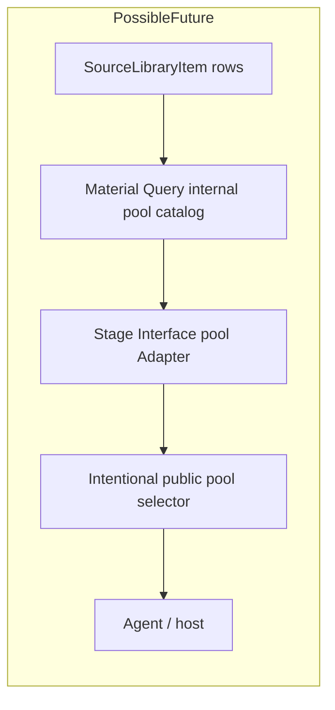

---

## Candidate 6: Move misplaced Stage Interface output/input helpers into their owning Modules

**Recommendation strength:** Worth exploring

### Files

- `src/stage_interface/outputs.ts`
- `src/stage_interface/tool_definitions/canonical_review.ts`
- `src/stage_interface/tool_definitions/library.ts`
- `src/stage_interface/outputs/material.ts`
- `src/stage_interface/outputs/recommendation.ts`
- `src/stage_interface/outputs/links.ts`
- `test/stage_interface/stage-interface-dispatch.test.ts`

### Current shape

Stage Interface has focused output modules for material, recommendation, and links:

- `src/stage_interface/outputs/material.ts`
- `src/stage_interface/outputs/recommendation.ts`
- `src/stage_interface/outputs/links.ts`

But `src/stage_interface/outputs.ts` is a mixed module. It contains:

- library import compact output functions;
- canonical review compact output functions;
- helper functions for canonical review output shaping;
- `reviewSubjectRef(subjectId: string): Ref`, which is not output projection. It constructs an internal `Ref` from a public `subjectId`.

`src/stage_interface/tool_definitions/canonical_review.ts` imports `reviewSubjectRef` from `../outputs.js` and uses it to normalize public input before calling `CanonicalMaintenancePort`.

### Problem

This is a small but real Locality leak.

The output Module contains an input/ref-construction helper. The helper is Shallow: its Interface is nearly the same as its Implementation, and the name only hides three fields:

```ts
{ namespace: "minemusic", kind: "recording", id: subjectId }
```

The helper makes canonical review input normalization depend on an output projection file. It also makes `outputs.ts` a grab bag for unrelated Stage Interface areas.

This is not as urgent as collection outputs or broad CollectionPort use, but it is exactly the kind of low-grade bounce that accumulates in Stage Interface.

### Deletion test

Deleting `reviewSubjectRef` and inlining it locally would remove a misleading dependency and would not spread meaningful complexity. That helper is Shallow.

Deleting the compact output functions would spread projection logic into handlers, so those functions earn their keep. The issue is the misplaced helper and mixed Module boundary, not output projection itself.

### Deepening opportunity

Keep compact output projection functions, but put them under owning Modules:

- canonical review output projection under a canonical review output Module;
- library import output projection under a library output Module;
- canonical review public-id-to-Ref normalization beside canonical review tool definitions or in a small input Adapter.

Plain English: output Modules should shape outputs; input handle normalization should live with the tool group that accepts that input.

### Benefits

**Locality:** Canonical review input changes stop touching output projection files. Library import output changes stop sharing a file with canonical review output changes.

**Leverage:** The existing pattern from material/recommendation/links becomes consistent across Stage Interface.

**Availability:** Smaller output Modules reduce the chance that a canonical review-only change breaks library import output or vice versa.

**Test improvement:** Import guards can enforce that output modules do not export public-id-to-Ref constructors. Dispatch tests stay unchanged.

### Risks/tradeoffs

- The first migration is mostly file movement, so it can look cosmetic. Keep it small and tied to the concrete misplaced helper.
- Splitting output files before higher-value public protocol or boundary work may create low-leverage churn.
- Barrel exports must preserve existing imports.

### Architecture guard

Add an import/export guard for Stage Interface output modules:

- output modules may import contract output/domain types and export `compact*`/`public*` projection functions;
- output modules must not export functions that construct internal `Ref` values from public ids, unless explicitly named as an input Adapter and placed under tool definitions.

This can start as a simple text guard for `function .*Ref(` in `src/stage_interface/outputs*.ts`, with an allowlist if needed.

### Minimal migration slice

First PR:

1. Move `reviewSubjectRef(...)` from `src/stage_interface/outputs.ts` into `src/stage_interface/tool_definitions/canonical_review.ts` or a canonical-review input helper.
2. Leave compact output functions where they are.
3. Add a tiny import guard or a direct test that `canonical_review.ts` no longer imports `reviewSubjectRef` from output projection.

Second PR, only if useful: split `outputs.ts` into `outputs/library.ts` and `outputs/canonical_review.ts`.

### Before/After diagram

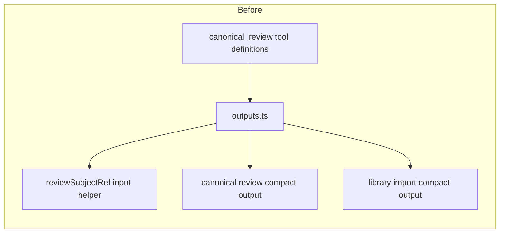

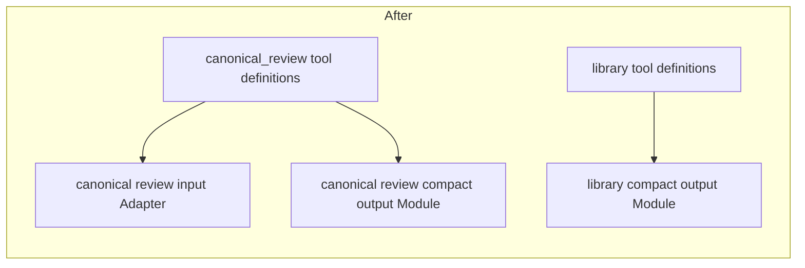

---

## Top recommendation and why

After the 2026-06-03 implementation sync, **Candidate 1: Compact collection outputs at the Stage Interface Seam** is complete on current `main`, and **Candidate 2: narrow Material-facing Collection capabilities and route Resolve relation policy through Policy** is implemented on branch `codex/material-collection-policy-handoff`.

Start next with **Candidate 3: split the monolithic music Tool Group by work area, not by tool count**.

Reason: the strongest remaining issue is now Stage Interface surface shape rather than an unresolved capability leak. Candidate 3 is the next slice that can improve agent comprehension and tool ownership without reopening the just-finished Material Flow boundary work.

## What not to change yet

Do not rewrite Stage Core composition. `src/stage_core/compose.ts` is doing what `ADR-0001` says: assembly and lifecycle wiring. It wires broad concrete Implementations into narrower consumers and returns a harness for tests/runtime use. Changing it before narrowing the consumer Seams would create churn without improving Locality.

Do not delete `src/material/store/index.ts` just because many methods are pass-through. Its facade has real Depth around `mergeMaterials(...)`, where it migrates relations and activity. The deletion test says deleting it would spread cross-store merge behavior across callers. It earns its boundary.

Do not split `src/material/query/index.ts` by function count alone. It is a Deep Module. Extract only behavior clusters that have a cohesive reason to change, starting with related-candidate generation if you pursue Candidate 4.

Do not hide provider/account fields in `music.pools.list` without owner judgment. Current tests intentionally require provider-account disambiguation in labels. That may be the correct public Interface.

## Questions that need owner judgment before implementation

1. Are provider ids and provider account ids intended to be stable public protocol fields for agents, or should they be hidden behind public pool selectors?
2. Should `music.collection.*` remain under the `minemusic.music` instrument externally even if internal Tool Definition Modules split? The report assumes yes.
3. Are collection diagnostic/audit views planned? If yes, raw-ish collection details should be a separate explicit view, not the default action output.
4. Should Material Query expose `contextBrief` and `listPools` as optional capabilities on the same created service, or should Stage Interface receive them as separate capabilities for better availability?

## Which candidate should we explore first?

Pick one: **Material-facing Collection capability narrowing and Resolve policy handoff** for the highest-Leverage architecture guard, or **music Tool Group internal split** if Stage Interface locality should take priority over Material Flow boundaries.
