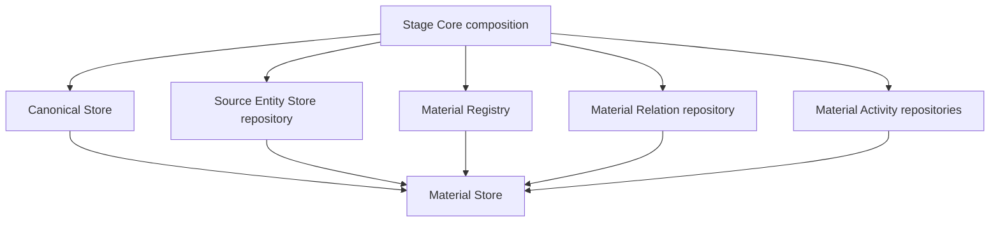

> Status: Superseded for formal rebuild
> Formal authority: `ARCHITECTURE.md`, `CURRENT_STATE.md`,
> `docs/formal-project-glossary.md`, and ADR-0004 through ADR-0007.
> Use only for: pre-formal Material Store implementation evidence until Music
> Data Platform rewrites source/material/canonical/owner fact boundaries.

# Material Store Design

Material Store is the durable material-state capability inside MineMusic. It
owns product-level material identity state, source entity state, Source Library
membership, confirmed source-to-canonical bindings, material relations, and
material activity projections.

Canonical Store remains the canonical identity subdomain inside Material Store.
Its current design and ports live in `docs/canonical-store/`.

## Boundary

Material Store owns:

- Material Registry records, redirects, source/canonical lookup indexes, and
  material merge behavior;
- Source Entity Store records for source tracks, releases, and artists;
- Source Library items and import/update provenance;
- Confirmed Canonical Bindings from source entities to canonical records;
- material-scoped relations such as blocked, wrong-version, not-playable,
  liked, disliked, saved, and favorite;
- material activity and material session activity projections.

Material Store does not own:

- provider API calls or provider account transport;
- Material Resolve/Query orchestration;
- Stage Interface compact output DTOs;
- Collection storage or Collection write semantics;
- Memory decisions;
- Canonical Maintenance review orchestration.

## Current Composition

`src/material/store/index.ts` composes Material Store from:

- a canonical subdomain read surface: `Pick<CanonicalStorePort, "get" |
  "findByLabel">`;
- `MaterialRegistryPort`;
- `MusicMaterialRelationRepository`;
- `MaterialActivityRepository`;
- `MaterialSessionActivityRepository`;
- `SourceEntityStoreRepository`.

Stage Core creates the Canonical Store first, then passes it to Material Store
when composing the runtime in `src/stage_core/compose.ts`.

## Source Entity Store

Source Entity Store is the provider-neutral source layer. It stores source
track/release/artist records, Source Library items, and confirmed bindings from
source refs to canonical records.

When MineMusic writes a Confirmed Canonical Binding through
`MaterialStorePort.putConfirmedCanonicalBinding(...)`, that write must also
leave Material Registry with a canonical-confirmed `MaterialRecord` containing
both the bound `canonicalRef` and `sourceRef`.

Library Import/Update writes observed provider items into Source Entity Store,
Source Library, Library Import repository provenance/absence state, and factual
events. Ordinary import/update does not write Collection membership and does
not depend on Confirmed Canonical Bindings as its success condition. The Library
Import implementation currently lives at
`src/material/store/source_entity/library-import.ts`.

## Material Registry

Material Registry owns stable `materialRef` records. It maps source refs and
canonical refs to current material records, supports source-ref attachment,
canonical promotion, and material merge redirects. Material Store merge also
migrates relations and activity from the loser material to the survivor.

## Resolved Boundary Decisions

- ADR-0003 accepts materialRef-backed Collection items and supersedes
  ADR-0002's earlier canonical-only Collection consequence.
- Source Grounding now reads confirmed canonical bindings through a narrow
  `SourceGroundingEvidenceStorePort` instead of calling Canonical Store
  source-ref APIs.

Resolved inconsistency details are recorded in
`docs/maintenance/architecture-inconsistency-log.md`.

## Related Documents

- `docs/material-store/ports.md`
- `docs/material-store/progress.md`
- `docs/canonical-store/design.md`
- `docs/canonical-store/ports.md`
- `docs/canonical-store/progress.md`
- `docs/adr/0002-material-store-boundary.md`
- `docs/adr/0003-materialref-backed-collections.md`
- `docs/archive/material-store/README.md`
