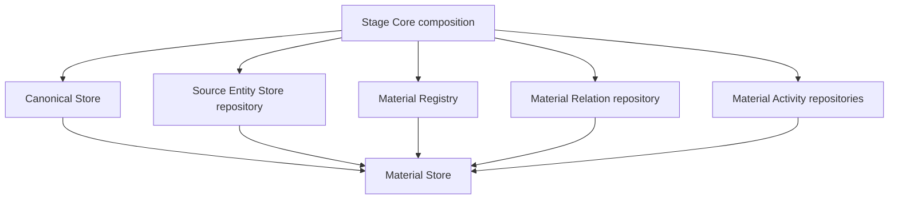

# Material Store Design

Material Store is the durable material-state capability inside MineMusic. It
owns product-level material identity state, source entity state, Source Library
membership, confirmed source-to-canonical bindings, material relations, and
material activity projections.

Canonical Store remains the canonical identity subdomain inside Material Store.
Its current design and ports live in `docs/canonical-store/`.

## Boundary

Material Store owns:

- Material Registry records, redirects, source/canonical lookup indexes, and
  material merge behavior;
- Source Entity Store records for source tracks, releases, and artists;
- Source Library items and import/update provenance;
- Confirmed Canonical Bindings from source entities to canonical records;
- material-scoped relations such as blocked, wrong-version, not-playable,
  liked, disliked, saved, and favorite;
- material activity and material session activity projections.

Material Store does not own:

- provider API calls or provider account transport;
- Material Resolve/Query orchestration;
- Stage Interface compact output DTOs;
- Collection storage or Collection write semantics;
- Memory decisions;
- Canonical Maintenance review orchestration.

## Current Composition

`src/material/store/index.ts` composes Material Store from:

- a canonical subdomain read surface: `Pick<CanonicalStorePort, "get" |
  "findByLabel">`;
- `MaterialRegistryPort`;
- `MusicMaterialRelationRepository`;
- `MaterialActivityRepository`;
- `MaterialSessionActivityRepository`;
- `SourceEntityStoreRepository`.

Stage Core creates the Canonical Store first, then passes it to Material Store
when composing the runtime in `src/stage_core/compose.ts`.

## Source Entity Store

Source Entity Store is the provider-neutral source layer. It stores source
track/release/artist records, Source Library items, and confirmed bindings from
source refs to canonical records.

Library Import/Update writes observed provider items into Source Entity Store
and Source Library first. It writes Collection only when a confirmed canonical
binding already maps the source entity to a canonical record. The Library
Import implementation currently lives at
`src/material/store/source_entity/library-import.ts`.

## Material Registry

Material Registry owns stable `materialRef` records. It maps source refs and
canonical refs to current material records, supports source-ref attachment,
canonical promotion, and material merge redirects. Material Store merge also
migrates relations and activity from the loser material to the survivor.

## Current Inconsistencies

- `AI-001`: ADR-0002 still says Collection remains canonical-only, while
  current code and root architecture describe materialRef-backed Collection
  items.
- `AI-002`: ADR-0002 says ordinary business modules should stop using
  `CanonicalStorePort.resolveSourceRef`; current Source Grounding still uses
  that Canonical Store method when normalizing source-backed materials.

These are recorded in
`docs/maintenance/architecture-inconsistency-log.md`; this document describes
the observed current implementation.

## Related Documents

- `docs/material-store/ports.md`
- `docs/material-store/progress.md`
- `docs/canonical-store/design.md`
- `docs/canonical-store/ports.md`
- `docs/canonical-store/progress.md`
- `docs/adr/0002-material-store-boundary.md`
- `docs/archive/material-store/README.md`
