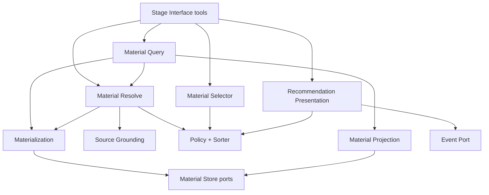

# Material Flow Design

This document is the current authority for MineMusic material-flow behavior.
It describes the code observed in `src/material/**`, the Stage Core wiring in
`src/stage_core/compose.ts`, and the material boundary guards in
`test/architecture/material-boundary.test.ts`.

Historical design and PR-plan evidence from the material and recommendation
posture refactors is preserved under `docs/archive/material/2026-06-02/` and
`docs/archive/recommendation/2026-06-02/`.

## Boundary

Material Flow owns the runtime path from candidate/source-library/collection
inputs to domain `MusicMaterial` results and final recommendation-domain
presentation items. It includes:

- material resolve;
- material query, related, context brief, and pool listing;
- material projection from registry records to domain `MusicMaterial`;
- source and Source Library materialization;
- material policy, sorting, and selection;
- recommendation presentation policy and event recording.

Material Flow does not own:

- durable Material Store or Canonical Store internals;
- Source Entity Store or Library Import storage semantics;
- Stage Interface compact output DTOs, tool schemas, or MCP exposure;
- provider implementation details;
- Collection persistence;
- Memory feedback consequence decisions outside the material ports it calls.

The public material handle is `materialId`. The internal product identity is
`materialRef`. Stage Interface owns conversion from domain results to compact
agent-facing cards.

## Current Flow

Stage Interface calls Material Flow through ports and projects the returned
domain values into compact output. Material Flow does not import Stage
Interface output modules.

## Components

### Resolve

`src/material/resolve/index.ts` implements `MaterialResolvePort`.

Resolve performs canonical-first lookup, Source Library scoped discovery,
provider grounding, and candidate-level resolve status aggregation. It
delegates source-backed material creation and projection to
`MaterialSourceMaterializerPort` instead of receiving registry writer methods
directly, and it delegates resolution-time blocked/wrong-version/not-playable
projection to `MaterialPolicyEvaluatorPort` through the internal
`material_resolution` policy purpose.

Resolve consumes `MaterialResolveStorePort`, `SourceGroundingPort`,
`MaterialSourceMaterializerPort`, and `MaterialPolicyEvaluatorPort`.

### Query, Related, Context, And Pools

`src/material/query/index.ts` implements `MaterialQueryPort`,
`MaterialRelatedPort`, `MaterialContextBriefPort`, and `MaterialPoolsPort`.

Query gathers domain material candidates from all-material, source-library,
collection, and related pools. It applies return-kind filters, relation and
recent-activity exclusions, cursor pagination, and ordering through the
selector. Source Library pool items are materialized through
`MaterialSourceLibraryMaterializerPort`.

Query consumes `MaterialQueryStorePort`, `MaterialResolvePort`,
`MaterialSelectorPort`, `MaterialSourceLibraryMaterializerPort`, and optionally
`MaterialQueryCollectionReadPort`. It does not receive full
`MaterialStorePort`, does not receive collection write authority, and does not
perform registry materialization writes directly.

### Projection

`src/material/projection/index.ts` owns conversion between internal
`materialRef`, public `materialId`, current `MaterialRecord`, and domain
`MusicMaterial`.

Projection reads through `MaterialProjectionStorePort`. Shared helpers such as
`materialIdToRef`, `materialRefToMaterialId`, and `materialForMaterialId` are
exported from `src/material/index.ts` for narrow consumers.

### Materialization

`src/material/materialization/index.ts` owns SourceMaterial and Source Library
item materialization. It is the shared writer boundary that can call registry
creation, attachment, promotion, and merge methods through
`MaterialSourceMaterializerStorePort`.

Resolve uses `MaterialSourceMaterializerPort`. Query uses
`MaterialSourceLibraryMaterializerPort`.

### Policy, Sort, And Selection

`src/material/policy/index.ts` implements the per-material policy evaluator and
the sorter. It uses projection helpers for record-to-domain projection instead
of carrying local record projection code. Policy consumes
`MaterialPolicyCollectionBlockPort` for collection-backed blocked membership
evidence and owns the internal `material_resolution` purpose that Resolve uses
to mark blocked materials and preserve wrong-version/not-playable results
without dropping them.

`src/material/selection/index.ts` composes policy evaluation, sorting,
diversity, and limiting over materialId candidates.

### Recommendation Presentation

`src/material/presentation/index.ts` implements
`RecommendationPresentationPort`. It evaluates the intended ordered materialId
list with presentation policy, preserves the surviving order, applies card
limits, records typed `recommendation.presented` events, and returns domain
presentation items. Stage Interface performs compact output projection.

## Public Surface Notes

Material Flow is not the public tool surface. The current public tool contracts
are documented in `docs/stage-interface/tool-contracts.md`.

Observed public-surface facts relevant to Material Flow:

- `music.material.query`, `music.material.related`,
  `music.material.context.brief`, `music.pools.list`,
  `music.material.select`, and `stage.recommendation.present` are Stage
  Interface tools backed by material ports.
- `music.material.resolve.cards`, `library.source.list`, and public
  `stage.materials.prepare` are not current stable public tools.
- Compact MaterialCard-like DTOs are Stage Interface output types, not material
  service communication formats.

## Guards

`test/architecture/material-boundary.test.ts` verifies the material boundary:

- material port key sets are exact for projection, query, resolve,
  materialization, Source Library reads, Stage Interface material reads, and
  narrow collection seams used by Query and Policy;
- material modules do not import Stage Interface output DTOs or legacy
  material card modules;
- legacy root material directories are removed;
- query, policy, selection, and resolve avoid full material-store dependencies
  and hidden materialization writers;
- query cannot import broad `CollectionPort` or collection writer/block
  methods, policy cannot import broad `CollectionPort` or collection
  list/write methods, and resolve cannot read Collection or relation-projection
  internals directly;
- materialization avoids imports from query, resolve, Stage Interface,
  presentation, library import, and memory.

## Related Documents

- `docs/material/ports.md`
- `docs/material/projection-materialization.md`
- `docs/material/progress.md`
- `docs/stage-interface/design.md`
- `docs/stage-interface/tool-contracts.md`
- `docs/archive/material/README.md`
- `docs/archive/recommendation/README.md`
