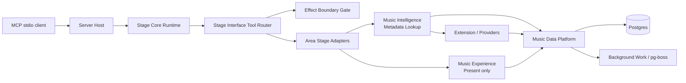
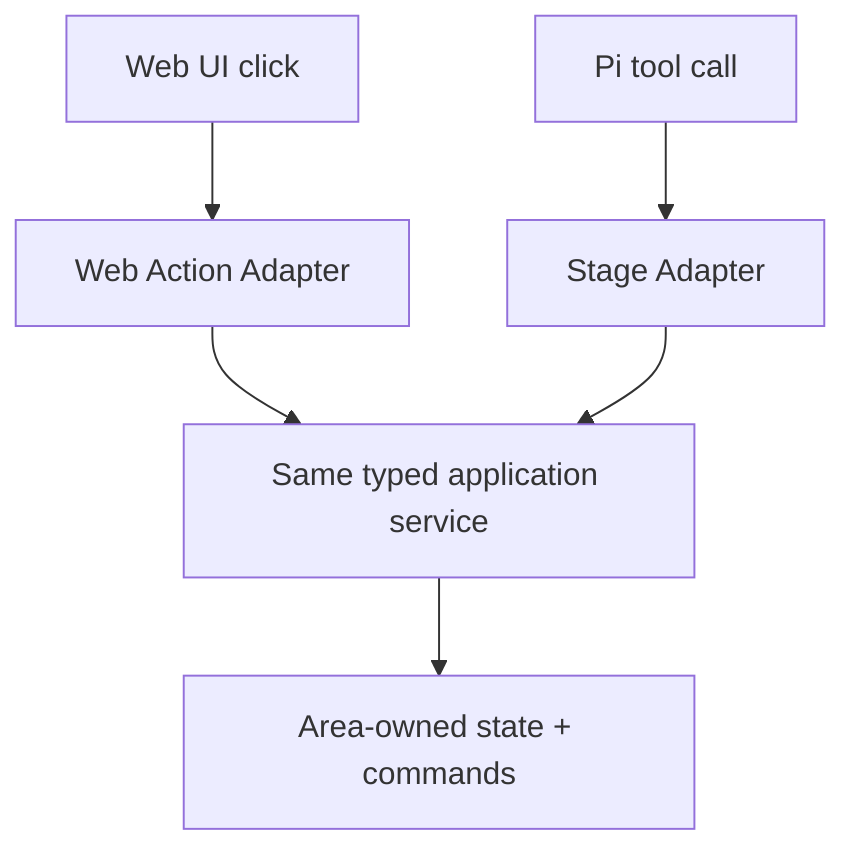
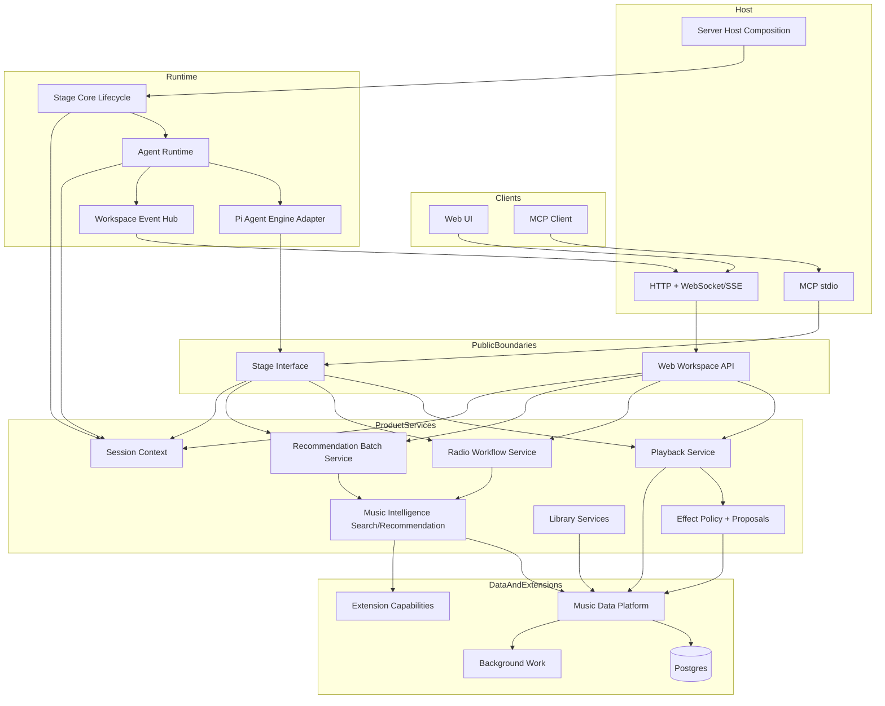
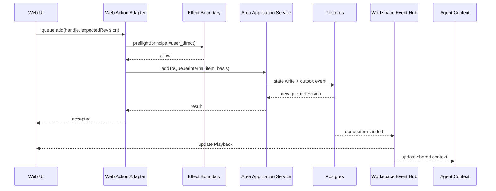
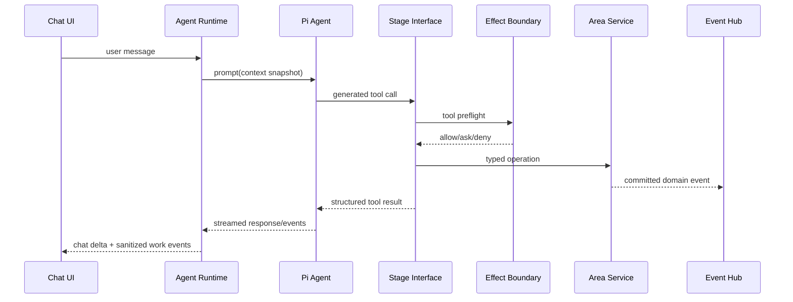
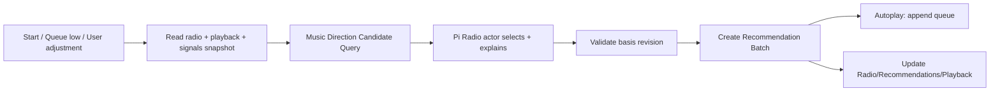

# MineMusic Pi Agent Core + Web UI 融合架构研究报告

> 状态：架构研究与实施建议
> MineMusic 审查基准：`main@76bb9a09efd778af2d32c461991635e6e3a7f4d1`
> PRD：`music-agent-workbench-prd.md`
> 研究范围：Pi agent core、Web UI、Chat、Playback、Cards、Radio Workflow、Tools、State、Effects、Persistence
> 结论性质：基于当前代码和权威文档的目标架构建议，不代表已经实现

> Supersession note (2026-06-29): this research draft predates the current
> `docs/formal-rebuild/agent-context-engineering-spec.md`. Its old
> Session-Context-as-area model is retired. Current authority: Agent Runtime owns
> seven context rails and the shared Workspace Context assembler; Music
> Experience owns queue/now-playing/radio truth; Workbench Interface remains an
> interaction-state source, not an agent-context blob owner.

> 修订说明：本版在原报告基础上明确两次关键收束：第一，把原先容易被理解为“外部 Pi adapter 接入 MineMusic”的表述改为：**MineMusic 是 agent-native runtime；Agent Runtime 是 MineMusic 内部一等组件；Pi 只是 Agent Runtime 使用的 engine implementation**。第二，本文曾误读 ADR-0030，把 **Session Context** 也写成 formal top-level area；当前 authority 已更正为：ADR-0030 只新增 **Agent Runtime** 与 **Workbench Interface** 两个 top-level areas，Session Context 是旧的 agent-facing umbrella term，不是 area。本文中的 `adapter` 应理解为 Agent Runtime 内部的反腐/engine 适配层，不是把 agent 放在 MineMusic 外部。


---

## 1. Executive Summary


### 1.0 本次修订后的核心结论：Agent Runtime 不是外部 adapter

原报告中“Pi agent core = agent execution engine adapter”的说法容易造成误解：它不是说 Pi agent 站在 MineMusic 外部，通过少数工具遥控 MineMusic。修订后的判断是：

```text
MineMusic Runtime
  ├─ Agent Runtime                  # MineMusic 内部一等 runtime 组件
  │   ├─ Main Agent Actor
  │   ├─ Radio Agent Actor
  │   ├─ Agent Context rails
  │   ├─ Workspace Context Assembler
  │   ├─ Agent Event / Work Supervisor
  │   └─ Pi Engine Adapter           # 仅是 engine implementation bridge
  │
  ├─ Workbench Interface             # interaction state / workspace protocol
  ├─ Stage Interface                 # agent-facing capability contract
  ├─ Music Experience                # durable music interaction outcomes/history
  ├─ Music Data Platform             # source/material/canonical/library/owner facts
  ├─ Effect Boundary                 # proposal / permission / audit truth
  └─ Server Host / Web Workspace API # transport and composition
```

这意味着：

- agent 必须深度嵌入 MineMusic runtime，而不是站在系统外；
- Pi 的 `transformContext`、tool extension、event stream、`abort/steer`、`beforeToolCall/afterToolCall` 等能力应被 MineMusic Agent Runtime 吸收使用；
- MineMusic 仍然保留 domain ownership：Pi 不直接拥有 material identity、queue truth、radio state machine、provider registry、Effect approval policy、DB write model 或 public handle veil；
- agent 的自由体现在音乐意图理解、工具组合、Radio loop、推荐判断、解释、提案、协商和中断响应；不是体现在能随便碰 DB/provider/raw refs。

本修订不改变“Pi 可替换”的工程目标，但把“可替换”从“外部 client”重新定位为“内部 Agent Runtime 的可替换 engine”。

---

MineMusic 当前已经具备一套质量较高的正式化后端骨架：

- Stage Core 有明确的 RuntimeModule 生命周期、工具贡献合并和失败清理；
- Stage Interface 已经是完整的 agent-facing API 边界，具备 schema 校验、Effect preflight、超时、取消、错误词表、Public Handle Veil 和输出泄漏防护；
- Server Host 已经能组装 Extension、Music Data Platform、Music Intelligence、Music Experience、Background Work，并通过 MCP-over-stdio 暴露工具；
- Music Data Platform 已经拥有 Source / Material / Canonical、owner catalog、source library、owner relations、candidate commit、Postgres Search projection 和 result-set persistence；
- Music Intelligence 已经有 provider/local mixed metadata lookup；
- provider capability 已经包含 playable links、picture URL、lyrics 和 download source 等基础能力。

这些资产应保留。Pi agent core 和 Web UI 不应推翻它们，而应分别作为：

```text
Pi agent core = agent execution engine adapter
Web UI        = public workspace client + host transport
```

推荐的核心架构判断是：

1. **Pi 不成为 MineMusic 的领域核心。**
   Pi 负责 LLM loop、消息流、工具调用、steering、abort 和运行时状态；MineMusic 继续负责音乐对象、工具契约、权限、状态机、持久化和产品语义。

2. **Stage Interface 继续作为唯一 agent-facing callable boundary。**
   Pi 的工具列表必须由现有 `ToolDeclaration` 自动派生，Pi tool 执行必须回到 `StageInterface.dispatch(...)`，不能直接调用 provider、数据库或领域 repository。

3. **Web UI 不以 Stage tool 为主要产品 API。**
   用户点击和 agent tool call 应进入同一组窄 application services，但经由不同 adapter：Web Action Adapter 与 Stage Adapter。这样满足 PRD 的“用户操作和 agent 操作共享同一产品对象与工作流”，同时避免把 UI 按钮伪装成 LLM 工具调用。

4. **Agent Runtime context rails 与 Music Experience 必须一起承接 listening runtime。**
   当前 authority 下，live queue/now-playing/radio truth 由 Music Experience 拥有；Agent Runtime 的 Workspace Context 只读取并压缩这些 facts 给 agent。Invocation Context 承载 turn/run intent 和 basis revisions；Workbench Interface 提供 interaction-state facts。

5. **必须引入 server-authoritative agent context assembly，但不能让它变成新的全能 bounded context。**
   Agent Runtime 组装 Actor Identity、Actor Instruction、Workspace Context、Invocation Context、Continuity Context 和 Knowledge / Memory Context；它不拥有 queue/radio truth、Library/identity、proposal/confirmation 或 Web workspace protocol。

6. **“用户显式操作优先”必须通过 revision 和 intent epoch 实现，而不是 prompt 约定。**
   Agent 生成的 mutation 带 `basisRevision` / `intentEpoch`；用户操作更新 revision。旧方向的 agent 结果在 commit 时被拒绝，而不是先写入再补救。

7. **Radio subagent 应是 Radio workflow 的执行参与者，不是第二套产品模型。**
   Music Experience 保存 commanded direction、evolved posture、queue 和 radio truth；Radio 的 `runId`、wake reason、suggested append count 和 basis revisions 属于 Invocation Context；Pi Radio actor 在版本化 context 上完成候选判断、解释和下一步建议，但不直接拥有 queue 或 durable state。

8. **当前 Metadata Lookup Search 不能单独满足 PRD 的模糊音乐意图。**
   “更阴一点”“保留空旷感但更 shoegaze”不是 metadata lookup。Music Intelligence 需要新增明确的 `Music Direction Query` / `Recommendation Candidate Query`，不能把语义推荐偷偷塞进 `music.discovery.lookup`。

推荐采用**渐进式扩展**，不是重写：先建立 Agent Context rails / Workspace Context assembler 基础，再接 Agent Runtime/Pi 主 agent，再接 Web shell，随后完成 Playback、Recommendation Batch 和 Radio。本文后文仍保留大量 pre-refactor Session Context 研究表述；按页首 supersession note 读取。

---

## 2. Evidence Inventory 与权威性

### 2.1 已阅读的要求文档

| 证据编号 | 路径 | 主要用途 |
|---|---|---|
| D1 | `AGENTS.md` | 权威顺序、area 边界、Stage Interface 与写边界规则 |
| D2 | `INDEX.md` | 当前 formal phases、真实 source entrypoints、ADR 导航 |
| D3 | `ARCHITECTURE.md` | 顶层 area、Server Host / Stage Core / Stage Interface / Agent Runtime / Workbench Interface 所有权 |
| D4 | `CURRENT_STATE.md` | 当前实现状态，Phase 22 以及仍未完成的 area |
| D5 | `PROGRESS.md` | Phase 16–22 的实际落地历史和 next milestones |
| D6 | `docs/formal-project-glossary.md` | Source / Material / Canonical、Session Context、Effect 等正式词汇 |
| D7 | `docs/maintenance/documentation-architecture.md` | 文档权威层级和 design/ports/progress 分工 |
| D8 | `music-agent-workbench-prd.md` | 产品需求、交互模型、Radio/Playback/Card/Agent workflow |
| D9 | `docs/adr/0030-agent-runtime-and-workbench-interface-are-top-level-areas.md` | Agent Runtime 与 Workbench Interface 升为 formal top-level areas；Session Context 明确不是 top-level area |

### 2.2 已阅读的代码入口

| 证据编号 | 路径 | 结论 |
|---|---|---|
| C1 | `src/stage_core/index.ts` | Stage Core 当前公开入口 |
| C2 | `src/stage_core/runtime.ts` | 顺序初始化 RuntimeModule，汇总工具后创建 Stage Interface |
| C3 | `src/stage_core/runtime_module.ts` | RuntimeModule 目前只贡献 instruments/tools |
| C4 | `src/stage_interface/index.ts` | Tool Call Router、schema、gate、timeout、veil、declared error |
| C5 | `src/stage_interface/context.ts`、`src/stage_interface/tool_context_factory.ts` | 每次调用的 owner/session/request context |
| C6 | `src/contracts/stage_interface.ts` | ToolDeclaration、MusicItemHandle、MusicCard、lookup/import/relation contract |
| C7 | `src/server/index.ts`、`src/server/host.ts` | 当前宿主和 composition root |
| C8 | `src/server/config.ts` | Postgres、Background Work、本地源和 NCM/QQ 配置；无 Pi/Web 配置 |
| C9 | `src/server/transports/mcp_rendering.ts` | 从同一 ToolDeclaration 派生 MCP tool 的现成模式 |
| C10 | `src/server/stage_tool_context_assembly.ts` | 生产 StageToolContext 组装与当前 in-memory audit |
| C11 | `src/music_experience/stage_adapter/index.ts` | Music Experience 当前仅贡献 present |
| C12 | `src/music_experience/stage_adapter/present.ts` | candidate commit + durable MusicCard presentation；明确不是 playback |
| C13 | `src/music_intelligence/index.ts` | 同时导出旧 Retrieval 和新 Search |
| C14 | `src/music_intelligence/core/search/metadata_lookup_retrieval_adapter.ts` | 新 Search 仍以兼容 adapter 接旧 Retrieval query port |
| C15 | `src/music_data_platform/index.ts` | 当前 MDP identity/catalog/search/import/relation/commit 能力总览 |
| C16 | `src/music_data_platform/metadata_lookup_search_workspace.ts` | Postgres result set、local/provider mixed search、candidate cache |
| C17 | `src/effect_boundary/stage_tool_execution_gate.ts` | 当前只按 ToolDeclaration 做 allow/ask/deny |
| C18 | `src/contracts/kernel.ts` | FormalArea、Result、Ref、错误基础契约 |
| C19 | `src/contracts/music_data_platform.ts` | SourceProvider、playable/picture/lyrics、MusicMaterial、candidate contract |
| C20 | `src/contracts/stage_core.ts` | runtime snapshot/status contract |
| C21 | `package.json` | 当前没有 Pi、Web framework、HTTP/WebSocket 依赖 |
| C22 | `test/formal/active-tree.test.ts` | 严格 active-tree、import、veil 和路径 allow-list guards |

### 2.3 实际入口与用户给定入口的差异

- `src/music_experience/index.ts` 当前不存在；真实入口是 `src/music_experience/stage_adapter/index.ts`。[C11]
- `src/contracts/index.ts` 已按 formal contracts DAG 删除；调用方应直接引用 `kernel.ts`、`stage_interface.ts`、`music_data_platform.ts`、`stage_core.ts` 等 area contract。[D2][C18-C20]
- 当前 Server Host 只有 MCP-over-stdio 生产 transport，没有 HTTP、WebSocket、SSE 或 Web UI host。[C7][C9][C21]

### 2.4 文档漂移

根文档与代码应作为当前判断依据，但 area progress/phase plan 有漂移：

- `CURRENT_STATE.md`、`INDEX.md`、`PROGRESS.md` 已将 Phase 22 第一 slice 记为实现；
- `docs/formal-rebuild/phase-22-search-core-metadata-lookup-refactor-implementation-plan.md` 头部仍写 “no implementation started”；
- `docs/music-intelligence/progress.md` 仍写 implemented through Phase 15D；
- `docs/music-data-platform/progress.md` 头部仍写 through Phase 18D/E。

按照 `docs/maintenance/documentation-architecture.md` 的权威层级，本报告采用 root state docs + 当前代码为准。正式开始 Pi/Web 阶段前应先修正文档状态，避免后续工作建立在过期 area progress 上。[D4][D7]

### 2.5 Pi 外部证据

用户所称 Pi agent core 对应当前官方项目中的 `@earendil-works/pi-agent-core`。本次核对的官方源码入口：

- `earendil-works/pi/packages/agent/README.md`
- `earendil-works/pi/packages/agent/package.json`
- `earendil-works/pi/packages/agent/src/agent.ts`
- `earendil-works/pi/packages/agent/src/agent-loop.ts`
- `earendil-works/pi/packages/agent/src/types.ts`

审查时 package manifest 为 `0.79.7`，Node 要求为 `>=22.19.0`。Pi 提供 Agent state、tool execution、event streaming、parallel/sequential tool mode、`beforeToolCall` / `afterToolCall`、`abort()`、`steer()`、follow-up queue 和 context transform。实现时必须锁定具体版本/commit，不能直接跟随 `main`。

### 2.6 主流 agent 系统调研结论

补充调研覆盖 Pi、OpenAI Agents SDK、LangGraph、AutoGen、Semantic Kernel、CopilotKit / AG-UI、OpenHands 和 Goose。稳定共识不是“agent 站在产品外面只调几个工具”，也不是“agent framework 直接拥有所有产品状态”，而是：

```text
Agent runtime
  + application/domain runtime
  + shared state/event interaction layer
```

对 MineMusic 的架构含义：

- Agent Runtime 是应用内部运行组件，不是外部 tool client。
- Agent state 不等于 application state；Pi messages / agent run state、Agent Context rails、Music Experience、Music Data Platform、Memory 必须分开。
- Agent 通过 snapshot / events / shared context 感知产品，通过 Stage Interface / commands / proposals 行动。
- Main Agent 与 Radio Agent 不共享无边界可变 prompt/messages；它们通过 typed actor messages、versioned Workspace Context facts / Invocation Context basis 和 domain events 协作。
- HITL 不是一个确认弹窗，而是可暂停、可恢复、可过期、可审计的 workflow/proposal state。
- Web UI 主要消费 typed events 和 projections；所有写操作仍回到 owning area commands。
- 权限、transaction、一致性、revision、effect approval 和恢复逻辑留在代码中，不交给 LLM 自由处理。

---

## 3. PRD 要求面与当前承接度

| PRD 要求 | 架构必须提供 | 当前代码落点 | 当前缺口 |
|---|---|---|---|
| Chat 常驻 | 主 agent session、流式消息、conversation continuity | Stage Interface 仅提供 tool dispatch；MCP transport 可调用工具 | 无 agent loop、消息状态、流式 Chat protocol |
| Playback 常驻 | now playing、queue、controls、progress、volume、source、error | provider 有 `getPlayableLinks`；Music Experience 只有 `present` | 无 Workspace Context playback/queue projection、Music Experience durable playback outcome、browser controller、playback events |
| Selected Object | session-selected handle、summary、agent context injection | 已有 opaque `MusicItemHandle` 和 Handle Registry | 无 selected-object session state |
| Functional Cards | area-owned view projections、compact/expanded state | 当前 `MusicCard` 只表示单一音乐对象 | 无 Radio/Recommendations/Library card snapshots |
| Action Cards | effect proposal、confirm/cancel/apply/open lifecycle | Effect gate 只有一次性 allow/ask/deny | 无 proposal persistence、public action-card projection、resolution command |
| UI/Agent 共享操作 | 同一 application service，两种 adapter | Stage adapters 已调用 narrow services | Web adapter 尚不存在；尚无 Playback/Radio services |
| 用户显式操作优先 | revision / Invocation Context basis、stale commit rejection | 当前 requestId/sessionId 已存在 | 无 Agent Context basis 和 optimistic concurrency |
| 主 agent + Radio subagent | 两个 actor、共享 snapshot、typed directive/result | 当前无 Pi，无 Radio domain | 整体缺失 |
| Agent work visibility | sanitized work events、interrupt、status projection | Stage tool timeout/abort、MCP cancelled 已存在 | 无 agent event translator、Web event stream、work state |
| Silent/Notify/Speak | event routing policy | Tool resultSummary 仅面向 transport | 无 speech policy / notification policy |
| Recommendation Batch | batch source、history、direction revision、dismiss/feedback | metadata lookup result set 是检索窗口，不是产品 recommendation batch | 缺少 product batch model |
| Radio motif/variation | Workspace Context radio section + Music Experience radio truth | 无 | 缺失 |
| Library Card | import status、scope、relations、selectable items | MDP import、catalog、relation tools已存在 | 缺少 UI projection和事件更新 |
| Session signals | play/skip/reorder/steering/explicit preference 分层 | owner saved/favorite/blocked 已存在 | 无 playback/session signal model |
| 模糊音乐意图 | semantic/direction candidate query | 当前 Search 只做 metadata lookup | 不能覆盖“更阴”“更 shoegaze”等 PRD 核心场景 |
| 非阻塞和中断 | cancellable work supervisor、basis revision | Stage Interface abortSignal、Pi abort 可用 | 后台/Radio work cancellation尚无统一语义 |
| Session-level understanding | Agent Context rails / Workspace Context assembler | `StageToolContext` 只有调用级上下文 | 无 durable/reconnectable Agent Context path |

结论：**当前架构已能承接“工具调用和音乐数据”，但尚不能承接“持续、可听、并行、可纠正的产品 runtime”。**

---

## 4. 当前实际架构



### 4.1 值得直接复用的部分

#### Stage Runtime

`src/stage_core/runtime.ts` 已经具备：

- module validation；
- required module fail-fast；
- reverse-order cleanup；
- Stage Interface 在 contributions 合并后创建；
- runtime snapshot。

它适合作为 Pi runtime module、Web host dependency 和 Music Experience service 生命周期的上层协调器。[C2]

#### Stage Interface

`src/stage_interface/index.ts` 已经具备绝大多数 agent tool frame 必需能力：

- 输入/输出 JSON Schema；
- Effect preflight；
- timeout；
- AbortSignal；
- declared public errors；
- output veil；
- internal anchor leak guard；
- tool descriptor/handler 分离。

Pi 工具桥接应建立在此处，而不是绕过此处。[C4][C6]

#### Public Handle Veil

当前 `MusicItemHandle` 明确区分：

```text
library   = durable item
candidate = temporary provider candidate
```

这与 PRD 的 common object flow 高度匹配。Chat、Web card、Playback、Radio 均可使用同一 opaque handle，但必须通过 adapter 解析，不能把 `materialRef` / `sourceRef` 暴露给 UI 或 LLM。[C6][C12]

#### Music Data Platform

MDP 已经解决大量不应在 Pi/Web 阶段重做的问题：

- durable identity；
- source/material binding；
- candidate commitment；
- owner catalog visibility；
- import；
- saved/favorite/blocked；
- metadata projection；
- provider/local mixed result set；
- cursor/result TTL；
- projection maintenance。

Pi 和 Web 必须使用这些既有 command/read ports，不能新增旁路存储。[C15][C16]

### 4.2 不能被误认为已经完成的部分

#### Search 不等于 Recommendation

当前 `src/music_intelligence/core/search/metadata_lookup_retrieval_adapter.ts` 仍以 metadata lookup 为核心，且兼容旧 Retrieval query shape。[C13][C14]

它可以回答：

```text
找名为 whoo 的歌
查某个艺术家/专辑
在本地库和 provider 中做名称检索
```

不能充分回答：

```text
来点像 whoo 但更阴一点
保留空旷感但更 shoegaze
大幅减少电子感
```

后者需要新的 recommendation/direction query family、music-to-language evidence、相似性、session signals 和 LLM judgement。

#### Music Experience 不等于 Playback

`src/music_experience/stage_adapter/present.ts` 明确将 playback 设为非本工具职责；当前 area 文件集只有 presentation adapter。[C11][C12][C22]

#### Effect Gate 不等于 Action Card System

当前 gate 只在一次 tool call 前决定 allow/ask/deny，并使用 in-memory audit。它没有：

- proposal id；
- pending/confirmed/cancelled/expired 状态；
- apply-to target；
- public outcome；
- Web resolution；
- agent work resume token。

因此 Action Card 不能通过简单扩充 `ToolDeclaration` 完成。[C17]

---

## 5. 目标架构原则


### 5.0 修订后的总原则：深度嵌入，显式所有权

本节补充一个更准确的总原则：

> MineMusic should embed the agent deeply, but keep ownership explicit.

中文表述：**agent 要深度嵌入 MineMusic，但状态和语义归属必须清楚。**

这不是“隔离 MineMusic 和 agent”。相反，agent 必须成为 MineMusic runtime 的一等组件：

```text
Agent Runtime ↔ Workspace Context assembler / context rails
Agent Runtime ↔ Stage Interface
Agent Runtime ↔ Music Experience
Agent Runtime ↔ Music Data Platform read/context ports
Agent Runtime ↔ Effect Boundary
Agent Runtime ↔ Event Hub / Web UI
```

但以下 ownership 不能被 Pi 或任何 agent core 吞掉：

```text
Music Data Platform owns material/source/canonical/library/owner facts.
Workbench Interface owns workspace interaction state and protocol.
Agent Runtime owns context assembly, including Workspace Context selection and
  encoding plus Invocation Context placement.
Music Experience owns queue, now-playing, radio truth, durable
  playback/radio/recommendation outcomes, and consequential listening history.
Effect Boundary owns permission, proposal, confirmation, and audit.
Stage Interface owns agent-facing capability contracts and public handle veil.
Server Host owns concrete process/transport/composition.
Agent Runtime owns agent actors, work lifecycle, context assembly, event translation.
Pi owns only the engine implementation details behind Agent Runtime.
```

因此，本文后续凡提到 `Pi adapter`、`Pi Engine Adapter`、`PiToolCatalogAdapter`，都应读作 **MineMusic Agent Runtime 内部实现层**，不是一个产品边界，不是一个外部客户端，也不是 MineMusic 和 agent 之间的隔离墙。

#### Pi extension points 的正确落点

Pi 自带 extension point 应进入 MineMusic Agent Runtime 内部：

| Pi extension point | MineMusic 中的落点 | 明确禁止 |
| --- | --- | --- |
| `tools` | 由 Stage Interface `ToolDeclaration` 自动生成 Pi tools | 手写绕过 Stage Interface 的 Pi tools |
| `transformContext` | 注入 MineMusic `SessionContextSnapshot` 与 area-owned public projections | 直接查 DB 拼内部状态 |
| `convertToLlm` | 过滤 UI-only/workbench-only messages，生成 LLM-safe context | 泄露 raw provider payload/internal refs |
| `beforeToolCall` | run cancellation、telemetry、coarse execution gating | 替代 Effect Boundary |
| `afterToolCall` | work trace、follow-up hint、agent event translation | 写 Music Experience / MDP durable state |
| event subscription | 转换为 MineMusic workspace events / visible work events | 默认把 raw tool log 推给普通 UI |
| `abort` / `steer` | 绑定用户 interrupt / direction change / radio steering | 允许旧 run 继续提交 stale action |

这会让 MineMusic 充分利用 Pi 的 extension 机制，同时避免把 MineMusic 的 product state、权限和音乐对象模型塞进 Pi hook/message state 里。


### 5.1 Pi 是可替换 engine，MineMusic 是产品 harness

应新增 MineMusic 自有的窄 port：

```ts
interface AgentEngine {
  createActor(input: AgentActorConfig): AgentActor;
}

interface AgentActor {
  run(input: AgentRunInput): AsyncIterable<AgentEngineEvent>;
  steer(message: AgentSteeringMessage): void;
  abort(reason: AgentAbortReason): void;
  snapshot(): AgentActorSnapshot;
  dispose(): Promise<void>;
}
```

`PiAgentEngine` 只是该 port 的 concrete adapter。任何 Pi 类型都不能进入：

- Music Experience domain；
- Music Intelligence query contract；
- Music Data Platform；
- Stage Interface public DTO；
- Web protocol。

### 5.2 Stage Interface 仍然是 agent tool source of truth

新增 `PiToolCatalogAdapter`：

```text
ToolDeclaration
  -> Pi AgentTool definition
  -> execute()
  -> StageInterface.dispatch()
  -> compact Pi tool result
```

应复用 `src/server/transports/mcp_rendering.ts` 的已有思路：descriptor 只定义一次，transport/engine adapter 负责名称和格式转换。[C9]

### 5.3 Web Action 与 Stage Tool 是两个 adapter，不是两个产品模型



例如：

```text
Web: queue.add(item)
Agent tool: music.playback.add_to_queue(item)
                    ↓
       MusicPlaybackService.addToQueue(...)
```

两者共享业务验证、revision、effect policy 和事件；但各自保留适合用户或 LLM 的 public contract。

### 5.4 Session Context 是协调 envelope，不是全局 domain store

Session Context 只拥有：

- session identity / owner-scoped workspace envelope；
- selected object；
- latest explicit intent；
- area slice revisions；
- live queue/candidate/pacing context；
- connection/reconnect state；
- compact visible-surface registry。

它不拥有：

- agent run/message/work state；
- material identity；
- durable queue/radio/recommendation history/outcomes；
- library relation；
- provider account；
- effect decision。

### 5.5 调研后的四个平面

后续实现应按四个平面表达架构，而不是只说“Pi adapter”：

```text
Interaction Plane:
  Web UI / MCP / Workspace Event Protocol

Agent Runtime Plane:
  Main Agent Actor / Radio Agent Actor / AgentEngine / Context Assembler
  / Work Supervisor / Agent run-message store

Capability & Control Plane:
  Stage Interface / Web Action Adapter / Effect Boundary / proposals
  / basis revision / intent epoch / cancellation

Application & Domain Plane:
  Session Context / Music Experience / Music Intelligence
  / Music Data Platform / Extension
```

感知通道是 snapshot、events、shared context；行动通道是 Stage tools、
area commands 和 Effect proposals。确定性产品规则（权限、transaction、
revision、stale rejection、proposal lifecycle）留在代码中，不交给 Pi 或 LLM
自由处理。

### 5.6 事件传播，不替代 area source of truth

建议增加：

```text
area command transaction
  -> source-of-truth write
  -> workspace outbox event
  -> event hub
  -> Web UI / Agent Context / projections
```

`WorkspaceEvent` 是传播协议和审计线索，不应成为所有业务状态的唯一真相。

### 5.7 最新用户意图通过并发控制生效

所有 agent mutation 应携带：

```ts
type ActionBasis = {
  sessionRevision: number;
  intentEpoch: number;
  areaRevision?: number;
  workId?: string;
};
```

规则：

- 用户 direct action 可基于当前状态应用并推进 revision；
- agent auto action 必须验证 basis；
- agent proposal 可以过期；
- stale agent result 返回明确 `stale_basis`，不静默覆盖；
- already-visible recommendation items可保留，但旧方向不再扩展。

### 5.8 Interactive work 与 durable background work 分开

- Pi main/radio turn、候选比较、UI stream：in-process cancellable task supervisor；
- library import、localize、批量分析：Background Work / pg-boss；
- 不要把 interactive agent turn 放进 pg-boss；
- 不要让长任务阻塞 Web event loop；
- 两类 work 都使用同一 `workId` / cancel / status public projection。

---

## 6. 推荐分层模型




#### 修订：推荐分层中的 Agent Runtime 应提升为内部一等层

上图里的 `AgentRuntime` 是 **MineMusic Agent Runtime**，不是薄外部包装。它至少承担：

```text
- Main Agent Actor lifecycle
- Radio Agent Actor lifecycle
- agent run/message/work state
- Session Context / area projection assembly
- Pi extension point integration
- Stage Interface tool projection into Pi tools
- sanitized agent event/work trace projection
- user interrupt -> abort/steer propagation
- stale basis rejection coordination
```

因此，推荐分层应在实现时拆成：

```text
Agent Runtime                    # MineMusic-owned runtime component
  AgentEnginePort                # MineMusic-owned engine abstraction
  PiAgentEngineAdapter           # concrete Pi implementation
  AgentContextAssembler          # Session Context + area projections -> LLM context
  AgentEventTranslator           # Pi events -> workspace/product events
  AgentWorkSupervisor            # cancellation, visibility, stale result control
  MainAgentActor                 # user-facing conversation continuity
  RadioAgentActor                # radio workflow loop participant
```

这层和 Stage Interface 不是竞争关系：Agent Runtime 负责“agent 如何运行、如何嵌入 workspace”；Stage Interface 负责“agent 可以调用哪些能力、这些能力如何被描述、约束、校验和治理”。


### 6.1 各层职责

| 层 | 责任 | 禁止 |
|---|---|---|
| Web UI | 渲染、浏览器音频、用户输入、UI-only layout | 直接访问 DB/provider；自己决定 Radio/queue truth |
| Web Workspace API | snapshot、typed action、event stream、auth/session | 重写领域规则 |
| Stage Interface | agent tool contract、schema、veil、dispatch | Chat transcript、Radio state、Web layout |
| Agent Runtime | actor lifecycle、seven context rails、Workspace Context assembly、stream、cancel、run persistence | Material/queue/radio 领域判断 |
| Workbench Interface | interaction state、workspace protocol、workspace snapshot/events | queue/radio truth、agent run/message/work state、durable history |
| Pi Adapter | Pi state/tool/event 适配 | 直接写产品状态 |
| Music Experience | durable playback/radio/recommendation outcomes、presented history、feedback binding | live Session Context、provider raw data、public transport |
| Music Intelligence | candidate retrieval、scoring/evidence、direction query | queue mutation、effect confirmation |
| Music Data Platform | identity/catalog/library/signals/search projections | agent/UI session state |
| Effect Boundary | principal-aware policy、proposal、confirmation、audit | 执行业务 mutation 本身 |
| Stage Core | module lifecycle、组装、健康状态 | full service registry、产品工作流 |
| Server Host | concrete composition、transport、config/secrets | 领域业务规则 |

---

## 7. Pi Agent Core 融入方案


### 7.0 修订后的融入原则：Pi 被 MineMusic Agent Runtime 吸收

本节原本使用“Pi Agent Core 融入方案”描述 engine 接入。为避免误解，修订后的架构重心不是“Pi -> MineMusic tools”，而是：

```text
MineMusic Agent Runtime
  owns Main Agent actor
  owns Radio Agent actor
  owns agent work lifecycle
  owns context assembly
  owns event translation
  uses Pi as engine implementation
```

`PiAgentEngineAdapter` 只是 Agent Runtime 下面的薄实现层。真正的融合点是：

```text
Agent Runtime ↔ Session Context
Agent Runtime ↔ Stage Interface
Agent Runtime ↔ Music Experience
Agent Runtime ↔ Event Hub
Agent Runtime ↔ Effect Boundary
```

而不是单纯：

```text
Pi ↔ tools
```

#### Agent Runtime 内部职责

```ts
type MineMusicAgentRuntime = {
  startMainAgent(input: MainAgentRunInput): AsyncIterable<WorkspaceEvent>;
  startRadioAgent(input: RadioAgentRunInput): AsyncIterable<WorkspaceEvent>;
  interruptWork(input: AgentInterruptInput): Promise<Result<AgentWorkSnapshot>>;
  steer(input: AgentSteeringInput): Promise<Result<AgentWorkSnapshot>>;
  snapshot(input: AgentRuntimeSnapshotInput): Promise<AgentRuntimeSnapshot>;
};
```

这不是一个新的 domain truth owner。它只拥有 agent work/run/message 相关 runtime state；Playback、Radio、Recommendation、Library、Effect Proposal 的最终 truth 仍归原 owning areas。

#### Pi adapter 的正确职责边界

```text
PiAgentEngineAdapter SHOULD:
  - translate ToolDeclaration into Pi tool definitions;
  - call StageInterface.dispatch for every tool execution;
  - map MineMusic SessionContextSnapshot and area projections into Pi transformContext payload;
  - map Pi events into MineMusic AgentRuntimeEvent / WorkspaceEvent;
  - map MineMusic interrupt/steer into Pi abort/steer;
  - keep Pi-specific message/tool/event types out of domain contracts.

PiAgentEngineAdapter MUST NOT:
  - call Music Data Platform repositories or commands directly;
  - call provider SDKs directly;
  - mutate playback queue or radio session directly;
  - decide Effect approval policy;
  - persist Music Experience state;
  - expose raw Pi events or raw tool logs to ordinary UI;
  - treat Pi message state as product truth.
```

#### Agent-facing 能力不应被收窄

把 Pi 放进 Agent Runtime 不意味着削弱 agent。相反，Stage Interface 和 Web Workspace API 必须给 agent 足够丰富的 product-level capabilities：

```text
music.discovery.lookup
music.item.get_details
music.item.compare_versions
music.recommend.direction_query
music.recommend.create_batch
music.playback.play
music.playback.add_to_queue
music.radio.start
music.radio.update_direction
music.radio.add_variation
music.radio.pause / resume / end
music.feedback.record
effect.proposal.create / resolve
workspace.inspect
```

限制的是越权通道，不是音乐表达能力。Agent 的自由应体现在意图理解、工具组合、音乐判断、Radio loop、提案、解释和协商上，而不是体现在直接访问 DB/provider/raw refs 上。


### 7.1 推荐位置

ADR-0030 已确认 Agent Runtime 是 formal top-level area。第一版采用：

```text
src/agent_runtime/agent_engine.ts
src/agent_runtime/agent_runtime.ts
src/agent_runtime/agent_context_assembler.ts
src/agent_runtime/agent_event_translator.ts
src/agent_runtime/agent_work_state.ts
src/server/pi_agent_engine.ts
src/server/agent_runtime_module.ts
```

含义：

- Agent Runtime 定义 MineMusic-owned engine/runtime port；
- Stage Core 只负责 lifecycle composition；
- Server Host 拥有 Pi 依赖、model/provider 配置和 secrets；
- area modules 提供工具和领域 services；
- Pi 不进入 `FormalArea` union；
- 若未来 prompt/persona/conversation policy 演化成独立长期 Memory 或独立 product semantics，再通过 ADR 决定是否调整 ownership。

### 7.2 Tool bridge

#### 输入

从 `runtime.interface.tools` 读取 `ToolDeclaration`：

- `name`：做 deterministic safe-name mapping；
- `description + usage + examples`：生成 Pi tool description；
- `inputSchema`：转换为 Pi 使用的 TypeBox/schema；
- `sideEffect/invocationPolicy`：决定 Pi execution mode 的保守默认；
- handler：调用 `StageInterface.dispatch`。

#### 执行模式

Pi 默认支持 parallel tool execution。MineMusic 应采用：

```text
read-only + no runtime conflict -> parallel
durableUserStateWrite          -> sequential
runtimeStateWrite              -> sequential per conflict scope
unknown                         -> sequential
```

第一版可以保守地将所有 write tool 设为 sequential。后续再引入：

```ts
execution: {
  mode: "parallel" | "sequential";
  conflictScope?: "workspace" | "queue" | "radio" | "library_item";
}
```

不要让 Pi `beforeToolCall` 取代 Effect Boundary。Effect Boundary 的 `StageInterface.dispatch` preflight 仍是最终权限判定。

### 7.3 Pi event 到产品事件的映射

| Pi event | MineMusic runtime event | UI 默认表现 |
|---|---|---|
| `agent_start` | `agent.run.started` | Chat 进入运行状态 |
| `message_start` | `chat.message.started` | 创建 assistant message shell |
| `message_update` | `chat.message.delta` | 流式文本 |
| `message_end` | `chat.message.completed` | 固化消息 |
| `tool_execution_start` | `agent.work.started` | 相关 Functional Card 显示轻量状态 |
| `tool_execution_update` | `agent.work.progress` | 可展开短摘要 |
| `tool_execution_end` | `agent.work.completed/failed` | 更新状态，不默认输出 raw tool log |
| `turn_end` | `agent.turn.completed` | 持久化 turn metadata |
| `agent_end` | `agent.run.completed` | run 收尾、flush snapshot |

`agent.work.*` 必须经过 sanitizer，将内部工具名映射为产品语言：

```text
music.discovery.lookup -> 正在搜索音乐
music.playback.resolve -> 正在检查可播放来源
radio.build_batch       -> 正在构建电台批次
```

Debug surface 可以显示 raw name，普通音乐体验不显示。

### 7.4 Context assembly

新增 Agent Runtime-owned context assembly。当前 authority 把 context 拆成七轨：

- Actor Identity: `ActorDefinition.identity` 的 role / job / persona；
- Actor Instruction: `ActorDefinition.instruction` 的 responsibilities / operatingRules / prohibitions；
- Capability Context: pi `tools`，由 `ActorDefinition.toolPack.stageToolNames` 选择 Stage Interface declarations；
- Workspace Context: `listening` / `radio` 等 workspace-visible sections，由 area-owned projections + Workbench interaction-state 组装；
- Invocation Context: user turn 或 Radio run JSON，包括 `runId`、wake reason、suggested append count 和 basis revisions；
- Continuity Context: pi `messages`；
- Knowledge / Memory Context: `userTasteHint`、Memory、Knowledge、Handbook 或 retrieval 输入。

不要将完整 DB row、provider payload、原始 event log 或全部 tool trace 塞进 LLM context。

Pi 的 `messages`/compaction 可用于 continuity；MineMusic 不把旧 Session Context snapshot 当成单一 DTO 注入。Workspace facts 必须从 owning projections 重新组装，不能从 transcript 或旧 blob 反推。

### 7.5 中断和 steering

Pi 提供 `steer()` 和 `abort()`，但两者语义不同：

- `steer()` 通常在当前 tool calls 完成后进入下一 turn；
- PRD 要求 unfinished work 停止进入 UI；
- 因此“停止并换方向”不能只调用 `steer()`。

推荐流程：

```text
1. increment intentEpoch
2. cancel workId
3. abort active Pi run
4. propagate AbortSignal to Stage Interface / tools
5. reject late commits by basisRevision/intentEpoch
6. preserve already-visible results
7. start new run or steer from updated snapshot
```

当前 Stage Interface 和 MCP transport 已有 AbortSignal/cancellation 基础，可复用。[C4][D5]

### 7.6 Main Agent 与 Radio Agent

```text
main-agent actor:
  conversation continuity
  selected-object discussion
  ordinary commands
  explanation
  proposal/card narration

radio-agent actor:
  active radio-cycle judgement
  candidate comparison
  final song selection
  recommendation reason
  direction conflict detection
```

二者不直接共享可变 Pi message array。它们共享的是版本化 Session Context snapshot 与 area projections，并通过 typed actor messages / commands / events 通信：

```ts
type RadioDirective =
  | { kind: "start"; motif: RadioMotif; mode: RadioMode }
  | { kind: "adjust_direction"; correction: string }
  | { kind: "add_variation"; variation: RadioVariation }
  | { kind: "pause" | "resume" | "end" };

type RadioAgentProposal = {
  basis: ActionBasis;
  directionSummary?: string;
  selectedItems: MusicItemHandle[];
  reasons: Record<string, string>;
  queueIntent?: "append" | "none";
};
```

Radio agent 不直接改 queue。`RadioWorkflowService` 校验 proposal basis 后再调用 Playback/Recommendation services。

---

## 8. Web UI 融入方案


#### 修订：Web UI 与 Agent Runtime 的关系

Web UI 不只是另一个 transport。它和 Agent Runtime 应通过 Session Context / Workspace Event Protocol 形成共同产品运行面：

```text
Web UI action
  -> Web Workspace API
  -> Web Action Adapter
  -> Area application service
  -> Session Context / event update
  -> Agent Context Assembler sees latest state

Agent Runtime action
  -> Stage Interface tool
  -> Stage Adapter
  -> Same area application service
  -> Session Context / event update
  -> Web UI sees latest state
```

这保证 PRD 里的“用户按钮和 Chat 指令触发同一产品动作”不是靠两边互相模拟，而是靠两种 adapter 进入同一组 owning services。Agent Runtime 深度读取 workspace state，Web UI 深度接收 agent work/product event，但二者都不拥有底层 domain truth。


### 8.1 运行位置

Pi 和 provider credentials 必须在 server side。Web UI 只接 MineMusic host。

推荐新增：

```text
apps/web/
src/server/web_workspace_protocol.ts
src/server/web_workspace_host.ts
src/server/transports/web/http_router.ts
src/server/transports/web/event_stream.ts
src/server/web_action_adapter.ts
```

`package.json` 可在 Web phase 变为 npm workspaces，但不要为了接 UI 先移动现有 `src/`。先增加 `apps/web`，保持 core 路径稳定。

### 8.2 Web protocol

最小 protocol：

```text
POST /api/workspaces
GET  /api/workspaces/{workspaceId}/snapshot
POST /api/workspaces/{workspaceId}/messages
POST /api/workspaces/{workspaceId}/actions
POST /api/workspaces/{workspaceId}/work/{workId}/cancel
GET/WS /api/workspaces/{workspaceId}/events
```

Action request 使用 typed discriminated union，而不是字符串 command bus：

```ts
type WorkspaceAction =
  | { type: "selection.set"; item: MusicItemHandle; expectedRevision?: number }
  | { type: "selection.clear"; expectedRevision?: number }
  | { type: "playback.play"; item: MusicItemHandle; expectedQueueRevision?: number }
  | { type: "playback.pause" }
  | { type: "queue.add"; item: MusicItemHandle; expectedQueueRevision?: number }
  | { type: "queue.remove"; queueItemId: string; expectedQueueRevision: number }
  | { type: "radio.start"; motif: RadioMotif; mode: RadioMode }
  | { type: "radio.variation.add"; variation: RadioVariation; expectedRadioRevision: number }
  | { type: "proposal.resolve"; proposalId: string; decision: "confirm" | "cancel" };
```

Transport router 只负责：

- auth/owner/workspace；
- schema；
- idempotency key；
- action adapter dispatch；
- error/status mapping。

### 8.3 Snapshot + event stream

初始连接：

```text
GET snapshot -> snapshotRevision=N
open event stream from N
apply ordered events
detect gap -> reload snapshot
```

Event envelope：

```ts
type WorkspaceEventEnvelope<T> = {
  eventId: string;
  workspaceId: string;
  ownerScope: string;
  revision: number;
  type: string;
  occurredAt: string;
  actor: "user" | "main_agent" | "radio_agent" | "system";
  correlationId?: string;
  causationId?: string;
  workId?: string;
  payload: T;
};
```

`type` 字段是传输 envelope 的 discriminator；`payload` 必须来自有限
`WorkspaceEvent` discriminated union，由 emitting area 定义，不允许变成
任意 `string -> any` event bus。

Web UI 不应轮询所有 cards。Card refresh 按事件更新，符合 PRD。

### 8.4 Server-authoritative 与 client-local 状态

| 状态 | 权威位置 | 原因 |
|---|---|---|
| selected object | Session Context | agent 必须读取 |
| chat messages/run | Agent Runtime persistence | reconnect/continuity |
| queue/now playing live context | Session Context | agent和用户共享当前意图与 pacing |
| durable playback/radio outcomes | Music Experience | 可回看、可审计、可绑定反馈 |
| actual media clock | browser controller | HTMLMediaElement 才知道真实状态 |
| radio motif/variations/mode live state | Session Context | workflow 当前约束 |
| recommendation batches | Music Experience | 可回看、可标旧方向 |
| effect proposals | Effect Boundary | confirmation/audit |
| expanded Functional Card | client-local first version | 用户控制焦点，不影响业务 |
| folded/dismissed content view | client-local/session UI state | 不是 dislike/preference |
| saved/favorite/blocked | Music Data Platform | durable owner relation |
| speech preference for current chat | Session Context | session-only steering |

### 8.5 Common object identity

PRD 要求同一对象可进入 Chat、Playback、Radio。建议复用当前 opaque `MusicItemHandle` 和 registry：

- `library` handle 可跨 surface 稳定使用；
- `candidate` handle 有 TTL；
- candidate 在需要 durable 操作时走 Candidate Commit；
- UI、Chat 和 Radio 不接触 internal refs。

但应补 ADR：当前 handle 语义由 Stage Interface 拥有；Web 引入后，它实际上变成跨公共 surface 的 Public Music Handle。推荐提取为：

```text
src/contracts/public_music.ts
src/public_music_handle/
```

或明确允许 Server Host Web adapter 消费 Stage Interface-owned handle port。无论选哪种，Music Experience domain 都不能依赖 public handle DTO；adapter 负责解析成 internal ref。

---

## 9. 统一 Action / State / Event 流

### 9.1 用户按钮流



### 9.2 Chat tool 流



### 9.3 明确用户优先规则

1. UI direct operation 成功后推进相关 revision；
2. in-progress agent work 持有旧 basis；
3. commit 时发现 revision/intentEpoch 不一致；
4. service 返回 `stale_basis`；
5. Agent Runtime 不把未完成结果推入 UI；
6. main agent 可解释“已按你最新的调整继续”。

这条规则必须在 application service/DB conditional update 中实现，不应依赖 Pi prompt。

---

## 10. Session Context + Music Experience 目标模型

### 10.1 Playback

#### Source of truth

Playback 有两层 truth：Session Context 保存当前 desired/live state；
Music Experience 保存 consequential durable events/outcomes。

```ts
type PlaybackLiveState = {
  workspaceId: string;
  revision: number;
  state: "idle" | "loading" | "playing" | "paused" | "error";
  currentQueueItemId?: string;
  queue: QueueItem[];
  source?: PlaybackSourceSummary;
  volume: number;
  lastError?: PlaybackPublicError;
};
```

#### Browser authority split

Server 保存逻辑 queue 和 desired state；浏览器保存真实播放器状态：

```text
Server desired: play item X
Browser observed: loading -> started -> progress -> ended/error
```

不要每秒写 Postgres。建议：

- play/pause/seek/track-change/error 持久化；
- progress delta 经 event stream 临时广播；
- 周期性低频 checkpoint；
- reconnect 后以 server queue + client capability 恢复。

#### Playback source resolution

当前 provider contract 已有：

```text
getPlayableLinks(sourceRef)
getDownloadSource(sourceRef)
```

实现链路：

```text
MusicItem internal ref
-> Material Projection / bound source ranking
-> PlaybackSourceResolver port
-> Extension SourceProvider.getPlayableLinks
-> Effect Boundary
-> short-lived PlaybackSource
-> browser player
```

Playable URL 是 runtime fact，不应作为 Material durable identity 或长期 card 字段持久化。[C19]

#### 多标签页

需要 `playbackControllerId` 或 lease：

- 一个 workspace 同时只有一个 active browser controller；
- 其他 tab 只观察；
- controller 断开后 lease 过期；
- 是否允许多设备是待产品确认项。

### 10.2 Recommendation Batch

Metadata result set 是技术查询窗口，不是产品 batch。新增：

```ts
type RecommendationBatch = {
  batchId: string;
  workspaceId: string;
  source: "chat" | "radio" | "motif" | "variation" | "correction";
  directionRevision?: number;
  createdAt: string;
  status: "building" | "ready" | "cancelled" | "superseded" | "failed";
  items: RecommendationItem[];
};
```

每个 item：

- `MusicItemHandle`；
- compact card projection；
- one-sentence reason；
- source/basis；
- visible/dismissed UI state；
- explicit preference state另走 MDP relation/signal。

当 direction 改变：

- 旧 batch 保留；
- 标记 `previous_direction` / `superseded`；
- old work 不再追加 item；
- 不删除已经呈现的结果。

### 10.3 Radio

#### Aggregate

Radio 也有两层 truth：Session Context 保存 live motif/variation/mode/work
context；Music Experience 保存 consequential durable radio history、
recommendation outcomes 和 feedback bindings。

```ts
type RadioLiveState = {
  radioSessionId: string;
  workspaceId: string;
  revision: number;
  intentEpoch: number;
  status: "idle" | "preparing" | "running" | "paused" | "waiting_for_input" | "ended";
  mode: "autoplay" | "preview";
  motif: RadioMotif;
  variations: RadioVariation[];
  directionSummary: string;
  activeBatchId?: string;
  activeWorkId?: string;
};
```

Motif/Variation：

```ts
type RadioSeed =
  | { kind: "text"; text: string }
  | { kind: "music_item"; item: MusicItemHandle }
  | { kind: "artist"; item: MusicItemHandle }
  | { kind: "album"; item: MusicItemHandle };

type RadioVariation = {
  variationId: string;
  seed: RadioSeed;
  strength: "slight" | "normal" | "strong";
  enabled: boolean;
};
```

#### Radio cycle



#### Autoplay priority

用户 reorder/remove/insert/play/skip：

- 先更新 queue；
- 产生 current-session signal；
- 增加 queue revision；
- radio agent 旧 queue intent 自动失效；
- motif 和 variations 仍是主约束；
- Radio 下一 cycle 读取最新 queue。

### 10.4 Music Direction Query

新增 Music Intelligence contract，不能复用 metadata lookup：

```ts
type MusicDirectionCandidateQuery = {
  ownerScope: string;
  sessionId: string;
  motif: DirectionSeed;
  variations: DirectionConstraint[];
  exclusions: DirectionConstraint[];
  scope: RecommendationScope;
  freshness: RecommendationFreshness;
  playablePolicy: "required" | "preferred" | "any";
  limit: number;
};
```

输出是候选和证据，不是最终 judgement：

```ts
type DirectionCandidate = {
  target: InternalMaterialOrCandidateTarget;
  hints: DirectionHint[];
  scores: CandidateScore[];
  playable: boolean | "unknown";
  evidence: CandidateEvidence[];
};
```

Pi Radio actor使用这些候选完成最终选歌与自然语言理由，符合 PRD “candidate helpers 提供 handles/hints/scores/playable，LLM 做最终选择”。

第一版实现可以从以下证据开始：

- metadata fields；
- library membership；
- saved/favorite/blocked；
- recent recommendation/play/skip；
- provider search；
- LLM query decomposition。

但 schema 应预留：

- tags/descriptions；
- embeddings；
- acoustic/music-to-language features；
- Memory/taste score。

---

## 11. Cards、Action Cards、Work Trace 与 Speech

### 11.1 不要让领域对象等于 UI Card

推荐三层：

```text
Domain State
  -> Public View Projection
  -> Web Component
```

例如：

```ts
type FunctionalCardSnapshot =
  | RadioCardSnapshot
  | RecommendationsCardSnapshot
  | LibraryCardSnapshot;

type ActionCardSnapshot =
  | ConfirmActionCard
  | ChooseActionCard
  | ApplyToActionCard
  | OpenActionCard;
```

当前 `MusicCard` 可以继续作为 agent-facing compact representation，但 Web UI 需要更丰富的 projection：

- artwork；
- primary/secondary text；
- recommendation reason；
- allowed actions；
- playback/source state；
- badges；
- optimistic action state。

不要把 React component props 写入 Music Data Platform。

### 11.2 Action Card = Effect Proposal 的 public projection

新增 Effect Boundary model：

```ts
type EffectProposal = {
  proposalId: string;
  workspaceId: string;
  actor: "main_agent" | "radio_agent";
  actionKind: string;
  targetSummary: PublicTargetSummary;
  basis: ActionBasis;
  status: "pending" | "confirmed" | "cancelled" | "expired" | "applied" | "failed";
  expiresAt: string;
};
```

Effect Boundary 决定是否 proposal；area service 提供可执行 command；Web 将 proposal 投影为 Action Card。

这样：

- Confirm/Cancel 有持久状态；
- proposal 能跨 reconnect；
- user direct decision 有审计；
- stale proposal 可失效；
- applied outcome 能更新相关 Card/Playback。

### 11.3 Agent Work Trace

对外只暴露短、稳定的 work vocabulary：

```text
searching_music
checking_playability
building_recommendation_batch
analyzing_library_scope
maintaining_radio_queue
waiting_for_confirmation
```

每个 work：

```ts
type VisibleAgentWork = {
  workId: string;
  actor: "main_agent" | "radio_agent";
  category: string;
  status: "running" | "paused" | "cancelled" | "completed" | "failed";
  shortSummary: string;
  steps?: readonly string[];
  interruptible: boolean;
};
```

Raw Pi event、raw tool name、provider error payload只进入 debug/audit。

### 11.4 Speech Policy

新增纯决策组件：

```ts
type SpeechDecision = "silent" | "notify" | "speak";
```

输入：

- event category；
- user decision required；
- direction conflict；
- blocker；
- important result；
- mode change；
- user当前“少说话/多解释”指令。

输出：

- Silent：仅更新 surface；
- Notify：badge/status/short prompt；
- Speak：创建 Chat message。

Speech Policy 不由 Pi 自由决定，否则 Chat 会退化成 tool log。

---

## 12. Persistence 与所有权

### 12.1 继续使用的现有数据

| 数据 | 所有者 | 现状 |
|---|---|---|
| source/material/canonical | Music Data Platform | 保留 |
| source library/import batches | Music Data Platform | 保留 |
| owner catalog | Music Data Platform | 保留 |
| saved/favorite/blocked | Music Data Platform | 保留 |
| provider candidate cache | Music Data Platform | 保留，注意 TTL |
| metadata lookup documents/result sets | MDP + Music Intelligence | 保留 |
| localize/background jobs | MDP + Background Work | 保留 |

### 12.2 建议新增的状态

| 概念表/存储 | 所有者 | 用途 |
|---|---|---|
| `session_contexts` | Session Context | session envelope、selected object、intent epoch、slice revisions、live constraints |
| `agent_runs` | Agent Runtime | actor/run/status/model metadata |
| `agent_messages` | Agent Runtime | session chat continuity |
| `music_experience_sessions` | Music Experience | consequential listening session history |
| `playback_queues` / `playback_queue_items` | Music Experience | durable queue outcomes/history |
| `radio_sessions` / `radio_variations` | Music Experience | durable Radio outcomes/history |
| `recommendation_batches` / `recommendation_items` | Music Experience | product recommendation history |
| `effect_proposals` | Effect Boundary | Action Card/confirmation lifecycle |
| `workspace_event_outbox` | shared runtime infrastructure | reliable event delivery |
| `session_material_signals` | Music Experience/MDP projection seam | play/skip/replay/reorder short-term signals |

实际表名应在 owning area design/ports 文档中确定。

### 12.3 不应持久化的内容

- 每秒播放进度；
- Pi raw streaming delta 的每个 token；
- raw tool trace；
- provider raw search payload；
- short-lived playable URL；
- React component state；
- expanded card focus（first version）；
- dismiss action作为长期 preference；
- Pi 内部对象序列化。

### 12.4 Outbox

对 queue/radio/batch/proposal 等 durable mutation，建议 transaction 中同时写 outbox。Web event hub读取 outbox并广播，避免：

```text
DB write succeeded
but Web event was lost
```

agent token delta等纯 runtime stream可直接广播，不要求 outbox。

---

## 13. 推荐模块和路径调整

| 当前路径 | 保留职责 | 建议新增/调整 |
|---|---|---|
| `src/stage_core/runtime.ts` | lifecycle/assembly | 增加 assembly 后的 `start`/`onRuntimeReady` 阶段 |
| `src/stage_core/runtime_module.ts` | module descriptor/contribution | 不引入通用 service locator；允许 lifecycle-only module |
| `src/stage_core/` | runtime assembly/lifecycle | 只增加必要 lifecycle seam；不放 Agent Runtime 或 Session Context implementation |
| `src/agent_runtime/` | 不存在 | 新增 AgentEnginePort、AgentRuntime、ContextAssembler、EventTranslator、WorkSupervisor、actor runtime |
| `src/session_context/` | 不存在 | 新增 session envelope、selected object、intent epoch、area revisions、live radio/listening context |
| `src/stage_interface/` | agent tool boundary | 增加 Pi tool renderer/adapter或由 Server Host拥有 renderer |
| `src/server/` | composition/transport | 新增 `pi_agent_engine.ts`、`agent_runtime_module.ts`、`web_workspace_host.ts` |
| `src/server/transports/` | protocol adapters | 新增 `web/http_router.ts`、`web/event_stream.ts` |
| `src/music_experience/` | 当前 present | 建立 `core/playback/`、`core/radio/`、`core/recommendation/`、persistence、stage_adapter |
| `src/music_intelligence/core/search/` | metadata lookup | 保留；完成与旧 Retrieval contract 解耦 |
| `src/music_intelligence/core/recommendation/` | 不存在 | 新增 Direction/Recommendation Candidate query |
| `src/music_data_platform/` | identity/library/catalog/search | 保持；补 session signal write/read seam |
| `src/effect_boundary/` | tool gate | 扩展为 principal-aware policy + proposal persistence |
| `src/contracts/stage_interface.ts` | agent protocol | 保持 compact；不要塞 Web workspace 全量 DTO |
| `src/contracts/agent_runtime.ts` | 不存在 | 新增 Agent Runtime area contract |
| `src/contracts/session_context.ts` | 不存在 | 新增 Session Context area contract |
| `src/contracts/music_experience.ts` | 不存在 | 新增 area contract，不能 import Stage Interface DTO |
| `src/contracts/public_music.ts` | 不存在 | 可选：提取跨 public surface handle/card primitives |
| `apps/web/` | 不存在 | 新增 Web client |
| `package.json` | 单 package | Web phase再引入 workspaces；Pi dependency精确锁版本 |


### 13.0 修订后的模块命名：Agent Runtime Integration Layer

为避免“adapter = 外部隔离层”的误解，建议实现时使用以下命名：

```text
src/agent_runtime/                         # formal Agent Runtime area root
  agent_engine.ts                          # MineMusic-owned AgentEnginePort
  agent_runtime.ts                         # Main/Radio agent lifecycle and work supervisor
  agent_context_assembler.ts               # Session Context + area projections -> agent context
  agent_event_translator.ts                # Pi events -> Workspace events
  agent_work_state.ts                      # visible work / interrupt / stale-result state

src/server/pi_agent_engine.ts              # concrete Pi engine implementation only
src/server/agent_runtime_module.ts         # Server Host composition for Agent Runtime
```

ADR-0030 已经把 Agent Runtime 定为 formal top-level area。它不属于
Stage Core，也不属于 Server Host。Stage Core 只装配它；Server Host 只放
concrete Pi engine adapter、config/secrets 和 host transport wiring。

命名规则：

| 不推荐表述 | 推荐表述 | 原因 |
| --- | --- | --- |
| External Pi Adapter | Agent Runtime Integration Layer | agent 是内部 runtime 一等组件 |
| Pi owns MineMusic tools | Agent Runtime projects Stage capabilities into Pi tools | Stage Interface 仍是 capability contract owner |
| Pi event stream is UI state | Agent Event Translator emits sanitized Workspace Events | raw agent events 不等于产品状态 |
| Pi message state stores radio/playback | Session Context owns live state; Music Experience owns durable outcomes; Agent Runtime reads snapshots | 防止 Pi hook/message 吞掉产品 truth |


### 13.1 Stage Core 生命周期需要的最小升级

当前所有 module `initialize()` 完成后，Stage Interface 才创建。因此 agent module 在 initialize 阶段拿不到最终 tool catalog。[C2]

推荐两阶段：

```ts
interface RuntimeModule {
  descriptor: RuntimeModuleDescriptor;
  initialize(): Promise<Result<RuntimeModuleContribution>>;
  onRuntimeReady?(input: {
    stageInterface: StageInterface;
  }): Promise<Result<void>>;
  stop?(): Promise<Result<void>>;
}
```

顺序：

```text
validate
-> initialize modules
-> merge contributions
-> create Stage Interface
-> onRuntimeReady modules
-> ready
```

Pi Agent Runtime 在 `onRuntimeReady` 生成 tool catalog。失败时仍执行逆序 cleanup。

---

## 14. 分阶段实施计划

### Phase 0 — Architecture Authority 与 ADR

**目标**

- 固化 Pi、Web、Workspace、Playback authority 和 Effect Proposal 决策；
- 修正文档漂移。

**涉及**

- `ARCHITECTURE.md`
- `CURRENT_STATE.md`
- `INDEX.md`
- `docs/formal-project-glossary.md`
- 新 ADR：
  - Agent Runtime And Session Context Are Top-Level Areas（ADR-0030，已接受）
  - Pi Is An Agent Engine Adapter
  - Web Actions And Stage Tools Share Application Services
  - Session Context Ownership
  - Browser Playback Authority Split
  - Effect Proposal And Action Card Mapping
  - Public Music Handle Across Surfaces

**验证**

- 每个新增概念有 owner、reads、writes、forbidden imports；
- area progress 与 root state 一致。

**主要风险**

- 未先确定 Session Context ownership，后续会把状态随意塞进 Server Host 或 Stage Core。

---

### Phase 1 — Session Context Action/Event/Revision Foundation

**目标**

建立 Web、main agent、radio agent都可共享的 concurrency基础，不接真实 UI/Pi。

**涉及模块**

- `src/session_context/`
- `src/contracts/session_context.ts`
- Workspace Event Protocol / Event Hub runtime infrastructure
- `src/contracts/music_experience.ts`
- Music Experience最小 session/revision schema
- Server Host composition
- Postgres outbox

**实现**

- session context create/read；
- selected object set/clear；
- intent epoch；
- idempotency key；
- area revision；
- event replay；
- stale basis error。

**验证**

- 用户 action 后旧 agent action被拒绝；
- duplicate action idempotent；
- snapshot + event replay一致；
- event gap可恢复；
- no domain module imports Web/Stage DTO。

**风险**

- 设计成通用 `string -> any` command bus；
- Session Context store开始复制 area truth。

---


### Phase 1.5 — Agent Runtime Foundation（新增修订阶段）

**目标**

在 Pi 主 agent vertical slice 之前，先建立 MineMusic-owned Agent Runtime，而不是直接把 Pi 当外部 tool client 接入。

**涉及模块**

- `src/agent_runtime/`
- `src/contracts/agent_runtime.ts`
- `src/server/pi_agent_engine.ts`
- `src/server/agent_runtime_module.ts`
- Session Context / Event Hub
- Stage Interface tool projection

**实现**

- 定义 `AgentEnginePort` / `AgentActor` / `AgentRuntimeEvent`；
- 定义 Main Agent actor 和 Radio Agent actor 的 runtime envelope；
- 定义 `AgentContextAssembler`，从 Session Context snapshot 与 area projections 生成 agent context；
- 定义 `AgentEventTranslator`，把 Pi raw events 转成 sanitized workspace/work events；
- 定义 `AgentWorkSupervisor`，处理 cancellation、interrupt、stale basis 和 visible work state；
- Pi adapter 只作为 `AgentEnginePort` concrete implementation；
- 所有 tool execution 仍进入 `StageInterface.dispatch(...)`。

**验证**

- Pi package import 只允许在 concrete Pi adapter / server composition 文件中出现；
- Agent Runtime 不 import Music Data Platform repositories/provider SDK；
- Pi event 不直接进入 Web UI，必须经过 sanitizer；
- agent work cancel 后 late result 不能提交 product mutation；
- Main/Radio actor 读取同一个 versioned Session Context snapshot；
- Stage tool list 由 `ToolDeclaration` 自动投影，不手写重复 tool schema。

**主要风险**

- 如果跳过此阶段，Phase 2 很容易退化成“外部 Pi client 调 MineMusic tools”；这会削弱 PRD 所需的 workspace-native agent 体验。


### Phase 2 — Pi Main Agent Vertical Slice

**目标**

用 Pi 驱动一个可流式 Chat，调用现有 lookup/present/import/relation tools。

**涉及模块**

- Stage Core `onRuntimeReady`
- `AgentEngine` port
- `PiAgentEngine`
- `PiToolCatalogAdapter`
- Agent Runtime
- agent run/message persistence
- existing Stage Interface

**验证**

- Pi tool definition与 ToolDeclaration schema/description一致；
- tool call只经 `StageInterface.dispatch`；
- candidate handle可 lookup -> present；
- stream event顺序；
- abort传播到 tool handler；
- write tools sequential；
- Pi types不进入 area contracts；
- locked Pi version与Node engine检查。

**风险**

- Pi message state被误当 durable truth；
- duplicated permission logic；
- tool-name mapping不能 round-trip；
- dependency快速变化。

---

### Phase 3 — Web Host 与 Workbench Shell

**目标**

交付固定 Chat + Playback 区域和 Functional Card shell，先使用 placeholder Playback state。

**涉及模块**

- `apps/web/`
- Web Workspace API
- HTTP + WebSocket/SSE transport
- Web action adapter
- session context snapshot / workspace event stream
- Chat view、selected object strip、card layout

**验证**

- reconnect snapshot/event replay；
- multiple compact cards + one expanded；
- expanded focus不被 agent抢占；
- selection通过 server同步给 agent；
- dismiss不调用 relation/feedback；
- transport不泄露 internal refs。

**风险**

- UI直接调用 Stage tool；
- UI component state进入 domain schema；
- 未做 backpressure/reconnect。

---

### Phase 4 — Playback Vertical Slice

**目标**

完成 PRD Playback minimum。

**涉及模块**

- Music Experience Playback aggregate/service/schema
- PlaybackSourceResolver
- Extension provider playable links adapter
- Effect policy
- Web HTMLMediaElement controller
- playback/queue Stage tools
- Web actions

**功能**

- play/pause/previous/next；
- progress/seek；
- volume；
- queue add/remove/reorder；
- current source；
- basic errors；
- Recommendations/Library/Radio item进入 Playback。

**验证**

- user click和agent tool得到同一 queue结果；
- stale queue write被拒绝；
- provider URL不持久化；
- autoplay blocked有明确状态；
- browser error回写；
- current source切换；
- multi-tab lease。

**风险**

- provider法律/版权/DRM限制；
- 浏览器 autoplay；
- 将 observed progress误作 server durable truth。

---

### Phase 5 — Recommendation Batch 与 Card Projection

**目标**

建立 Recommendations Card和通用对象动作。

**涉及模块**

- Music Experience recommendation batch model
- Music Intelligence Recommendation Candidate query
- Web projections
- Stage tools for “more like this” / correction
- session signals

**验证**

- 每次生成新 batch而非覆盖；
- source/direction revision可追踪；
- old batch保留且标旧方向；
- dismiss与 dislike完全分离；
- common actions进入Chat/Playback/Radio；
- reason一条默认显示。

**风险**

- 用 metadata lookup冒充 semantic recommendation；
- recommendation impression 与普通 lookup混淆；
- raw scores暴露给 UI/LLM。

---

### Phase 6 — Radio Workflow + Radio Subagent

**目标**

完成 motif/variation/direction/mode与并行 Radio actor。

**涉及模块**

- Session Context live Radio state
- Music Experience durable Radio outcomes/history
- Radio Workflow Service
- Pi Radio actor adapter
- Direction Candidate Query
- queue continuity
- Radio/Recommendations Card projections
- cancellation/work supervisor

**验证**

- Chat继续时Radio循环继续；
- Autoplay和Preview差异；
- user queue action优先；
- variation强度/enable/disable；
- direction summary correction；
- stale proposal不写queue；
- pause/resume/end；
- stop old work后无新旧方向item进入UI。

**风险**

- Radio agent直接改queue；
- main/radio共享可变Pi message state；
- 未限制循环频率和provider成本；
- agent解释与实际selection basis不一致。

---

### Phase 7 — Effect Proposal、Action Cards、Work Visibility、Hardening

**目标**

完成三层权限、Action Cards、Silent/Notify/Speak 和生产强化。

**涉及模块**

- Effect Boundary proposal store/policy
- Action Card projection
- work trace sanitizer
- speech policy
- audit persistence
- rate limits/quotas
- E2E tests

**验证**

- high-impact action默认proposal；
- proposal confirm/cancel/expire/apply；
- outcome更新目标surface；
- raw tool/provider detail不默认显示；
- cancel library analysis/import/radio batch；
- unfinished result不再进入UI；
- already-visible result保留；
- user direct/agent auto/agent proposes矩阵测试。

**风险**

- Effect Boundary只覆盖agent，不覆盖Web；
- proposal与实际command脱节；
- audit记录敏感参数。

---

## 15. 验证与架构守卫

当前 `test/formal/active-tree.test.ts` 对路径和 imports 使用严格 allow-list。新增文件时必须同步更新 guard，但不要放宽成“任意文件都允许”。[C22]

建议新增：

### 15.1 Pi adapter guards


#### 修订：Pi adapter guards 应升级为 Agent Runtime integration guards

原先“Pi adapter guards”的方向保留，但名称和覆盖范围需要扩大：

```text
- Pi package imports confined to PiAgentEngineAdapter / server composition.
- Agent Runtime may depend on AgentEnginePort, not Pi concrete types.
- Agent Runtime may read Session Context/public projection DTOs, not repositories/provider SDKs.
- Stage capabilities must be projected from ToolDeclaration, not duplicated in Pi-specific definitions.
- Pi beforeToolCall/afterToolCall must not replace Effect Boundary.
- Pi events must pass through AgentEventTranslator before Web/UI exposure.
- Pi message state must not be treated as playback/radio/recommendation durable truth.
- Main Agent and Radio Agent must share versioned Session Context snapshot, not mutable Pi message arrays.
```


- `src/server/pi_*` 是唯一允许 import Pi package 的位置；
- Music Experience/Intelligence/MDP/Stage Interface禁止 import Pi；
- Pi tool definitions数量、名称映射、schema hash与 Stage Interface一致；
- Pi tool执行只能调用 Stage Interface dispatch；
- write tool默认 sequential；
- Pi dependency精确版本和Node engine guard。

### 15.2 Web boundary guards

- `apps/web` 不 import server/domain implementation；
- Web protocol不包含 `materialRef`、`sourceRef`、`canonicalRef`、resultSetId；
- Web action adapter只能依赖窄 application service ports；
- Web UI禁止直接构造 provider id之外的内部 source identifiers；
- no raw provider payload in snapshot/events。

### 15.3 Shared operation tests

针对每个共同动作，运行同一 contract suite：

```text
Web action -> application service
Stage tool -> application service
```

断言最终 domain state和events相同，允许 public response shape不同。

### 15.4 Concurrency tests

- user edit wins over agent work；
- two queue reorder with same expected revision only one succeeds；
- old Radio direction batch cannot append；
- cancelled work late callback cannot commit；
- idempotency key重放不重复；
- multi-tab playback lease。

### 15.5 Event tests

- source-of-truth write和outbox同 transaction；
- event ordering；
- reconnect replay；
- gap detection；
- snapshot revision；
- ephemeral progress不污染 durable event history。

### 15.6 Playback tests

- HTMLMediaElement adapter contract；
- playability resolver fallback；
- restricted/unavailable；
- autoplay rejection；
- source expiry；
- next/end/error；
- queue direct/agent parity。

### 15.7 Radio tests

- state machine transitions；
- motif/variation validation；
- autoplay/preview；
- user signal weighting不越过 motif hard constraints；
- direction correction；
- speech triggers；
- loop rate/cost limit；
- candidate explanation basis。

### 15.8 Effect tests

- principal矩阵：user/main_agent/radio_agent/system；
- direct/auto/proposes；
- proposal lifecycle；
- destructive/high-impact默认 ask；
- confirmation使用最新 revision；
- sensitive args不进入 public audit。

---

## 16. 仍需产品或架构确认的问题

以下问题不能从当前代码自动决定：

1. **Pi 依赖锁定**
   使用当前 `@earendil-works/pi-agent-core`，还是需要兼容旧 `@mariozechner` 名称？应锁定哪个 release/commit，允许哪些 LLM provider？

2. **部署/账户模型**
   First version 是否明确为 local single-owner？若 Web 可远程访问，auth、CSRF、secret isolation、ownerScope 和多租户必须前置。

3. **Playback 范围**
   First version 仅浏览器内播放，还是还要支持 server device/casting？后者会显著改变 Playback authority。

4. **Provider 播放许可**
   NCM/QQ playable link 的产品使用、地区、账号、VIP、DRM 和过期策略由谁确认？

5. **Autoplay 浏览器策略**
   初次用户手势后是否允许 Radio连续播放？被浏览器阻止时，是 Action Card还是 Playback error？

6. **多标签页/多设备**
   一个 workspace只能一个 active playback controller，还是允许设备切换？

7. **Session 恢复**
   Chat、queue、Radio session、recommendation batches在服务重启后是否必须恢复？PRD只要求 first version session-level understanding，但Web reconnect通常需要持久化。

8. **Selected Object 生命周期**
   selected object是否跨浏览器刷新保留，还是只在当前 workspace/tab？

9. **UI dismiss 同步**
   dismiss/fold是纯本地状态，还是同一 workspace多客户端同步？无论如何都不能变成 preference。

10. **推荐语义第一版数据源**
    First version是否接受 LLM query decomposition + metadata/library signals，还是必须引入 embeddings/tags/acoustic features？

11. **Radio final judgement owner**
    recommendation reason由 Radio actor生成并固化，还是 main agent可以重写？建议 reason与selection同一 actor/basis生成。

12. **Agent Speech 默认强度**
    Silent/Notify/Speak 的具体触发阈值、Radio session summary频率和用户“少说话”覆盖范围。

13. **Confirmation 矩阵**
    bulk library organization、delete、cross-platform write、long-term Memory采用哪些 proposal type和过期时间？

14. **Library Import cancel**
    当前 Background Work是否需要正式 cancel job能力，还是 first version仅停止UI等待而让已提交批次完成？PRD要求取消 foreground import flow，需明确真实停止语义。

15. **Public Handle ownership**
    是否将现有 Stage Interface handle registry正式提升为 Web+Agent共享 Public Music Handle，还是给Web单独的opaque id层？建议共享底层registry、分离surface DTO。

---

## 17. Final Recommendation

作为架构负责人，我会按以下顺序执行：

### 先保留

- Stage Core lifecycle；
- Stage Interface Tool Frame；
- Public Handle/Cursor Veil；
- Effect preflight入口；
- Music Data Platform identity/catalog/search/import/relation；
- Extension provider slots；
- Postgres和Background Work；
- MCP transport。

### 先补，不先重写

1. 修复 authority docs漂移；
2. 写 Pi/Web/Session Context/Playback/Effect Proposal ADR；
3. 建立 Session Context revision + event outbox；
4. 给 Stage Core增加 post-assembly ready phase；
5. 用一个 existing lookup/present flow完成 Pi main-agent vertical slice；
6. 再建 Web shell。

### 第一个可演示 vertical slice

```text
Web Chat
-> Pi main agent
-> music.discovery.lookup
-> music.experience.present
-> MusicCard in Chat/Recommendations shell
-> select object
-> relation save/favorite
-> stream work status
```

这个 slice验证：

- Pi tool bridge；
- Web stream；
- handles；
- shared action semantics；
- session/reconnect；
- Effect gate。

### 第二个 vertical slice

```text
Library/Recommendation item
-> play
-> resolve source
-> browser playback
-> queue action
-> agent observes updated context
```

### 第三个 vertical slice

```text
motif
-> Radio session
-> direction candidate query
-> Pi Radio selection
-> Recommendation Batch
-> Preview/Autoplay
-> user correction invalidates old work
```

### 现在不要做

- 不要让 Pi 直接访问 repository/provider；
- 不要让 Web UI直接调用 Stage tool作为按钮后端；
- 不要先建复杂插件市场；
- 不要把所有 product events做成永久 event sourcing；
- 不要用 metadata lookup冒充推荐；
- 不要先做 long-term Memory；
- 不要把 Radio loop放入 pg-boss；
- 不要将整个 workspace状态塞进一个 JSON aggregate；
- 不要为了“统一”引入 string-keyed global service locator；
- 不要在 domain contracts中出现 Pi/React/WebSocket 类型。

最终目标不是“把一个 agent library 和一个网页接进来”，而是：

> 让 Pi、Web UI、MCP 和未来其他 surface 都成为 MineMusic product operations 的受控 adapter；音乐对象、工作流、权限、状态和持久化仍由 MineMusic 正式 bounded contexts 所有。

---


### 本次修订后的最终口径

本文的最终推荐应读成以下版本：

```text
MineMusic is an agent-native music runtime.
Agent Runtime is a first-class MineMusic runtime component.
Pi is the replaceable agent engine implementation used by Agent Runtime.
Stage Interface is the agent-facing capability contract.
Session Context, Music Experience, Music Data Platform, Effect Boundary, and Extension keep domain ownership.
Web UI and Agent Runtime share Session Context state, events, and product operations.
```

因此，下一轮实施不应只是“接 Pi tool calling”，而应先建立 MineMusic Agent Runtime，再把 Pi extension points 吸收到这个 runtime 中。这样既避免把 agent 隔离在外，也避免 Pi 框架吞掉 MineMusic 的音乐产品架构。


## 18. 证据索引

### MineMusic 文档

- `AGENTS.md`
- `INDEX.md`
- `ARCHITECTURE.md`
- `CURRENT_STATE.md`
- `PROGRESS.md`
- `docs/formal-project-glossary.md`
- `docs/maintenance/documentation-architecture.md`
- `docs/formal-rebuild/phase-22-search-core-metadata-lookup-refactor-implementation-plan.md`
- `docs/music-intelligence/progress.md`
- `docs/music-data-platform/progress.md`
- `music-agent-workbench-prd.md`

### MineMusic 代码

- `package.json`
- `src/contracts/kernel.ts`
- `src/contracts/stage_core.ts`
- `src/contracts/stage_interface.ts`
- `src/contracts/music_data_platform.ts`
- `src/stage_core/index.ts`
- `src/stage_core/runtime.ts`
- `src/stage_core/runtime_module.ts`
- `src/stage_interface/index.ts`
- `src/stage_interface/context.ts`
- `src/stage_interface/tool_context_factory.ts`
- `src/stage_interface/handle_minting.ts`
- `src/stage_interface/lookup_cursor_store.ts`
- `src/server/index.ts`
- `src/server/host.ts`
- `src/server/config.ts`
- `src/server/stage_tool_context_assembly.ts`
- `src/server/music_experience_runtime_module.ts`
- `src/server/transports/mcp_rendering.ts`
- `src/music_experience/stage_adapter/index.ts`
- `src/music_experience/stage_adapter/present.ts`
- `src/music_intelligence/index.ts`
- `src/music_intelligence/core/search/index.ts`
- `src/music_intelligence/core/search/metadata_lookup_retrieval_adapter.ts`
- `src/music_data_platform/index.ts`
- `src/music_data_platform/metadata_lookup_search_workspace.ts`
- `src/effect_boundary/index.ts`
- `src/effect_boundary/stage_tool_execution_gate.ts`
- `test/formal/active-tree.test.ts`

### Pi 官方证据

- `earendil-works/pi/packages/agent/README.md`
- `earendil-works/pi/packages/agent/package.json`
- `earendil-works/pi/packages/agent/src/agent.ts`
- `earendil-works/pi/packages/agent/src/agent-loop.ts`
- `earendil-works/pi/packages/agent/src/types.ts`
